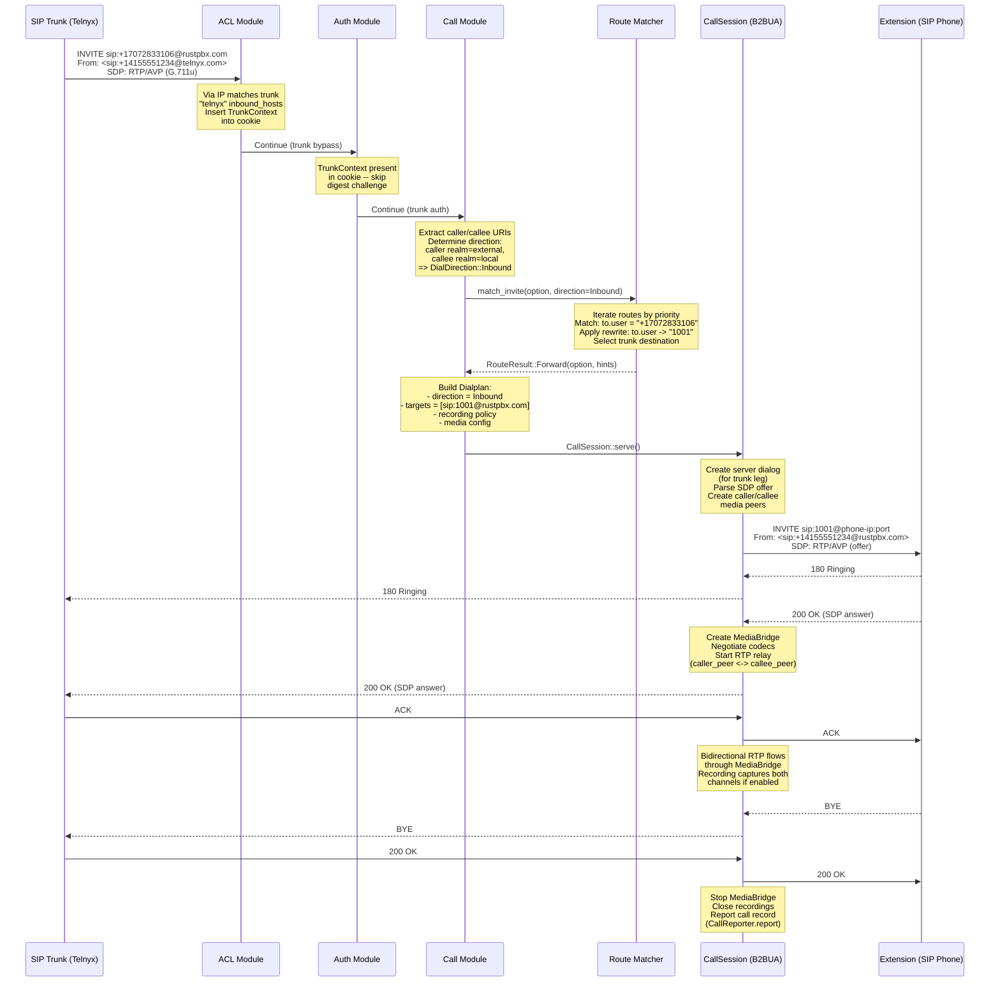
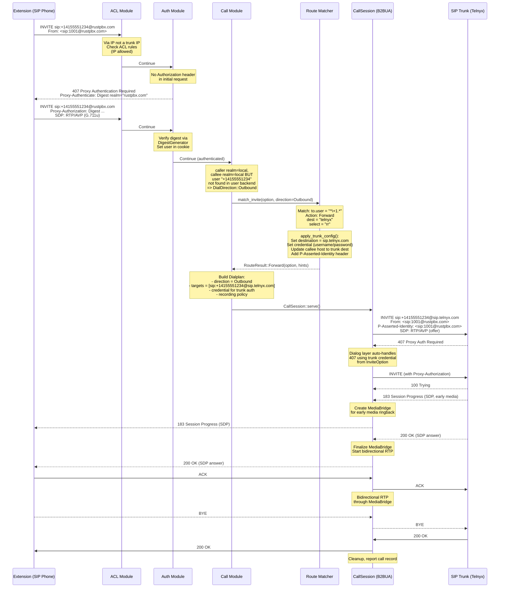
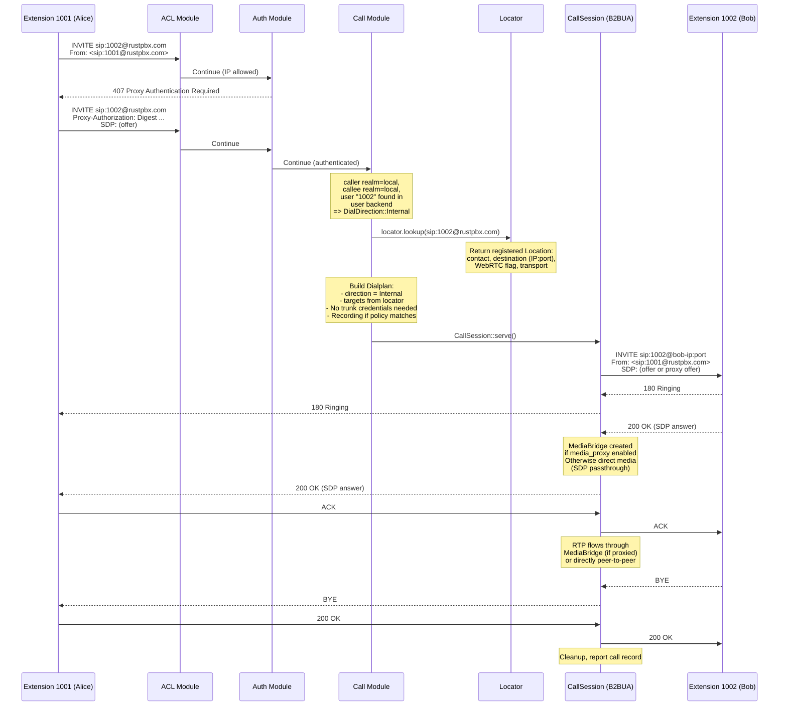
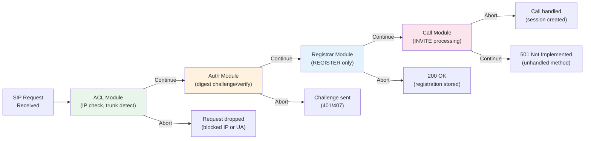
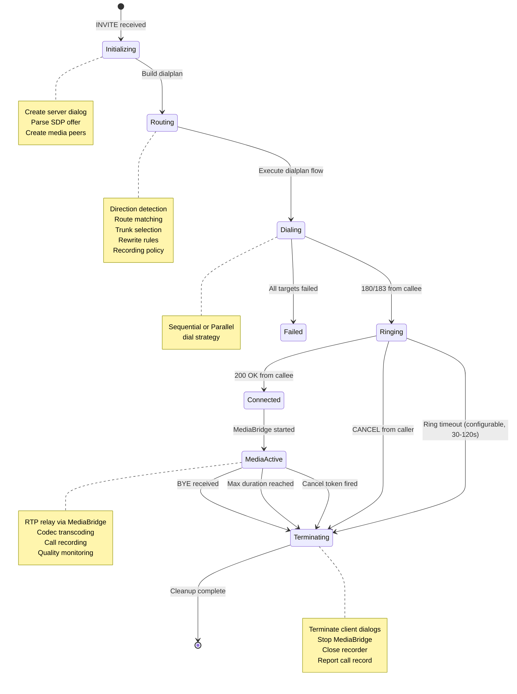
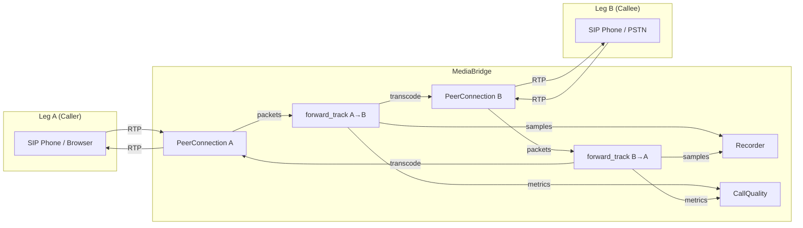
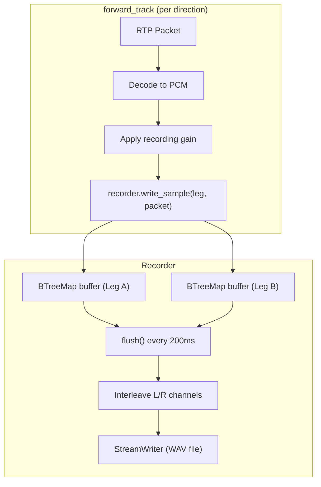
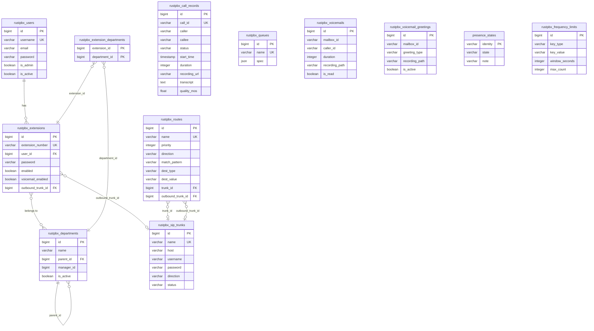

# RustPBX System Architecture

## 1. System Overview

RustPBX (v0.3.18) is a SIP PBX server implemented in Rust. It provides SIP proxy
and B2BUA (Back-to-Back User Agent) functionality, media proxying, WebRTC gateway,
call recording, call transcription, voicemail, and an administrative web console.

The system is designed to replace legacy hosted PBX platforms (CTM, Twilio) with a
self-hosted, single-binary solution that handles the full call lifecycle: SIP
signaling, media bridging, recording, CDR generation, and downstream integrations.

**Key characteristics:**

- **Single binary** -- compiles to one executable with all functionality built in
- **Async Rust** -- built on Tokio for high-concurrency, non-blocking I/O
- **Modular SIP pipeline** -- pluggable ACL, auth, presence, registrar, and call modules
- **B2BUA architecture** -- full media control with codec transcoding and recording
- **WebRTC gateway** -- browser-based softphones connect via WebSocket + ICE/DTLS
- **Addon system** -- trait-based plugins for ACME, archiving, transcription, queues, etc.
- **Multi-database** -- SQLite (default) or MySQL via SeaORM with automatic migrations
- **Cloud storage** -- local filesystem, S3 (AWS/Aliyun/Tencent/Minio/DigitalOcean), GCP, Azure

**Core dependencies:**

| Crate | Role |
|-------|------|
| `rsipstack` | SIP transport, transaction, and dialog layers |
| `rustrtc` | WebRTC peer connections, ICE, DTLS-SRTP |
| `audio-codec` | Codec support (Opus, G.729, G.722, PCMU, PCMA) |
| `sea-orm` | ORM for SQLite/MySQL with migration support |
| `axum` | HTTP/WebSocket server framework |
| `object_store` | Unified storage abstraction (local, S3, GCP, Azure) |
| `tokio` | Async runtime |

---

## 2. High-Level Architecture

```
                    +-------------------+
                    |   Web Browser /   |
                    |   SIP Phone       |
                    +--------+----------+
                             |
              +--------------+--------------+
              |              |              |
         HTTP/HTTPS     WebSocket       SIP/UDP/TCP/TLS
         (8080/8443)    (WS/WSS)       (5060/5061)
              |              |              |
    +---------+---------+    |    +---------+---------+
    |   Axum HTTP       |    |    |   rsipstack       |
    |   Router          |    |    |   Endpoint        |
    |                   |    |    |                   |
    | /console/*        |    |    | NatInspector       |
    | /ami/v1/*         |    +----+ SipFlowInspector   |
    | /iceservers       |         |                   |
    | /static/*         |         | TransportLayer     |
    | Addon routes      |         | (UDP,TCP,TLS,WS)   |
    +---+------+--------+         +--------+----------+
        |      |                           |
        |      |                  +--------+----------+
        |      |                  |  SIP Transaction   |
        |      |                  |  Layer             |
        |      |                  +--------+----------+
        |      |                           |
        |      |                  +--------+----------+
        |      |                  |  Proxy Module      |
        |      |                  |  Pipeline          |
        |      |                  |                   |
        |      |                  | 1. ACL Module      |
        |      |                  | 2. Auth Module     |
        |      |                  | 3. Presence Module |
        |      |                  | 4. Registrar       |
        |      |                  | 5. Call Module     |
        |      |                  | 6. TrunkRegister   |
        |      |                  +--------+----------+
        |      |                           |
        |      |          +----------------+----------------+
        |      |          |                                 |
        |      |  +-------+--------+              +---------+---------+
        |      |  | B2BUA Session  |              | Registrar /       |
        |      |  | (ProxyCall)    |              | Locator           |
        |      |  |                |              | (Memory/DB/HTTP)  |
        |      |  | Caller Dialog  |              +-------------------+
        |      |  | Callee Dialog  |
        |      |  | MediaBridge    |
        |      |  +---+------+----+
        |      |      |      |
        |      | +----+--+ +-+-------+
        |      | |RtcTrack| |RtpTrack|    (Media Tracks)
        |      | |WebRTC  | |Plain   |
        |      | +--------+ +--------+
        |      |      |          |
        |      |  +---+----------+---+
        |      |  |   Recorder       |
        |      |  |   (Stereo WAV)   |
        |      |  +--------+---------+
        |      |           |
   +----+------+---+  +----+----------+
   | Console UI    |  | CallRecord    |
   | (minijinja +  |  | Manager       |
   |  Alpine.js +  |  | (CDR + hooks) |
   |  Tailwind)    |  +----+----------+
   +-------+-------+       |
           |           +----+----------+
   +-------+-------+   | Storage       |
   | SeaORM DB     |   | (Local/S3/    |
   | (SQLite/MySQL)|   |  GCP/Azure)   |
   +---------------+   +---------------+
```

### Component Summary

| Component | Source Module | Description |
|-----------|-------------|-------------|
| **HTTP Server** | `src/app.rs` | Axum-based HTTP/HTTPS server with CORS, gzip, request logging |
| **SIP Server** | `src/proxy/server.rs` | SIP endpoint with transport bindings and module pipeline |
| **Proxy Modules** | `src/proxy/` | Pluggable pipeline: ACL, Auth, Presence, Registrar, Call |
| **B2BUA Session** | `src/proxy/proxy_call/` | Manages two SIP dialogs with media bridge between them |
| **Media Tracks** | `src/media/mod.rs` | RtcTrack (WebRTC), RtpTrack (plain RTP), FileTrack (playback) |
| **Recorder** | `src/media/recorder.rs` | Stereo WAV recording with per-leg decoding and gain control |
| **Call Record Manager** | `src/callrecord/mod.rs` | Async CDR processor with hooks (DB save, transcript, archive) |
| **Console** | `src/console/` | Admin web UI: extensions, trunks, routes, call records, diagnostics |
| **Addon Registry** | `src/addons/registry.rs` | Discovers, initializes, and manages addon lifecycle |
| **User Backend** | `src/proxy/user*.rs` | SIP authentication: Memory, Database, HTTP, Plain file, Extension |
| **Locator** | `src/proxy/locator*.rs` | Registration binding lookup: Memory, Database, HTTP |
| **Storage** | `src/storage/mod.rs` | Unified object storage via `object_store` crate |
| **Database** | `src/models/mod.rs` | SeaORM with SQLite/MySQL, automatic migrations |
| **SipFlow** | `src/sipflow/` | SIP message tracing and per-call packet capture |
| **AMI API** | `src/handler/ami.rs` | REST management API at `/ami/v1/` |

---

## 3. Directory Structure

```
rustpbx/
|-- Cargo.toml                      # Crate metadata, dependencies, feature flags
|-- src/
|   |-- bin/
|   |   |-- rustpbx.rs              # Main binary entry point (CLI, config, startup loop)
|   |   |-- sipflow.rs              # Standalone SIP flow viewer binary
|   |-- lib.rs                      # Module declarations
|   |-- app.rs                      # AppState, AppStateBuilder, create_router(), run()
|   |-- config.rs                   # Config, ProxyConfig, all configuration structs
|   |-- version.rs                  # Version info and user-agent string
|   |-- preflight.rs                # Pre-startup validation (port availability, etc.)
|   |-- fixtures.rs                 # Demo/seed data initialization
|   |-- utils.rs                    # Shared utilities (sanitize_id, task metrics)
|   |-- license.rs                  # License checking for commercial addons
|   |
|   |-- proxy/                      # SIP proxy and B2BUA core
|   |   |-- mod.rs                  # ProxyModule trait, ProxyAction enum
|   |   |-- server.rs               # SipServer, SipServerBuilder, SipServerInner
|   |   |-- acl.rs                  # ACL module (IP allow/deny, CIDR matching)
|   |   |-- auth.rs                 # Auth module (SIP Digest MD5, trunk bypass)
|   |   |-- registrar.rs            # REGISTER handling (Contact, GRUU, WebRTC detect)
|   |   |-- presence.rs             # Presence module (online/offline status)
|   |   |-- call.rs                 # Call module (INVITE handling, route matching)
|   |   |-- proxy_call/             # B2BUA session management
|   |   |   |-- session.rs          # ProxyCall session (two dialogs + media bridge)
|   |   |-- routing/                # Route and trunk configuration
|   |   |   |-- mod.rs              # TrunkConfig, RouteRule, MatchConditions, RouteAction
|   |   |   |-- matcher.rs          # Route matching logic
|   |   |   |-- http.rs             # HTTP-based dynamic routing
|   |   |-- nat.rs                  # NatInspector (Contact header rewriting for NAT)
|   |   |-- trunk_register.rs       # Upstream trunk registration for inbound delivery
|   |   |-- active_call_registry.rs # Active call tracking
|   |   |-- locator.rs              # Locator trait and memory implementation
|   |   |-- locator_db.rs           # Database-backed locator
|   |   |-- locator_webhook.rs      # Webhook notifications for registration events
|   |   |-- user.rs                 # UserBackend trait and memory implementation
|   |   |-- user_db.rs              # Database-backed user authentication
|   |   |-- user_extension.rs       # Extension-based user authentication
|   |   |-- user_http.rs            # HTTP-based user authentication
|   |   |-- user_plain.rs           # Plain file user authentication
|   |   |-- ws.rs                   # WebSocket SIP transport handler
|   |   |-- data.rs                 # ProxyDataContext (shared proxy state)
|   |
|   |-- call/                       # Call planning and data structures
|   |   |-- mod.rs                  # Location, DialStrategy, Dialplan, QueuePlan
|   |   |-- cookie.rs               # TransactionCookie (per-call state)
|   |   |-- policy.rs               # FrequencyLimiter trait
|   |   |-- queue_config.rs         # Queue configuration loading
|   |   |-- sip.rs                  # SIP helper utilities
|   |   |-- user.rs                 # SipUser struct
|   |
|   |-- media/                      # Media handling
|   |   |-- mod.rs                  # Track trait, RtcTrack, RtpTrack, FileTrack, MediaStream
|   |   |-- recorder.rs             # Stereo WAV recorder with dual-leg mixing
|   |   |-- transcoder.rs           # Audio transcoding between codecs
|   |   |-- call_quality.rs         # Per-leg RTP quality metrics (loss, jitter, MOS)
|   |   |-- negotiate.rs            # SDP negotiation helpers
|   |   |-- audio_source.rs         # Dynamic audio source switching
|   |   |-- wav_writer.rs           # Low-level WAV file writer
|   |
|   |-- callrecord/                 # Call Detail Record processing
|   |   |-- mod.rs                  # CallRecord, CallRecordManager, CallRecordHook trait
|   |   |-- sipflow/                # SIP flow capture and storage
|   |   |-- storage.rs              # CDR storage backends (local, S3, HTTP)
|   |
|   |-- models/                     # Database models and migrations
|   |   |-- mod.rs                  # create_db(), prepare_sqlite/mysql
|   |   |-- migration.rs            # Migrator with ordered migration list
|   |   |-- user.rs                 # User model (console login)
|   |   |-- extension.rs            # SIP extension model
|   |   |-- department.rs           # Department model
|   |   |-- extension_department.rs # Extension-department association
|   |   |-- sip_trunk.rs            # SIP trunk model
|   |   |-- routing.rs              # Route rule model
|   |   |-- call_record.rs          # Call record model + DatabaseHook
|   |   |-- presence.rs             # Presence model
|   |   |-- frequency_limit.rs      # Rate limiting model
|   |   |-- policy.rs               # PolicySpec model
|   |   |-- voicemail.rs            # Voicemail message model
|   |   |-- voicemail_greeting.rs   # Voicemail greeting model
|   |
|   |-- console/                    # Admin web console (feature-gated: "console")
|   |   |-- mod.rs                  # ConsoleState, template rendering, session auth
|   |   |-- auth.rs                 # Session-based auth (HMAC-SHA256 cookies)
|   |   |-- handlers/               # HTTP handlers for each console section
|   |       |-- mod.rs              # Router assembly (user, extension, trunk, route, etc.)
|   |
|   |-- handler/                    # HTTP handlers and middleware
|   |   |-- ami.rs                  # AMI REST API (/ami/v1/*)
|   |   |-- middleware/             # Request logging, client IP, AMI auth
|   |
|   |-- addons/                     # Plugin system
|   |   |-- mod.rs                  # Addon trait, SidebarItem, ScriptInjection
|   |   |-- registry.rs             # AddonRegistry (lifecycle, hooks, router merging)
|   |   |-- acme/                   # Let's Encrypt ACME certificate automation
|   |   |-- archive/                # Call record archival and retention
|   |   |-- transcript/             # Call transcription (SenseVoice/Groq Whisper)
|   |   |-- queue/                  # Call queue with hold music and dial strategies
|   |   |-- wholesale/              # Wholesale/carrier features
|   |   |-- endpoint_manager/       # Bulk endpoint provisioning
|   |   |-- enterprise_auth/        # LDAP/enterprise authentication
|   |
|   |-- storage/
|   |   |-- mod.rs                  # Storage abstraction (Local, S3, GCP, Azure)
|   |
|   |-- sipflow/
|   |   |-- mod.rs                  # SipFlowItem (SIP/RTP/Quality trace events)
|   |   |-- backend.rs              # Local and remote SIP flow backends
|   |
|   |-- services/                   # Background services
|
|-- static/                         # Static assets (JS, CSS, images)
|-- templates/                      # Jinja2/minijinja HTML templates
|-- config/                         # Runtime configuration directory
|   |-- certs/                      # TLS certificates
|   |-- recorders/                  # Recording output directory
|   |-- sounds/                     # Hold music, prompts, etc.
|   |-- trunks/                     # Generated trunk config files
|   |-- routes/                     # Generated route config files
|   |-- queue/                      # Queue configuration files
|   |-- acl/                        # ACL rule files
|   |-- voicemail/                  # Voicemail greetings and messages
|-- fixtures/                       # Seed/demo data
```

---

## 4. Key Data Flows

### 4.1 Inbound SIP Call (PSTN to Extension)

An inbound call arrives from a SIP trunk (e.g., Telnyx) and is routed to a
registered extension (browser softphone or SIP phone).

```
PSTN Carrier         RustPBX                         Browser Softphone
    |                    |                                  |
    |  INVITE            |                                  |
    |------------------->|                                  |
    |                    |  ACL check (IP allow/deny)       |
    |                    |  Auth bypass (trunk recognized)  |
    |                    |  Route matching (to.user match)  |
    |                    |  Locator lookup (find binding)   |
    |                    |  Create ProxyCall (B2BUA)        |
    |                    |                                  |
    |                    |  INVITE (new Call-ID)             |
    |                    |--------------------------------->|
    |                    |                                  |
    |                    |  200 OK                          |
    |                    |<---------------------------------|
    |  200 OK            |                                  |
    |<-------------------|                                  |
    |                    |                                  |
    |  ACK               |  ACK                             |
    |===================>|=================================>|
    |                    |                                  |
    |  RTP (PCMU/PCMA)   |  Media Bridge (transcode)       |  WebRTC (Opus/DTLS-SRTP)
    |<==================>|<================================>|
    |                    |  Recorder captures both legs     |
    |                    |                                  |
    |  BYE               |  BYE                             |
    |<-------------------|--------------------------------->|
    |                    |                                  |
    |                    |  CallRecord saved (CDR + WAV)    |
    |                    |  CallRecordHooks run             |
    |                    |  (DB save, transcript, archive)  |
```

**Key points:**
- The B2BUA creates two independent SIP dialogs (caller-side and callee-side)
- Media is bridged through RustPBX, enabling transcoding (e.g., PCMU <-> Opus)
- Recorder writes stereo WAV (left = caller, right = callee)
- NatInspector rewrites Contact headers for NAT traversal
- Recording policy can be per-trunk, per-route, or global

### 4.2 Outbound SIP Call (Extension to PSTN)

A registered extension initiates a call to an external number, routed through
a configured SIP trunk.

```
Browser Softphone      RustPBX                          SIP Trunk (Telnyx)
    |                    |                                  |
    |  INVITE            |                                  |
    |  (to: +17072833106)|                                  |
    |------------------->|                                  |
    |                    |  ACL check                       |
    |                    |  Auth (SIP Digest MD5)           |
    |  407 Proxy-Auth    |                                  |
    |<-------------------|                                  |
    |                    |                                  |
    |  INVITE + auth     |                                  |
    |------------------->|                                  |
    |                    |  Route matching (to.user regex)  |
    |                    |  Trunk selection (dest SIP URI)  |
    |                    |  Create ProxyCall (B2BUA)        |
    |                    |                                  |
    |                    |  INVITE + trunk credentials      |
    |                    |--------------------------------->|
    |                    |                                  |
    |                    |  100 Trying                      |
    |  100 Trying        |<---------------------------------|
    |<-------------------|                                  |
    |                    |  183 Session Progress (early media)|
    |  183 + SDP         |<---------------------------------|
    |<-------------------|                                  |
    |                    |  200 OK                          |
    |  200 OK            |<---------------------------------|
    |<-------------------|                                  |
    |                    |                                  |
    |  RTP (Opus/DTLS)   |  Media Bridge                   |  RTP (PCMU)
    |<==================>|<================================>|
```

**Key points:**
- Authentication uses SIP Digest (MD5) with 407 challenge-response
- Route matching uses `MatchConditions` (to.user, from.user, headers, etc.)
- Trunk credentials are injected by the Call module for outbound authentication
- Direction detection: caller is internal (same realm) = Outbound direction

### 4.3 WebRTC Connection Setup

Browser softphones connect via WebSocket for SIP signaling and WebRTC for media.

```
Browser                RustPBX
    |                    |
    |  WebSocket upgrade |
    |  (ws://host/ws)    |
    |------------------->|
    |                    |  sip_ws_handler() creates
    |                    |  WS transport in rsipstack
    |                    |
    |  SIP REGISTER      |
    |  (over WebSocket)  |
    |------------------->|
    |                    |  RegistrarModule detects WebRTC
    |                    |  (transport=WS, .invalid domain)
    |                    |  Stores binding in Locator
    |  200 OK            |
    |<-------------------|
    |                    |
    |  (On incoming call)|
    |                    |
    |  SIP INVITE        |
    |  (SDP with ICE)    |
    |<-------------------|
    |                    |
    |  RtcTrack creates PeerConnection
    |  ICE candidate exchange via SDP
    |  DTLS-SRTP handshake
    |                    |
    |  200 OK + SDP      |
    |------------------->|
    |                    |
    |  WebRTC media      |  (Opus over DTLS-SRTP)
    |<==================>|
```

**Key points:**
- WebSocket path is configurable via `proxy.ws_handler` (e.g., `/ws`)
- SIP signaling runs over the WebSocket using the `sip` protocol
- `RtcTrack` wraps `rustrtc::PeerConnection` for ICE/DTLS negotiation
- ICE servers are configurable (STUN/TURN) and served at `/iceservers`
- WebRTC detection: transport WS/WSS or Contact domain `.invalid`

### 4.4 Call Recording Pipeline

```
ProxyCall Session
    |
    |  Audio packets (both legs)
    |
    v
Recorder
    |  Decode per-leg (Opus/PCMU/etc -> PCM)
    |  Resample to target samplerate (default 16kHz)
    |  Apply gain (input_gain, output_gain)
    |  Time-aligned dual BTreeMap buffers
    |  Mix to stereo WAV (left=caller, right=callee)
    |
    v
Local WAV file (config/recorders/{session_id}.wav)
    |
    v
CallRecordManager (async, tokio::spawn)
    |
    +-- CallRecordHook: DatabaseHook
    |   |  Save CDR to call_records table
    |
    +-- CallRecordHook: TranscriptHook (addon)
    |   |  Run external ASR tool on recording
    |   |  Save transcript to database
    |
    +-- CallRecordHook: ArchiveHook (addon)
    |   |  Compress and archive to storage
    |
    +-- Upload to storage (Local/S3/HTTP)
        |  CDR JSON + WAV file
```

**Key points:**
- Recorder uses `Leg::A` (caller/browser) and `Leg::B` (callee/PSTN)
- Recording policy supports direction filtering, glob-based caller/callee allow/deny
- `CallRecordManager` runs as a separate tokio task with configurable max concurrency
- CDR output backends: Local filesystem, S3, HTTP (multipart upload)
- `CallRecordHook` trait enables post-processing pipelines (DB save, transcription, archival)

### 4.5 Call Queue Flow

```
Incoming INVITE
    |
    v
Route matches queue action
    |
    v
QueuePlan created
    |-- hold_audio: "config/sounds/phone-calling.wav"
    |-- dial_strategy: Sequential or Parallel
    |-- accept_immediately: true/false
    |-- fallback: busy / voicemail
    |
    v
ProxyCall enters queue mode
    |  Play hold music (FileTrack)
    |  Attempt dial to agents (DialStrategy)
    |
    +-- Sequential: ring agents one by one
    |   (timeout per agent, then next)
    |
    +-- Parallel: ring all agents simultaneously
    |   (first to answer wins)
    |
    +-- On answer: bridge media, stop hold music
    +-- On failure: play failure audio, disconnect or voicemail
```

---

## 5. Configuration

RustPBX is configured via a TOML file (default: `rustpbx.toml`). The configuration
is loaded at startup and supports hot-reload via the `/ami/v1/reload/app` endpoint.

### 5.1 Top-Level Configuration

| Section | Config Struct | Description |
|---------|---------------|-------------|
| `http_addr` | `Config.http_addr` | HTTP listen address (default: `0.0.0.0:8080`) |
| `https_addr` | `Config.https_addr` | HTTPS listen address (default: `0.0.0.0:8443`) |
| `ssl_certificate` / `ssl_private_key` | `Config` | TLS certificate and key paths |
| `external_ip` | `Config.external_ip` | Public IP for NAT traversal (SDP, Contact headers) |
| `rtp_start_port` / `rtp_end_port` | `Config` | RTP port range (default: 12000-42000) |
| `webrtc_port_start` / `webrtc_port_end` | `Config` | WebRTC port range (default: 30000-40000) |
| `database_url` | `Config.database_url` | Database URL (default: `sqlite://rustpbx.sqlite3`) |
| `log_level` | `Config.log_level` | Tracing log level (e.g., `info`, `debug`) |
| `log_file` | `Config.log_file` | Log file path (stdout if not set) |
| `demo_mode` | `Config.demo_mode` | Enable demo mode (also via `RUSTPBX_DEMO_MODE` env) |

### 5.2 Proxy Configuration (`[proxy]`)

| Field | Type | Description |
|-------|------|-------------|
| `addr` | String | SIP listen address (default: `0.0.0.0`) |
| `udp_port` | u16 | SIP UDP port (default: 5060) |
| `tcp_port` | u16 | SIP TCP port |
| `tls_port` | u16 | SIP TLS port |
| `ws_port` | u16 | SIP WebSocket port |
| `ws_handler` | String | WebSocket upgrade path (e.g., `/ws`) |
| `modules` | Vec | Module pipeline (default: `["acl", "auth", "registrar", "call"]`) |
| `user_backends` | Vec | Authentication backends (Memory, Http, Plain, Database, Extension) |
| `locator` | Enum | Registration storage (Memory, Http, Database) |
| `media_proxy` | Enum | Media proxy mode: `all`, `auto`, `nat`, `none` |
| `codecs` | Vec | Preferred codec list |
| `realms` | Vec | SIP realm domains |
| `nat_fix` | bool | Enable NatInspector Contact rewriting (default: true) |
| `session_timer` | bool | Enable SIP session timers |
| `registrar_expires` | u32 | Default registration expiry in seconds (default: 60) |
| `max_concurrency` | usize | Max concurrent SIP transactions |
| `acl_rules` | Vec | Inline ACL rules (e.g., `"allow all"`, `"deny all"`) |
| `acl_files` | Vec | External ACL rule file paths |
| `addons` | Vec | Enabled addon IDs (e.g., `["transcript", "archive"]`) |
| `frequency_limiter` | String | Rate limiting configuration |

### 5.3 Trunks (`[proxy.trunks.<name>]`)

| Field | Type | Description |
|-------|------|-------------|
| `dest` | String | Destination SIP URI (e.g., `sip:sip.telnyx.com`) |
| `backup_dest` | String | Failover destination |
| `username` / `password` | String | Trunk authentication credentials |
| `codec` | Vec | Preferred codecs for this trunk |
| `direction` | Enum | `inbound`, `outbound`, or `both` |
| `inbound_hosts` | Vec | IP addresses/CIDRs for inbound trunk identification |
| `recording` | RecordingPolicy | Per-trunk recording settings |
| `register` | bool | Enable upstream REGISTER for inbound delivery |
| `register_expires` | u32 | Registration expiry (default: 3600s) |
| `max_calls` | u32 | Maximum concurrent calls on this trunk |
| `max_cps` | u32 | Maximum calls per second |
| `transport` | String | Preferred transport (UDP, TCP, TLS) |

### 5.4 Routes (`[[proxy.routes]]` or external files)

| Field | Type | Description |
|-------|------|-------------|
| `name` | String | Route name |
| `priority` | i32 | Matching priority (lower = higher priority) |
| `match_conditions` | Struct | Match on `to.user`, `from.host`, headers, etc. |
| `rewrite` | Struct | Rewrite `to.user`, `from.user`, headers before forwarding |
| `action` | Enum | `forward` (to trunk), `reject`, `busy`, `queue` |

Routes can be defined inline in config or loaded from external TOML files
(`proxy.routes_files`). The Console UI manages routes in the database, which
are merged with file-based routes at runtime.

### 5.5 Recording Policy (`[recording]` or `[proxy.recording]`)

| Field | Type | Description |
|-------|------|-------------|
| `enabled` | bool | Enable recording |
| `directions` | Vec | Record for: `inbound`, `outbound`, `internal` |
| `caller_allow` / `caller_deny` | Vec | Glob patterns for caller filtering |
| `callee_allow` / `callee_deny` | Vec | Glob patterns for callee filtering |
| `auto_start` | bool | Start recording automatically (default: true) |
| `filename_pattern` | String | Custom filename pattern |
| `samplerate` | u32 | Recording sample rate (default: 16000) |
| `path` | String | Recording output directory (default: `./config/recorders`) |
| `input_gain` / `output_gain` | f32 | Gain multipliers for caller/callee audio |

### 5.6 Other Configuration Sections

| Section | Config Struct | Description |
|---------|--------------|-------------|
| `[callrecord]` | `CallRecordConfig` | CDR output: `local`, `s3`, or `http` |
| `[storage]` | `StorageConfig` | Object storage: `local` or `s3` |
| `[sipflow]` | `SipFlowConfig` | SIP trace: `local` or `remote` |
| `[quality]` | `QualityConfig` | Call quality monitoring thresholds |
| `[voicemail]` | `VoicemailConfig` | Voicemail settings (max duration, max messages, auto-transcribe) |
| `[console]` | `ConsoleConfig` | Web console settings (session secret, base path, registration) |
| `[ami]` | `AmiConfig` | AMI API access control (allowed IPs) |
| `[ice_servers]` | Vec | ICE (STUN/TURN) server configuration |
| `[archive]` | `ArchiveConfig` | Archive schedule (time, timezone, retention days) |
| `[proxy.transcript]` | `TranscriptToolConfig` | ASR command, model path, timeout |
| `[proxy.queues.<name>]` | `RouteQueueConfig` | Queue definitions (hold music, strategy, fallback) |

---

## 6. Database Schema

RustPBX uses SeaORM with SQLite (default) or MySQL. Migrations run automatically
on startup via `sea_orm_migration`.

### 6.1 Migration Order

The `Migrator` in `src/models/migration.rs` registers 17 migrations in order:

| # | Migration | Table(s) Created/Modified |
|---|-----------|--------------------------|
| 1 | `user::Migration` | `users` |
| 2 | `department::Migration` | `departments` |
| 3 | `extension::Migration` | `extensions` |
| 4 | `extension_department::Migration` | `extension_departments` |
| 5 | `sip_trunk::Migration` | `sip_trunks` |
| 6 | `presence::Migration` | `presence` |
| 7 | `routing::Migration` | `routes` |
| 8 | `queue::models::Migration` | `queue_*` (queue addon tables) |
| 9 | `call_record::Migration` | `call_records` |
| 10 | `frequency_limit::Migration` | `frequency_limits` |
| 11 | `call_record_indices::Migration` | Indices on `call_records` |
| 12 | `call_record_optimization_indices` | Additional optimization indices |
| 13 | `call_record_dashboard_index` | Dashboard-specific indices |
| 14 | `call_record_from_number_index` | From-number lookup index |
| 15 | `add_rewrite_columns` | Add rewrite columns to routes |
| 16 | `add_quality_columns` | Add quality metrics to call_records |
| 17 | `add_transcript_text_column` | Add transcript text to call_records |
| 18 | `create_voicemail_tables` | `voicemail_messages`, `voicemail_greetings` |

### 6.2 Core Tables

| Table | Model Module | Key Fields | Description |
|-------|-------------|------------|-------------|
| `users` | `models::user` | id, username, email, password_hash, role, is_active | Console admin users |
| `departments` | `models::department` | id, name, description | Organizational departments |
| `extensions` | `models::extension` | id, extension_number, name, password, voicemail_enabled | SIP extensions (phones) |
| `extension_departments` | `models::extension_department` | extension_id, department_id | Many-to-many association |
| `sip_trunks` | `models::sip_trunk` | id, name, dest, username, password, direction, inbound_hosts | SIP trunk definitions |
| `routes` | `models::routing` | id, name, priority, match_conditions, action, rewrite | Call routing rules |
| `call_records` | `models::call_record` | id, call_id, caller, callee, start_time, end_time, duration, details_json | CDR storage |
| `presence` | `models::presence` | id, extension, status, last_seen | Extension presence state |
| `frequency_limits` | `models::frequency_limit` | id, key, count, window | Rate limiting counters |
| `voicemail_messages` | `models::voicemail` | id, mailbox, caller, timestamp, duration, audio_path, transcript | Voicemail messages |
| `voicemail_greetings` | `models::voicemail_greeting` | id, mailbox, name, audio_path, is_active | Voicemail greetings |

### 6.3 Relationships

```
departments  <-->>  extension_departments  <<-->  extensions
                                                      |
                                                      | (extension_number used as SIP user)
                                                      v
                                                  presence
                                                      |
                                                  call_records
                                                      |
                                                  voicemail_messages
                                                  voicemail_greetings

sip_trunks  (standalone, referenced by route actions)
routes      (standalone, evaluated in priority order)
users       (standalone, console authentication)
frequency_limits (standalone, rate limiting)
```

---

## 7. External Dependencies

### 7.1 Core Networking & SIP

| Crate | Version | Feature Flag | Purpose |
|-------|---------|-------------|---------|
| `rsipstack` | path dep | -- | SIP transport, transaction, dialog layers |
| `rustrtc` | 0.3.21 | -- | WebRTC peer connections, ICE, DTLS-SRTP |
| `rsip` | 0.4.0 | -- | SIP message parsing and construction |
| `audio-codec` | 0.3.30 | `opus` | Codec support (Opus, G.729, G.722, PCMU, PCMA) |
| `ipnetwork` | 0.21.1 | -- | CIDR/IP network matching for ACL |

### 7.2 HTTP & Web

| Crate | Version | Purpose |
|-------|---------|---------|
| `axum` | 0.8.8 | HTTP/WebSocket server (ws, tokio, multipart features) |
| `axum-server` | 0.8.0 | HTTPS/TLS termination (tls-rustls) |
| `tower-http` | 0.6.8 | Static file serving, CORS, gzip compression |
| `reqwest` | 0.13 | HTTP client (webhooks, HTTP user backend, CDR upload) |
| `tokio-tungstenite` | 0.28.0 | WebSocket transport for SIP-over-WS |

### 7.3 Database & Storage

| Crate | Version | Purpose |
|-------|---------|---------|
| `sea-orm` | 1.1.19 | ORM for SQLite and MySQL |
| `sea-orm-migration` | 1.1.19 | Schema migration framework |
| `sqlx` | 0.8.6 | Underlying SQL driver (SQLite, MySQL, Postgres) |
| `object_store` | 0.13.1 | Unified object storage (AWS S3, GCP, Azure) |

### 7.4 Template & Console UI

| Crate | Version | Feature Flag | Purpose |
|-------|---------|-------------|---------|
| `minijinja` | 2 | `console` | Jinja2-compatible template engine |
| Alpine.js | (CDN) | -- | Reactive UI framework (loaded in templates) |
| Tailwind CSS | (CDN) | -- | Utility-first CSS framework |
| Chart.js | (CDN) | -- | Dashboard charts |

### 7.5 Security & Crypto

| Crate | Version | Purpose |
|-------|---------|---------|
| `rustls` | 0.23.36 | TLS implementation (ring backend) |
| `argon2` | 0.5.3 | Password hashing (console users) |
| `hmac` / `sha2` | 0.12 / 0.10.9 | HMAC-SHA256 session cookies |
| `md-5` | 0.10.6 | SIP Digest MD5 authentication |
| `totp-rs` | 5.7.0 | TOTP two-factor authentication |
| `rcgen` | 0.14.7 | Self-signed certificate generation |
| `ldap3` | 0.12.1 | LDAP authentication (enterprise auth addon) |

### 7.6 Audio & Media

| Crate | Version | Purpose |
|-------|---------|---------|
| `hound` | 3.5 | WAV file reading/writing |
| `minimp3` | 0.6.1 | MP3 decoding (hold music, prompts) |
| `byteorder` | 1.5.0 | PCM sample byte ordering |

### 7.7 Serialization & Config

| Crate | Version | Purpose |
|-------|---------|---------|
| `serde` / `serde_json` | 1 | JSON serialization/deserialization |
| `toml` / `toml_edit` | 0.9.8 / 0.23.9 | TOML config parsing and editing |
| `quick-xml` | 0.39.0 | XML serialization (SIP XML bodies) |
| `csv` | 1.4.0 | CSV import/export (wholesale addon) |

### 7.8 Async Runtime & Utilities

| Crate | Version | Purpose |
|-------|---------|---------|
| `tokio` | 1.49.0 | Async runtime (full features + tracing) |
| `tokio-util` | 0.7.18 | CancellationToken, sync utilities |
| `futures` | 0.3.31 | Async stream combinators |
| `async-trait` | 0.1.88 | Async trait methods |
| `tracing` / `tracing-subscriber` | 0.1.43 / 0.3.22 | Structured logging with env filter |
| `console-subscriber` | 0.5.0 | Tokio console debugging |
| `chrono` / `chrono-tz` | 0.4 / 0.10.4 | Date/time handling with timezone support |
| `uuid` | 1.19.0 | UUID v4 generation (Call-IDs, session IDs) |
| `regex` | 1.12.3 | Route matching, header pattern matching |
| `lru` | 0.16.3 | LRU caches (SIP flow ID cache) |
| `phonenumber` | 0.3.7 | Phone number parsing and validation |
| `zstd` | 0.13 | Zstandard compression (SIP flow storage) |

### 7.9 Feature Flags

| Feature | Controlled Dependencies | Description |
|---------|------------------------|-------------|
| `opus` | `audio-codec/opus` | Opus codec support (default: enabled) |
| `console` | `minijinja` | Admin web console (default: enabled) |
| `addon-acme` | `instant-acme` | Let's Encrypt ACME addon (default: enabled) |
| `addon-transcript` | -- | Call transcription addon (default: enabled) |
| `addon-archive` | `flate2` | Call record archival addon (default: enabled) |
| `addon-wholesale` | `flate2`, `async-compression` | Wholesale/carrier addon |
| `addon-endpoint-manager` | -- | Bulk endpoint management addon |
| `addon-enterprise-auth` | -- | Enterprise LDAP auth addon |
| `commerce` | wholesale + endpoint-manager + enterprise-auth | Commercial bundle |
| `cross` | `aws-lc-rs/bindgen` | Cross-compilation support |

**Default features:** `opus`, `console`, `addon-acme`, `addon-transcript`, `addon-archive`

---

## 8. Addon System

The addon system provides a trait-based plugin architecture for extending RustPBX
without modifying the core codebase.

### 8.1 Addon Trait (`src/addons/mod.rs`)

Every addon implements the `Addon` trait:

```rust
#[async_trait]
pub trait Addon: Send + Sync {
    fn id(&self) -> &'static str;
    fn name(&self) -> &'static str;
    fn description(&self) -> &'static str;
    async fn initialize(&self, state: AppState) -> anyhow::Result<()>;
    fn router(&self, state: AppState) -> Option<Router>;
    fn sidebar_items(&self, state: AppState) -> Vec<SidebarItem>;
    fn inject_scripts(&self) -> Vec<ScriptInjection>;
    fn call_record_hook(&self, db, config) -> Option<Box<dyn CallRecordHook>>;
    fn proxy_server_hook(&self, builder, ctx) -> SipServerBuilder;
    async fn authenticate(&self, state, identifier, password) -> Result<Option<User>>;
    // ... additional optional methods
}
```

### 8.2 Available Addons

| Addon | ID | Feature Flag | Description |
|-------|-----|-------------|-------------|
| ACME | `acme` | `addon-acme` | Automatic TLS certificates via Let's Encrypt |
| Archive | `archive` | `addon-archive` | CDR archival with retention policies |
| Transcript | `transcript` | `addon-transcript` | Call transcription via external ASR tools |
| Queue | `queue` | (always compiled) | Call queuing with hold music and dial strategies |
| Wholesale | `wholesale` | `addon-wholesale` | Carrier/wholesale features, rate management |
| Endpoint Manager | `endpoint_manager` | `addon-endpoint-manager` | Bulk SIP endpoint provisioning |
| Enterprise Auth | `enterprise_auth` | `addon-enterprise-auth` | LDAP/Active Directory authentication |

### 8.3 Addon Lifecycle

1. **Registration** -- `AddonRegistry::new()` in `src/addons/registry.rs` instantiates
   all addons (gated by feature flags)
2. **Initialization** -- `initialize_all()` calls each enabled addon's `initialize()`
3. **Router merging** -- `get_routers()` merges addon routes into the main Axum router
4. **Sidebar injection** -- `get_sidebar_items()` collects menu items for the console
5. **Script injection** -- `get_injected_scripts()` adds JS to matching console pages
6. **Call record hooks** -- `get_call_record_hooks()` collects post-call processors
7. **Proxy hooks** -- `apply_proxy_server_hooks()` lets addons modify the SIP server builder

Addons are enabled by listing their IDs in `proxy.addons`:

```toml
[proxy]
addons = ["transcript", "archive", "queue"]
```

---

## 9. API Reference

The RustPBX HTTP server listens on the address configured via `http_addr`
(default `0.0.0.0:8080`) and, optionally, `https_addr` for TLS. All endpoints
fall into three categories:

| Category | Path prefix | Authentication |
|----------|-------------|----------------|
| **AMI API** | `/ami/v1/*` | IP allowlist (`[ami].allows`) or console superuser session |
| **Console API** | `/{base_path}/*` (default `/console/*`) | Session cookie (`rustpbx_session`) or `Authorization: Bearer <token>` |
| **WebSocket** | Configurable (`proxy.ws_handler`, e.g. `/ws`) | None (SIP-level auth via REGISTER) |

#### Authentication Methods

**AMI API** -- Enforced by `ami_auth_middleware` (`src/handler/middleware/ami_auth.rs`).
Access is granted when the client IP appears in `[ami].allows` (e.g.
`allows = ["127.0.0.1", "*"]`) or the request carries a valid console session
cookie for a superuser account. Otherwise the server returns `403 Forbidden`.

**Console API** -- Uses an HMAC-SHA256 signed session token stored in the
`rustpbx_session` cookie. The token format is `{user_id}:{expires_ts}:{signature}`
with a 12-hour TTL. The token can also be sent as `Authorization: Bearer <token>`.
Endpoints that require login use the `AuthRequired` extractor; unauthenticated
requests receive a redirect to the login page.

**WebSocket** -- The `/ws` endpoint has no HTTP-level auth. Authentication happens
at the SIP protocol layer when the client sends a SIP REGISTER through the
WebSocket and the SIP server performs digest authentication against the configured
user backend.

---

### 9.1 AMI API (`/ami/v1/*`)

The Asterisk Manager Interface-inspired API provides system health, call
management, and configuration reload endpoints.

Source: `src/handler/ami.rs`

#### GET /ami/v1/health

Returns system health status, uptime, version, call statistics, and task metrics.

**Auth:** AMI

**Response:** `200 OK`

```json
{
  "status": "running",
  "uptime": "2024-02-23T10:00:00Z",
  "version": { "version": "0.3.18" },
  "total": 142,
  "failed": 3,
  "tasks": { "proxy_call": 2, "registrar": 1 },
  "sipserver": {
    "transactions": { "running": 1, "finished": 500, "waiting_ack": 0 },
    "dialogs": 2,
    "calls": 1,
    "running_tx": 1
  },
  "callrecord": {}
}
```

```bash
curl http://localhost:8080/ami/v1/health
```

#### GET /ami/v1/dialogs

Lists all active SIP dialogs with their state, from-URI, and to-URI.

**Auth:** AMI

**Response:** `200 OK` -- JSON array

```json
[
  { "state": "Confirmed", "from": "sip:1001@10.0.0.55", "to": "sip:1002@10.0.0.55" }
]
```

```bash
curl http://localhost:8080/ami/v1/dialogs
```

#### GET /ami/v1/hangup/{id}

Initiates a hangup (BYE) for the dialog with the given ID.

**Auth:** AMI

| Parameter | Type | In | Description |
|-----------|------|----|-------------|
| `id` | string | path | Dialog ID |

**Responses:**
- `200 OK` -- `{ "status": "ok", "message": "Dialog with id '...' hangup initiated" }`
- `404 Not Found` -- dialog not found
- `500 Internal Server Error` -- hangup failed

```bash
curl http://localhost:8080/ami/v1/hangup/abc123
```

#### GET /ami/v1/transactions

Lists all running SIP transaction keys.

**Auth:** AMI

**Response:** `200 OK` -- JSON array of strings

```bash
curl http://localhost:8080/ami/v1/transactions
```

#### POST /ami/v1/shutdown

Initiates a graceful server shutdown.

**Auth:** AMI

**Response:** `200 OK` -- `{ "status": "shutdown initiated" }`

```bash
curl -X POST http://localhost:8080/ami/v1/shutdown
```

#### POST /ami/v1/reload/trunks

Hot-reloads SIP trunk configuration from disk without restarting.

**Auth:** AMI

**Responses:**
- `200 OK` -- `{ "status": "ok", "trunks_reloaded": 3, "metrics": {...} }`
- `422 Unprocessable Entity` -- config file parsing failed
- `500 Internal Server Error` -- reload failed

```bash
curl -X POST http://localhost:8080/ami/v1/reload/trunks
```

#### POST /ami/v1/reload/routes

Hot-reloads routing rules from disk without restarting.

**Auth:** AMI

**Responses:**
- `200 OK` -- `{ "status": "ok", "routes_reloaded": 5, "metrics": {...} }`
- `422 Unprocessable Entity` -- config file parsing failed

```bash
curl -X POST http://localhost:8080/ami/v1/reload/routes
```

#### POST /ami/v1/reload/acl

Hot-reloads ACL (Access Control List) rules from disk.

**Auth:** AMI

**Responses:**
- `200 OK` -- `{ "status": "ok", "acl_rules_reloaded": 2, "metrics": {...}, "active_rules": [...] }`
- `422 Unprocessable Entity` -- config file parsing failed

```bash
curl -X POST http://localhost:8080/ami/v1/reload/acl
```

#### POST /ami/v1/reload/app

Validates the configuration file and optionally triggers a full application restart.

**Auth:** AMI

| Parameter | Type | In | Default | Description |
|-----------|------|----|---------|-------------|
| `mode` | string | query | -- | Set to `"check"` or `"validate"` for dry-run |
| `check_only` | bool | query | `false` | If true, validate without restarting |
| `dry_run` | bool | query | `false` | Alias for `check_only` |

**Responses:**
- `200 OK` (check mode) -- `{ "status": "ok", "mode": "check", "message": "Configuration validated..." }`
- `200 OK` (apply mode) -- `{ "status": "ok", "message": "Configuration validated. Restarting..." }`
- `400 Bad Request` -- no config file path known
- `422 Unprocessable Entity` -- validation failed with `"errors"` array

```bash
# Validate only
curl -X POST "http://localhost:8080/ami/v1/reload/app?check_only=true"

# Validate and restart
curl -X POST http://localhost:8080/ami/v1/reload/app
```

#### GET /ami/v1/frequency_limits

Lists active frequency/rate limit counters.

**Auth:** AMI

| Parameter | Type | In | Description |
|-----------|------|----|-------------|
| `policy_id` | string | query | Filter by policy ID |
| `scope` | string | query | Filter by scope (e.g. `"ip"`, `"user"`) |
| `scope_value` | string | query | Filter by specific scope value |
| `limit_type` | string | query | Filter by limit type |

**Responses:**
- `200 OK` -- JSON array of limit entries
- `501 Not Implemented` -- frequency limiter not configured

```bash
curl "http://localhost:8080/ami/v1/frequency_limits?scope=ip"
```

#### DELETE /ami/v1/frequency_limits

Clears frequency limit counters. Accepts the same query parameters as GET to
selectively clear.

**Auth:** AMI

**Responses:**
- `200 OK` -- `{ "status": "ok", "deleted_count": 5 }`
- `501 Not Implemented` -- frequency limiter not configured

```bash
curl -X DELETE "http://localhost:8080/ami/v1/frequency_limits?scope=ip&scope_value=192.168.1.100"
```

---

### 9.2 Console API (`/console/*`)

The console API serves the admin web UI (HTML pages) and provides JSON data
endpoints for AJAX operations. The default base path is `/console` (configurable
via `[console].base_path`). All paths below are relative to the base path.

Source: `src/console/handlers/*.rs`

#### 9.2.1 Authentication and User Management

Source: `src/console/handlers/user.rs`

##### GET /console/login

Renders the login page.

**Auth:** None

| Parameter | Type | In | Description |
|-----------|------|----|-------------|
| `next` | string | query | URL to redirect to after login |

##### POST /console/login

Authenticates with username/email and password. On success, sets a session
cookie and redirects.

**Auth:** None

| Field | Type | Required | Description |
|-------|------|----------|-------------|
| `identifier` | string | yes | Username or email |
| `password` | string | yes | Password |
| `next` | string | no | Post-login redirect URL |

**Response:** `302` redirect with `Set-Cookie: rustpbx_session=...` on success,
or re-renders login page with error message on failure.

```bash
curl -X POST -d "identifier=admin&password=admin123" \
  -c cookies.txt http://localhost:8080/console/login
```

##### GET /console/logout

Clears the session cookie and redirects.

**Auth:** None (clears existing session)

| Parameter | Type | In | Description |
|-----------|------|----|-------------|
| `next` | string | query | Post-logout redirect URL |

##### GET /console/register

Renders the registration page. Returns `403` if registration is disabled
(except when no users exist -- the first user is always allowed).

**Auth:** None

##### POST /console/register

Creates a new console user. The first user becomes superuser automatically.

**Auth:** None

| Field | Type | Required | Description |
|-------|------|----------|-------------|
| `email` | string | yes | Valid email address |
| `username` | string | yes | At least 3 characters |
| `password` | string | yes | At least 8 characters |
| `confirm_password` | string | yes | Must match password |

##### GET /console/forgot

Renders the forgot-password page.

**Auth:** None

##### POST /console/forgot

Generates a password reset token.

**Auth:** None

| Field | Type | Required | Description |
|-------|------|----------|-------------|
| `email` | string | yes | Registered email address |

**Response:** Always renders a success message. If the account exists, the
response includes a reset link (shown directly since no email transport is
configured).

##### GET /console/reset/{token}

Renders the password reset form for a valid, non-expired token (30-minute TTL).

**Auth:** None

##### POST /console/reset/{token}

Resets the password and logs the user in.

**Auth:** None

| Field | Type | Required | Description |
|-------|------|----------|-------------|
| `password` | string | yes | At least 8 characters |
| `confirm_password` | string | yes | Must match password |

---

#### 9.2.2 Dashboard

Source: `src/console/handlers/dashboard.rs`

##### GET /console/

Renders the dashboard page with call metrics, active calls, and timeline chart.

**Auth:** Session required

##### GET /console/dashboard/data

Returns dashboard data as JSON for AJAX refresh.

**Auth:** Session required

| Parameter | Type | In | Default | Description |
|-----------|------|----|---------|-------------|
| `range` | string | query | `"10m"` | Time range: `"10m"`, `"today"`, `"yesterday"`, `"week"`, `"7days"`, `"30days"` |

**Response:** `200 OK`

```json
{
  "range": { "key": "10m", "label": "Last 10 minutes" },
  "metrics": {
    "recent10": { "total": 5, "trend": "+25%", "answered": 4, "asr": "80%", "acd": "2m 30s",
                  "timeline": [0,1,2,0,1,0,0,0,1,0], "timeline_labels": ["10:01","10:02"] },
    "today": { "acd": "3m 15s" },
    "active": 2, "capacity": 100, "active_util": 2
  },
  "call_direction": { "Inbound": 3, "Outbound": 1, "Internal": 1 },
  "active_calls": [
    { "session_id": "...", "caller": "1001", "callee": "1002", "status": "Connected",
      "started_at": "10:05", "duration": "2m 30s" }
  ]
}
```

```bash
curl -b cookies.txt "http://localhost:8080/console/dashboard/data?range=today"
```

---

#### 9.2.3 Extensions CRUD

Source: `src/console/handlers/extension.rs`

##### GET /console/extensions

Renders the extensions list page.

**Auth:** Session required

##### POST /console/extensions

Queries extensions with pagination, filtering, and sorting (AJAX table).

**Auth:** Session required

**JSON body:**

```json
{
  "page": 1, "per_page": 20,
  "sort": "created_at_desc",
  "filters": {
    "q": "search text",
    "department_ids": [1, 2],
    "call_forwarding_enabled": true,
    "status": "active",
    "login_allowed": true,
    "created_at_from": "2024-01-01",
    "created_at_to": "2024-12-31",
    "registered_at_from": "2024-01-01",
    "registered_at_to": "2024-12-31"
  }
}
```

**Sort options:** `created_at_desc`, `created_at_asc`, `extension_asc`,
`extension_desc`, `display_name_asc`, `display_name_desc`, `status_asc`,
`status_desc`, `registered_at_asc`, `registered_at_desc`

**Response:** `200 OK` -- Paginated JSON with registration status from the locator

```json
{
  "page": 1, "per_page": 20, "total_pages": 3, "total_items": 45,
  "items": [
    {
      "extension": { "id": 1, "extension": "1001", "display_name": "Alice" },
      "departments": [],
      "registrations": { "available": true, "total": 1, "records": [] }
    }
  ]
}
```

##### PUT /console/extensions

Creates a new extension.

**Auth:** Session required

| Field | Type | Required | Description |
|-------|------|----------|-------------|
| `extension` | string | yes | Extension number (e.g. `"1001"`) |
| `display_name` | string | no | Display name |
| `email` | string | no | Email address |
| `sip_password` | string | no | SIP authentication password |
| `call_forwarding_mode` | string | no | `"none"`, `"always"`, `"busy"`, `"noanswer"` |
| `call_forwarding_destination` | string | no | Forwarding destination |
| `call_forwarding_timeout` | int | no | Forwarding timeout in seconds |
| `department_ids` | int[] | no | Associated department IDs |
| `login_disabled` | bool | no | Disable SIP login (default false) |
| `voicemail_disabled` | bool | no | Disable voicemail (default false) |
| `allow_guest_calls` | bool | no | Allow unauthenticated calls (default false) |
| `notes` | string | no | Free-text notes |

**Response:** `200 OK` -- `{ "status": "ok", "id": 1 }`

##### GET /console/extensions/new

Renders the create-extension form.

**Auth:** Session required

##### GET /console/extensions/{id}

Renders extension detail page with SIP registration status from the locator.

**Auth:** Session required

##### PATCH /console/extensions/{id}

Updates an extension. Only fields present in the body are modified.

**Auth:** Session required

**JSON body:** Same fields as PUT (all optional for partial update).

**Response:** `200 OK` -- `{ "status": "ok" }`

##### DELETE /console/extensions/{id}

Deletes an extension.

**Auth:** Session required

**Response:** `200 OK` -- `{ "status": <rows_affected> }`

```bash
# Create extension
curl -b cookies.txt -X PUT -H "Content-Type: application/json" \
  -d '{"extension":"1003","display_name":"Charlie","sip_password":"secret123"}' \
  http://localhost:8080/console/extensions

# Query extensions
curl -b cookies.txt -X POST -H "Content-Type: application/json" \
  -d '{"page":1,"per_page":20,"filters":{"q":"100"}}' \
  http://localhost:8080/console/extensions
```

---

#### 9.2.4 SIP Trunks CRUD

Source: `src/console/handlers/sip_trunk.rs`

##### GET /console/sip-trunk

Renders the SIP trunks list page.

**Auth:** Session required

##### POST /console/sip-trunk

Queries SIP trunks with pagination, filtering, and sorting.

**Auth:** Session required

**JSON body:**

```json
{
  "page": 1, "per_page": 20,
  "sort": "updated_at_desc",
  "filters": {
    "q": "telnyx",
    "status": "active",
    "direction": "outbound",
    "transport": "udp",
    "only_active": true
  }
}
```

**Sort options:** `updated_at_desc`, `updated_at_asc`, `name_asc`, `name_desc`,
`carrier_asc`, `carrier_desc`, `status_asc`, `status_desc`

##### PUT /console/sip-trunk

Creates a new SIP trunk (form-encoded body).

**Auth:** Session required

| Field | Type | Required | Description |
|-------|------|----------|-------------|
| `name` | string | yes | Unique trunk name |
| `display_name` | string | no | Human-readable name |
| `carrier` | string | no | Carrier name (e.g. `"Telnyx"`) |
| `description` | string | no | Description |
| `status` | string | no | `"active"`, `"inactive"`, `"maintenance"` |
| `direction` | string | no | `"inbound"`, `"outbound"`, `"bidirectional"` |
| `sip_server` | string | no | SIP server hostname/IP |
| `sip_transport` | string | no | `"udp"`, `"tcp"`, `"tls"` |
| `outbound_proxy` | string | no | Outbound proxy address |
| `auth_username` | string | no | Authentication username |
| `auth_password` | string | no | Authentication password |
| `default_route_label` | string | no | Default route label |
| `max_cps` | int | no | Max calls per second |
| `max_concurrent` | int | no | Max concurrent calls |
| `max_call_duration` | int | no | Max call duration (seconds) |
| `allowed_ips` | string | no | JSON array or newline-separated IPs/CIDRs |
| `did_numbers` | string | no | JSON array or newline-separated DID numbers |
| `is_active` | bool | no | Active flag (default true) |
| `metadata` | string | no | Arbitrary JSON metadata |

**Response:** `200 OK` -- `{ "status": "ok", "id": 1 }`

##### GET /console/sip-trunk/new

Renders the create-trunk form.

**Auth:** Session required

##### GET /console/sip-trunk/{id}

Renders trunk detail/edit page.

**Auth:** Session required

##### PATCH /console/sip-trunk/{id}

Updates a SIP trunk. Only fields present are modified (form-encoded).

**Auth:** Session required

**Response:** `200 OK` -- `{ "status": "ok" }`

##### DELETE /console/sip-trunk/{id}

Deletes a SIP trunk.

**Auth:** Session required

**Response:** `200 OK` -- `{ "status": "ok" }`

---

#### 9.2.5 Routing Rules CRUD

Source: `src/console/handlers/routing.rs`

##### GET /console/routing

Renders the routing rules list page.

**Auth:** Session required

##### POST /console/routing

Queries routing rules with pagination and filtering.

**Auth:** Session required

**JSON body:**

```json
{
  "page": 1, "per_page": 20,
  "sort": "priority_asc",
  "filters": { "q": "search", "direction": "outbound", "enabled": true }
}
```

##### PUT /console/routing

Creates a new routing rule.

**Auth:** Session required

**JSON body:** Routing rule payload with match conditions, destination, priority,
direction, selection strategy, and trunk associations.

**Response:** `200 OK` -- `{ "status": "ok", "id": 1 }`

##### GET /console/routing/new

Renders the create-route form.

**Auth:** Session required

##### GET /console/routing/{id}

Renders route detail/edit page.

**Auth:** Session required

##### PATCH /console/routing/{id}

Updates a routing rule.

**Auth:** Session required

**Response:** `200 OK` -- `{ "status": "ok" }`

##### DELETE /console/routing/{id}

Deletes a routing rule.

**Auth:** Session required

**Response:** `200 OK` -- `{ "status": "ok" }`

##### POST /console/routing/{id}/clone

Clones (duplicates) a routing rule.

**Auth:** Session required

**Response:** `200 OK` -- `{ "status": "ok", "id": <new_id> }`

##### POST /console/routing/{id}/toggle

Toggles the enabled/disabled state of a routing rule.

**Auth:** Session required

**Response:** `200 OK` -- `{ "status": "ok" }`

##### GET /console/routing/{id}/data

Returns routing rule data as JSON for AJAX loading.

**Auth:** Session required

---

#### 9.2.6 Call Records

Source: `src/console/handlers/call_record.rs`

##### GET /console/call-records

Renders the call records list page.

**Auth:** Session required

##### POST /console/call-records

Queries call records with pagination, filtering, and sorting.

**Auth:** Session required

**JSON body:**

```json
{
  "page": 1, "per_page": 20,
  "sort": "started_at_desc",
  "filters": {
    "q": "search text",
    "status": "answered",
    "direction": "inbound",
    "startDate": "2024-01-01",
    "endDate": "2024-01-31",
    "trunkId": 1,
    "departmentId": 2,
    "extensionId": 3
  }
}
```

**Response:** `200 OK` -- Paginated JSON with enriched call records (trunk
names, extension details, departments).

##### GET /console/call-records/{id}

Renders call record detail page.

**Auth:** Session required

##### PATCH /console/call-records/{id}

Updates a call record (notes, tags, disposition).

**Auth:** Session required

**Response:** `200 OK` -- `{ "status": "ok" }`

##### DELETE /console/call-records/{id}

Deletes a call record.

**Auth:** Session required

**Response:** `200 OK` -- `{ "status": "ok" }`

##### GET /console/call-records/{id}/metadata

Downloads call record metadata as a JSON file.

**Auth:** Session required

**Response:** `200 OK` with `Content-Disposition: attachment; filename="<call_id>_metadata.json"`

##### GET /console/call-records/{id}/sip-flow

Downloads the SIP flow trace for a call.

**Auth:** Session required

**Response:** `200 OK` with `Content-Disposition: attachment; filename="<call_id>_sipflow.json"`

##### GET /console/call-records/{id}/recording

Streams the call recording audio. Supports HTTP Range requests for seeking.

**Auth:** Session required

**Response:** `200 OK` (or `206 Partial Content`) with appropriate audio MIME type.

```bash
curl -b cookies.txt http://localhost:8080/console/call-records/42/recording -o recording.wav
```

---

#### 9.2.7 Active Call Control

Source: `src/console/handlers/call_control.rs`

##### GET /console/calls/active

Lists currently active proxy calls.

**Auth:** Session required

| Parameter | Type | In | Default | Description |
|-----------|------|----|---------|-------------|
| `limit` | int | query | 50 | Max results (clamped 1--500) |

**Response:** `200 OK`

```json
{
  "data": [
    {
      "meta": { "session_id": "abc123", "caller": "1001", "callee": "1002", "status": "connected" },
      "state": {}
    }
  ]
}
```

##### GET /console/calls/active/{session_id}

Returns details for a specific active call.

**Auth:** Session required

**Responses:**
- `200 OK` -- `{ "data": { "meta": {...}, "state": {...} } }`
- `404 Not Found` -- call not found

##### POST /console/calls/active/{session_id}/commands

Dispatches a command to an active call. The body is JSON tagged by the `action`
field.

**Auth:** Session required

**JSON body variants:**

```json
{ "action": "hangup", "reason": "normal", "code": 200, "initiator": "admin" }
{ "action": "accept", "callee": "sip:1002@domain", "sdp": "..." }
{ "action": "transfer", "target": "sip:1003@domain" }
{ "action": "mute", "track_id": "audio-0" }
{ "action": "unmute", "track_id": "audio-0" }
```

**Responses:**
- `200 OK` -- `{ "message": "Command dispatched" }`
- `404 Not Found` -- call not found
- `409 Conflict` -- command delivery failed

```bash
# Hang up a call
curl -b cookies.txt -X POST -H "Content-Type: application/json" \
  -d '{"action":"hangup","reason":"normal"}' \
  http://localhost:8080/console/calls/active/abc123/commands
```

---

#### 9.2.8 Presence

Source: `src/console/handlers/presence.rs`

##### GET /console/api/presence/{extension}

Returns the presence state for an extension.

**Auth:** None (no session required)

**Response:** `200 OK`

```json
{
  "success": true,
  "data": { "status": "online", "note": "Available", "activity": null, "last_updated": 1708700000 }
}
```

##### POST /console/api/presence/{extension}

Updates the presence state for an extension.

**Auth:** None

| Field | Type | Required | Description |
|-------|------|----------|-------------|
| `status` | string | yes | `"online"`, `"away"`, `"dnd"`, `"offline"` |
| `note` | string | no | Status note |
| `activity` | string | no | Activity label |

**Response:** `200 OK` -- `{ "success": true, "data": {...} }`

---

#### 9.2.9 Settings

Source: `src/console/handlers/setting.rs`

##### GET /console/settings

Renders the settings page with platform, proxy, storage, and security config.

**Auth:** Session required

##### PATCH /console/settings/config/platform

Updates platform-level settings by editing the TOML config file on disk.

**Auth:** Session required

##### PATCH /console/settings/config/proxy

Updates proxy settings (SIP configuration, external IP, realms, etc.).

**Auth:** Session required

##### PATCH /console/settings/config/storage

Updates call record storage settings (CDR backend).

**Auth:** Session required

##### POST /console/settings/config/storage/test

Tests the storage connection with the provided configuration.

**Auth:** Session required

##### POST /console/settings/config/proxy/locator-webhook/test

Tests the locator webhook endpoint connectivity.

**Auth:** Session required

##### POST /console/settings/config/proxy/http-router/test

Tests the HTTP router endpoint connectivity.

**Auth:** Session required

##### POST /console/settings/config/proxy/user-backend/test

Tests the user backend configuration (LDAP, HTTP, database).

**Auth:** Session required

##### PATCH /console/settings/config/security

Updates security settings (AMI access, ACL rules).

**Auth:** Session required

##### POST /console/settings/departments

Queries departments with pagination.

**Auth:** Session required

**JSON body:** `ListQuery` with optional `{ "q": "search" }` filter.

##### PUT /console/settings/departments

Creates a new department.

**Auth:** Session required

| Field | Type | Required | Description |
|-------|------|----------|-------------|
| `name` | string | yes | Department name |
| `display_label` | string | no | Display label |
| `slug` | string | no | URL-safe slug |

**Response:** `200 OK` -- `{ "status": "ok", "id": 1 }`

##### GET /console/settings/departments/{id}

Returns a department by ID.

**Auth:** Session required

##### PATCH /console/settings/departments/{id}

Updates a department.

**Auth:** Session required

##### DELETE /console/settings/departments/{id}

Deletes a department.

**Auth:** Session required

##### POST /console/settings/users

Queries console users with pagination.

**Auth:** Session required

**JSON body:** `ListQuery` with optional `{ "q": "search", "active": true }` filter.

##### PUT /console/settings/users

Creates a new console user (admin-initiated).

**Auth:** Session required

##### GET /console/settings/users/{id}

Returns a user by ID.

**Auth:** Session required

##### PATCH /console/settings/users/{id}

Updates a console user (username, email, password, active status, roles).

**Auth:** Session required

##### DELETE /console/settings/users/{id}

Deletes a console user.

**Auth:** Session required

---

#### 9.2.10 SIP Flow (Call Tracing)

Source: `src/console/handlers/sipflow.rs`

##### GET /console/sipflow/settings

Returns the current SipFlow configuration.

**Auth:** Session required

**Response:** `200 OK`

```json
{ "enabled": true, "backend_type": "local", "config": { "root": "/var/lib/rustpbx/sipflow" } }
```

##### PUT /console/sipflow/settings

Updates SipFlow configuration. Requires server restart.

**Auth:** Session required

| Field | Type | Required | Description |
|-------|------|----------|-------------|
| `backend_type` | string | yes | `"none"`, `"dir"`, `"local"`, `"remote"` |
| `config` | object | yes | Backend-specific settings |

**Response:** `200 OK`

```json
{ "message": "SipFlow settings updated. Please restart the server...", "restart_required": true }
```

##### GET /console/sipflow/flow/{call_id}

Queries the SIP message flow trace for a call.

**Auth:** Session required

| Parameter | Type | In | Description |
|-----------|------|----|-------------|
| `start` | string | query | Start time (RFC 3339 or Unix timestamp). Auto-resolved from call record if omitted |
| `end` | string | query | End time. Auto-resolved if omitted |

**Response:** `200 OK`

```json
{
  "status": "success", "call_id": "abc123",
  "start_time": "2024-02-23T10:00:00Z", "end_time": "2024-02-23T10:05:00Z",
  "flow": [
    { "seq": 1, "timestamp": "...", "msg_type": "Request",
      "src_addr": "10.0.0.100:5060", "dst_addr": "10.0.0.55:5060",
      "raw_message": "INVITE sip:1002@10.0.0.55 SIP/2.0\r\n..." }
  ]
}
```

##### GET /console/sipflow/media/{call_id}

Downloads captured media as a WAV file.

**Auth:** Session required

**Response:** `200 OK` with `Content-Type: audio/wav` and
`Content-Disposition: attachment; filename="<call_id>.wav"`

---

#### 9.2.11 Diagnostics

Source: `src/console/handlers/diagnostics.rs`

##### GET /console/diagnostics

Renders the diagnostics page.

**Auth:** Session required

##### GET /console/diagnostics/dialogs

Lists active SIP dialogs with full detail.

**Auth:** Session required

##### POST /console/diagnostics/trunks/test

Tests connectivity to a SIP trunk by sending a SIP OPTIONS probe.

**Auth:** Session required

| Field | Type | Required | Description |
|-------|------|----------|-------------|
| `trunk_id` | int | no | Database trunk ID |
| `target` | string | no | Direct SIP URI or host:port |
| `transport` | string | no | `"udp"`, `"tcp"`, `"tls"` |
| `timeout_ms` | int | no | Timeout in ms (default 1500, max 20000) |

**Response:** `200 OK` with probe results (status code, latency, SIP headers).

##### POST /console/diagnostics/trunks/options

Sends a SIP OPTIONS request and returns the full response.

**Auth:** Session required

**JSON body:** Same as `/diagnostics/trunks/test`.

##### POST /console/diagnostics/routes/evaluate

Evaluates which route matches a given call scenario without placing a call.

**Auth:** Session required

| Field | Type | Required | Description |
|-------|------|----------|-------------|
| `from_uri` | string | yes | Caller SIP URI |
| `to_uri` | string | yes | Callee SIP URI |
| `source_ip` | string | no | Source IP address |

**Response:** `200 OK` with matched route, trace steps, and dial plan resolution.

##### POST /console/diagnostics/locator/lookup

Looks up SIP registration location for a given extension or URI.

**Auth:** Session required

| Field | Type | Required | Description |
|-------|------|----------|-------------|
| `uri` | string | yes | SIP URI or extension number |

**Response:** `200 OK` with registration records (AOR, contact, transport,
expires, WebRTC support, user agent).

##### POST /console/diagnostics/locator/clear

Clears locator cache for a specific extension or all registrations.

**Auth:** Session required

| Field | Type | Required | Description |
|-------|------|----------|-------------|
| `uri` | string | no | SIP URI. If omitted, clears all |

---

#### 9.2.12 Addons

Source: `src/console/handlers/addons.rs`

##### GET /console/addons

Renders the addons management page listing all available addons with
enabled/disabled state and license status.

**Auth:** Session required

##### POST /console/addons/toggle

Enables or disables an addon by editing `proxy.addons` in the TOML config.
Requires restart.

**Auth:** Session required

| Field | Type | Required | Description |
|-------|------|----------|-------------|
| `id` | string | yes | Addon identifier |
| `enabled` | bool | yes | Enable or disable |

**Response:** `200 OK`

```json
{ "success": true, "requires_restart": true, "message": "Addon state updated..." }
```

##### GET /console/addons/{id}

Renders the detail page for a specific addon.

**Auth:** Session required

---

### 9.3 WebSocket (`/ws`)

The WebSocket endpoint provides SIP-over-WebSocket transport for browser-based
softphones. The path is configured via `proxy.ws_handler` (e.g.
`ws_handler = "/ws"`).

Source: `src/proxy/ws.rs`

#### Connection Protocol

1. Client opens a WebSocket to `ws://host:port/ws` (or `wss://` for TLS).
2. Client MUST request the `sip` subprotocol:
   ```
   Sec-WebSocket-Protocol: sip
   ```
3. Once connected, SIP messages are exchanged as WebSocket text frames (one
   complete SIP message per frame). Binary frames are also accepted.
4. The client typically sends REGISTER to authenticate, then INVITE to place calls.

#### Message Format

Each WebSocket text frame contains a complete SIP message (request or response)
as UTF-8 text.

**Example -- SIP REGISTER over WebSocket:**

```
REGISTER sip:10.0.0.55 SIP/2.0
Via: SIP/2.0/WSS df7jal23ls0d.invalid;branch=z9hG4bK-524287-1
Max-Forwards: 70
From: <sip:1001@10.0.0.55>;tag=abcdef
To: <sip:1001@10.0.0.55>
Call-ID: unique-call-id@browser
CSeq: 1 REGISTER
Contact: <sip:1001@df7jal23ls0d.invalid;transport=ws>
Expires: 600
Content-Length: 0
```

#### SIP Message Types

| Direction | Message Types |
|-----------|--------------|
| Client to Server | REGISTER, INVITE, ACK, BYE, CANCEL, OPTIONS, INFO, UPDATE, REFER |
| Server to Client | 1xx--6xx responses, INVITE (incoming calls), BYE, CANCEL, NOTIFY, OPTIONS |

#### Connection Lifecycle

- The connection remains open as long as the WebSocket is alive.
- Ping/Pong frames are handled automatically for keepalive.
- When the WebSocket closes, the transport layer removes the connection and
  registrations expire according to their `Expires` header.
- Server shutdown cancels all active WebSocket connections.

**Example -- JavaScript (JsSIP) connection:**

```javascript
const ua = new JsSIP.UA({
  sockets: [new JsSIP.WebSocketInterface('wss://10.0.0.55:8443/ws')],
  uri: 'sip:1001@10.0.0.55',
  password: 'secret',
  register: true
});
ua.start();
```

---

### 9.4 Other HTTP Endpoints

| Endpoint | Method | Auth | Description |
|----------|--------|------|-------------|
| `/iceservers` | GET | None | ICE server configuration for WebRTC clients |
| `/static/*` | GET | None | Static file serving (JS, CSS, images) |

---

### 9.5 Pagination Convention

All list/query endpoints use a consistent request and response format.

**Request:**

```json
{
  "page": 1,
  "per_page": 20,
  "per_page_min": 5,
  "per_page_max": 100,
  "sort": "created_at_desc",
  "filters": {}
}
```

**Response:**

```json
{
  "page": 1,
  "per_page": 20,
  "total_pages": 5,
  "total_items": 95,
  "has_prev": false,
  "has_next": true,
  "items": []
}
```

The `per_page` value is clamped between `per_page_min` (default 5) and
`per_page_max` (default 100). Page numbers are 1-based.

---

## 10. Entry Point and Startup Sequence

The main binary (`src/bin/rustpbx.rs`) follows this startup sequence:

1. **Install crypto provider** -- `rustls::crypto::ring::default_provider()`
2. **Install SQL drivers** -- `sqlx::any::install_default_drivers()`
3. **Load .env** -- `dotenvy::dotenv()`
4. **Parse CLI** -- `clap::Parser` (--conf, --super-username, --tokio-console, subcommands)
5. **Load config** -- `Config::load(path)` or `Config::default()`
6. **Handle subcommands** -- `CheckConfig` (validate and exit) or `Fixtures` (seed data)
7. **Handle super user** -- Create/update console admin user if `--super-username` provided
8. **Configure logging** -- tracing-subscriber with env filter, optional file output, optional tokio-console
9. **Enter retry loop** (max 10 retries, 5s interval):
   a. Load/reload config
   b. `AppStateBuilder::new().with_config(config).build().await`
      - Create database connection and run migrations
      - Create storage instance
      - Build CallRecordManager with hooks
      - Initialize ConsoleState (if console feature enabled)
      - Build SipServer with transport bindings and module pipeline
      - Initialize all enabled addons
   c. `create_router(state)` -- assemble Axum router with all routes
   d. `run(state, router)` -- start HTTP, HTTPS, and SIP servers concurrently via `tokio::select!`
   e. Wait for shutdown signal (CTRL+C, SIGTERM) or reload request
   f. If reload requested, loop back to (a); otherwise exit

---

## 11. SIP Call Flow Sequences

This section documents the internal SIP call flows within RustPBX. As a B2BUA,
RustPBX terminates and re-originates SIP dialogs rather than simply proxying them.
All incoming SIP transactions pass through the module pipeline defined in
configuration: **ACL -> Auth -> Registrar -> Call**, in that order. Each module
returns `Continue` (pass to next module) or `Abort` (stop processing).

**Key source files:**

| File | Role |
|------|------|
| `src/proxy/server.rs` | SIP server, transaction dispatch, module pipeline |
| `src/proxy/acl.rs` | Access control: IP allowlist, trunk detection, UA filtering |
| `src/proxy/auth.rs` | Digest authentication (401/407 challenges) |
| `src/proxy/registrar.rs` | REGISTER request handling, contact binding |
| `src/proxy/call.rs` | INVITE handling: direction detection, dialplan building, call session creation |
| `src/proxy/routing/mod.rs` | Route rules, trunk config, match conditions, rewrite rules |
| `src/proxy/routing/matcher.rs` | Route matching engine, trunk selection, pattern matching |
| `src/proxy/proxy_call/session.rs` | Call session lifecycle: dialing, media bridge, codec negotiation |
| `src/proxy/proxy_call.rs` | CallSessionBuilder: assembles CallContext and launches CallSession |
| `src/proxy/ws.rs` | WebSocket-to-SIP bridge for WebRTC browser clients |

### 11.1 Registration Flow

A SIP phone (softphone, desk phone, or browser) must register with RustPBX before
it can receive calls. Registration binds a contact address (IP + port + transport)
to a user identity (AoR). RustPBX uses HTTP Digest authentication (RFC 2617)
for registration.

```mermaid
sequenceDiagram
    participant UA as SIP Phone
    participant ACL as ACL Module
    participant Auth as Auth Module
    participant Reg as Registrar Module
    participant Loc as Locator (Contact Store)

    UA->>ACL: REGISTER sip:rustpbx.com
    Note over ACL: Check Via IP against<br/>trunk IPs and ACL rules
    ACL->>Auth: Continue (IP allowed)

    Note over Auth: No Authorization header<br/>present in initial REGISTER
    Auth-->>UA: 401 Unauthorized<br/>WWW-Authenticate: Digest realm="rustpbx.com",<br/>nonce="abc123", algorithm=MD5

    UA->>ACL: REGISTER sip:rustpbx.com<br/>Authorization: Digest username="1001",<br/>realm="rustpbx.com", nonce="abc123",<br/>response="computed_hash"
    ACL->>Auth: Continue (IP allowed)

    Note over Auth: Look up user "1001" via<br/>UserBackend.get_user()<br/>Verify digest response<br/>using DigestGenerator
    Auth->>Reg: Continue (user authenticated)

    Note over Reg: Parse Contact headers<br/>Determine expires value<br/>Detect transport (UDP/TCP/WS/WSS)<br/>Detect WebRTC support<br/>(WS transport + .invalid host)
    Reg->>Loc: locator.register("1001", location)
    Note over Loc: Store: AoR, Contact URI,<br/>destination (IP:port),<br/>expires, transport type,<br/>WebRTC flag, instance-id

    Reg-->>UA: 200 OK<br/>Contact: <sip:1001@phone-ip:port>;expires=60
```

**Implementation details:**

- `AclModule::on_transaction_begin()` (`src/proxy/acl.rs:288`) checks the Via header IP. If it matches a configured trunk, a `TrunkContext` is inserted into the transaction cookie, bypassing further ACL checks. Otherwise, IP is checked against allow/deny rules.
- `AuthModule::on_transaction_begin()` (`src/proxy/auth.rs:216`) sends a `401 Unauthorized` with `WWW-Authenticate` header for REGISTER requests lacking credentials. For retries with credentials, it calls `authenticate_request()` which uses `DigestGenerator` to verify the response hash.
- `RegistrarModule::on_transaction_begin()` (`src/proxy/registrar.rs:466`) parses Contact headers (including `+sip.instance`, `pub-gruu`, `reg-id` for GRUU support), determines the effective expires value, builds a `Location` struct, and calls `locator.register()` to store the binding.

### 11.2 Inbound SIP Call (PSTN to Extension)

An inbound call arrives from a SIP trunk (e.g., Telnyx) destined for a local extension.
The trunk is identified by its source IP address. No digest authentication is required
for trunk-originated calls -- the ACL module recognizes the IP and inserts a
`TrunkContext` into the transaction cookie.



**Implementation details:**

- Direction detection occurs in `CallModule::default_resolve()` (`src/proxy/call.rs:364`). When `caller_is_same_realm = false` and `callee_is_same_realm = true`, the direction is `Inbound`. If a `TrunkContext` is present but both realms appear external (common with Telnyx which uses internal IPs), the call is also treated as `Inbound`.
- `DefaultRouteInvite::resolve_source_trunk()` (`src/proxy/call.rs:215`) identifies the source trunk by extracting the Via IP and matching it against configured trunk `inbound_hosts` and `dest` addresses. The trunk's `incoming_from_user_prefix` and `incoming_to_user_prefix` are verified before routing proceeds.
- The route matcher (`src/proxy/routing/matcher.rs:131`) iterates rules by priority, checking direction, source trunk, match conditions (from.user, to.user, headers via regex), and applies rewrite rules with capture group substitution.
- `CallSession::serve()` (`src/proxy/proxy_call/session.rs:3670`) creates the server-side dialog, parses the SDP, creates caller and callee media peers (`VoiceEnginePeer`), determines whether a media proxy is needed (always true if recording is enabled or SDP contains `RTP/SAVPF`), and spawns the `process()` coroutine.
- The `MediaBridge` (`src/proxy/proxy_call/media_bridge.rs`) relays RTP packets between caller and callee peers, handling codec transcoding when needed and writing both channels to the recorder.

### 11.3 Outbound SIP Call (Extension to PSTN)

A registered extension dials an external number. RustPBX authenticates the caller
via digest auth, matches a route, selects a trunk, and originates a new INVITE
toward the trunk with the trunk's credentials.



**Implementation details:**

- When both caller and callee appear to be in the same realm but the callee user is not found in the user backend, `default_resolve()` (`src/proxy/call.rs:366`) falls through to `DialDirection::Outbound`. This handles the case where a local extension dials a number that is not a registered user.
- `select_trunk()` (`src/proxy/routing/matcher.rs:981`) supports multiple trunk selection algorithms: `rr` (round-robin with persistent state), `random`, and `hash` (consistent hashing on caller, callee, or call-id). Round-robin state is maintained in `RoutingState` so trunk selection is balanced across calls.
- `apply_trunk_config()` (`src/proxy/routing/matcher.rs:1039`) sets the destination `SipAddr`, updates the callee URI host to the trunk destination, and inserts the trunk `Credential` (username + password) into the `InviteOption`. The rsipstack dialog layer automatically handles 401/407 challenges from the trunk using these credentials.
- For outbound calls through trunks with credentials, a `P-Asserted-Identity` header is added containing the caller's URI, allowing the trunk to use it for caller ID presentation.

### 11.4 Internal Call (Extension to Extension)

When both caller and callee are registered local extensions, RustPBX routes the call
directly without trunk involvement. The call still goes through the B2BUA -- both
legs have independent SIP dialogs and media is bridged through the proxy when media
proxy mode is enabled.



**Implementation details:**

- The direction is determined as `DialDirection::Internal` at `src/proxy/call.rs:366` when both caller and callee realms match the server's realm AND the callee user exists in the user backend. The callee's `display_name` from the user profile is stored in the cookie as `CalleeDisplayName` for call record reporting.
- The locator lookup (`src/proxy/call.rs:413`) retrieves the callee's registered `Location`, including whether the endpoint supports WebRTC (`supports_webrtc` flag). This is critical for determining whether SDP rewriting and SRTP setup are needed.
- Media proxy mode (`src/proxy/proxy_call/session.rs:208`) is determined by the `media_proxy` config setting: `All` (always proxy), `None` (never proxy), `Auto` (proxy only for WebRTC endpoints with `RTP/SAVPF`). Recording always forces media proxy mode to ensure RTP flows through the server.
- Call forwarding is checked after dialplan construction (`src/proxy/call.rs:826`): if the callee has `CallForwardingConfig` (always, busy, no-answer), the dialplan is updated before session creation.

### 11.5 WebRTC Call (Browser to SIP)

Browser-based softphones connect via WebSocket and use WebRTC for media. RustPBX
bridges between the WebRTC world (DTLS-SRTP, ICE, Opus) and traditional SIP/RTP
(G.711, plain RTP). The WebSocket connection carries SIP signaling as text frames.

```mermaid
sequenceDiagram
    participant Browser as Browser Softphone
    participant WS as WebSocket Handler
    participant SIPStack as SIP Transaction Layer
    participant ACL as ACL Module
    participant Auth as Auth Module
    participant Reg as Registrar Module
    participant Call as Call Module
    participant Session as CallSession (B2BUA)
    participant Target as Target Endpoint

    Note over Browser,WS: Browser opens WebSocket to<br/>ws(s)://server:port/ws

    Browser->>WS: WebSocket Upgrade
    Note over WS: Create ChannelConnection<br/>Bridge WS frames to SIP<br/>transport layer<br/>Transport type: WS or WSS

    Browser->>WS: SIP REGISTER (text frame)<br/>Contact: <sip:1001@random.invalid;transport=ws>
    WS->>SIPStack: TransportEvent::Incoming(REGISTER)
    Note over SIPStack: Standard module pipeline<br/>(ACL -> Auth -> Registrar)

    SIPStack-->>WS: 401 Unauthorized
    WS-->>Browser: 401 (text frame)

    Browser->>WS: REGISTER with Authorization
    WS->>SIPStack: TransportEvent::Incoming(REGISTER)
    Note over Reg: Detect WebRTC:<br/>transport=WS + ".invalid" host<br/>Set supports_webrtc=true<br/>in Location
    SIPStack-->>WS: 200 OK
    WS-->>Browser: 200 OK (text frame)

    Note over Browser: Registration complete.<br/>Browser can now make/receive calls.

    Browser->>WS: INVITE sip:+14155551234@rustpbx.com<br/>SDP: UDP/TLS/RTP/SAVPF (Opus, PCMU, G722)<br/>a=ice-ufrag:...<br/>a=ice-pwd:...<br/>a=fingerprint:sha-256 ...
    WS->>SIPStack: TransportEvent::Incoming(INVITE)

    Note over ACL,Auth: Standard auth pipeline

    Note over Call: Direction = Outbound<br/>(external number)
    Call->>Session: CallSession::serve()

    Note over Session: Detect WebRTC SDP:<br/>"RTP/SAVPF" in offer<br/>=> Force media proxy<br/><br/>Create caller RTP track<br/>in WebRTC mode:<br/>- DTLS-SRTP handshake<br/>- ICE connectivity checks<br/>- Opus/PCMU codecs<br/><br/>Create callee RTP track<br/>in standard RTP mode:<br/>- Plain RTP/AVP<br/>- G.711u codec

    Session->>Target: INVITE sip:+14155551234@trunk<br/>SDP: RTP/AVP (G.711u offer from callee track)
    Target-->>Session: 200 OK (SDP answer, G.711u)

    Note over Session: MediaBridge bridges:<br/>Browser (Opus/SRTP) <-> Trunk (G.711u/RTP)<br/>Codec transcoding: Opus <-> G.711u<br/>Encryption: DTLS-SRTP <-> plain RTP

    Session-->>WS: 200 OK<br/>SDP: UDP/TLS/RTP/SAVPF (answer)<br/>a=ice-ufrag:...<br/>a=fingerprint:...
    WS-->>Browser: 200 OK (text frame)

    Note over Browser,Target: Bidirectional media flows<br/>Browser: SRTP (Opus) <-> RustPBX <-> Trunk: RTP (G.711u)
```

**Implementation details:**

- `sip_ws_handler()` (`src/proxy/ws.rs:16`) receives the upgraded WebSocket, splits it into read/write halves, creates a `ChannelConnection` that bridges WebSocket text frames to the SIP `TransportLayer`, and registers the connection with the SIP endpoint. All SIP messages arrive as text frames and are parsed via `SipMessage::try_from()`.
- WebRTC detection in the registrar (`src/proxy/registrar.rs:601`) checks two conditions: the Contact URI transport is WS/WSS AND the URI host contains `.invalid` (a common WebRTC convention since browser endpoints have no real SIP address). Both conditions set `supports_webrtc = true` on the `Location`.
- When `CallSession::serve()` encounters a WebRTC SDP (`RTP/SAVPF` profile), it forces media proxy mode (`src/proxy/proxy_call/session.rs:218`). The caller track is built with `TransportMode::WebRtc` (`src/proxy/proxy_call/session.rs:617`) which enables DTLS-SRTP and ICE on that track, while the callee track uses standard `RTP/AVP`.
- Codec negotiation (`src/proxy/proxy_call/session.rs:658`) finds the best codec common to both endpoints, preferring the dialplan's `allow_codecs` priority list. When the caller uses Opus (typical for WebRTC) and the callee uses G.711u (typical for PSTN trunks), the `MediaBridge` performs real-time transcoding between the two codecs.
- The `optimize_caller_codec()` method (`src/proxy/proxy_call/session.rs:507`) attempts to select a codec that both sides support natively (e.g., if both support PCMU, use that to avoid transcoding). If no common codec exists, the bridge transcodes.

### 11.6 Module Pipeline Summary

Every SIP request entering RustPBX passes through the module pipeline in
the order specified by the `modules` configuration. The default order is:



| Module | Handles Methods | Key Responsibility |
|--------|----------------|-------------------|
| **ACL** | All | IP allowlist/denylist, trunk IP detection (`TrunkContext`), User-Agent filtering |
| **Auth** | INVITE, REGISTER | Digest authentication challenge (401/407), credential verification, trunk bypass, guest call detection |
| **Registrar** | REGISTER | Contact binding, expires management, WebRTC detection, GRUU support |
| **Call** | INVITE, BYE, ACK, CANCEL, INFO, OPTIONS | Direction detection, dialplan construction, route matching, CallSession lifecycle |

### 11.7 B2BUA Session Lifecycle

Once the Call module creates a `CallSession`, the session manages the complete
lifecycle of the call through two independent SIP dialogs (server-side for the
caller, client-side for the callee):



**Dial strategies:**

- **Sequential** (`DialStrategy::Sequential`): Tries each target one at a time. If a target fails (timeout, reject), moves to the next. Used for failover scenarios and ordered hunt groups.
- **Parallel** (`DialStrategy::Parallel`): Rings all targets simultaneously. The first to answer wins; all other pending INVITEs are cancelled. Used for ring-all groups.
- **Queue** (`DialplanFlow::Queue`): Accepts the caller immediately (200 OK with hold music), then dials targets sequentially or in parallel. Supports queue fallback (redirect, failure prompt, escalation to another queue).

**Cleanup on termination:**

When a call ends (via BYE, CANCEL, timeout, or error), the `CallSession::Drop` implementation (`src/proxy/proxy_call/session.rs:3975`) performs:

1. Unregister the call from `ActiveProxyCallRegistry`
2. Stop the `MediaBridge` (halts RTP relay and transcoding)
3. Stop both caller and callee media peers
4. Invoke `CallReporter::report()` to emit the call record with timing, hangup reason, codec info, and quality metrics

---

## 12. Media Pipeline Architecture

This section documents the RTP media processing pipeline, codec negotiation,
recording, WebRTC media path, DTMF handling, and call quality monitoring.

**Source files:**

| File | Purpose |
|------|---------|
| `src/media/mod.rs` | Core media types: `Track` trait, `RtcTrack`, `FileTrack`, `MediaStream` |
| `src/media/recorder.rs` | Stereo WAV recording with per-leg buffering |
| `src/media/transcoder.rs` | Codec-to-codec transcoding pipeline |
| `src/media/call_quality.rs` | Jitter, loss, MOS estimation, quality watchdog |
| `src/media/negotiate.rs` | SDP parsing and codec negotiation |
| `src/media/wav_writer.rs` | WAV file header writing |
| `src/media/audio_source.rs` | Audio file playback (WAV, MP3, raw) |
| `src/proxy/proxy_call/media_bridge.rs` | Bidirectional RTP bridging between call legs |

### 12.1 High-Level Media Flow



The `MediaBridge` (`src/proxy/proxy_call/media_bridge.rs`) is the central
component that connects two call legs. It holds two `PeerConnection` objects
(one per leg), spawns `forward_track` tasks for each audio track, and
optionally attaches a `Recorder` and `CallQuality` monitor.

### 12.2 RTP Packet Flow -- The `forward_track` Pipeline

The `forward_track()` function (`media_bridge.rs`) processes every RTP packet
flowing from one leg to the other. The per-packet pipeline has ten stages:

```
1. Receive RTP packet from source PeerConnection
       |
2. Check suppression flag (MediaStream::is_suppress)
   - If suppressed: skip forwarding (used during hold/mute)
       |
3. Sequence & timestamp tracking
   - Update max_seq, detect out-of-order
       |
4. Call quality metrics update
   - Increment packet counter, compute jitter (RFC 3550),
     detect loss via sequence gaps
       |
5. SipFlow capture (optional)
   - If sipflow enabled: clone packet for SIP trace recording
       |
6. DTMF detection
   - If payload type matches telephone-event (RFC 4733):
     extract digit, duration, end-of-event flag
       |
7. Transcode (if codecs differ between legs)
   - Decode source codec → PCM
   - Apply gain (with soft clipping)
   - Resample if clock rates differ
   - Encode to destination codec
   - Remap timestamp and sequence number
       |
8. Payload-type rewrite
   - Replace PT in RTP header to match destination SDP answer
       |
9. Record (optional)
   - Write decoded PCM samples to Recorder for the appropriate leg
       |
10. Send RTP packet to destination PeerConnection
```

**Key implementation details:**

- The pipeline runs as an async Tokio task per track per direction (typically
  2 tasks per call: A→B and B→A).
- Every 5 seconds, the pipeline logs periodic stats: bitrate (kbps), packets
  per second, loss count, jitter, and codec name.
- On codec mismatch, a `Transcoder` is lazily created and cached for the
  lifetime of the track.
- The pipeline respects `CancellationToken` for clean shutdown on BYE/CANCEL.

### 12.3 Codec Support

**Supported codecs:**

| Codec | Clock Rate | PT (static) | PT (dynamic) | Notes |
|-------|-----------|-------------|--------------|-------|
| Opus | 48000 Hz | -- | 96 or 111 | Preferred for WebRTC. Enhanced fmtp: stereo, inbandfec, 128kbps |
| G.722 | 16000 Hz* | 9 | -- | *SDP advertises 8000 Hz per RFC 3551 quirk |
| PCMU (G.711 µ-law) | 8000 Hz | 0 | -- | Universal baseline codec |
| PCMA (G.711 A-law) | 8000 Hz | 8 | -- | European baseline codec |
| G.729 | 8000 Hz | 18 | -- | Low-bandwidth (8 kbps) |
| telephone-event | 8000 Hz | 101 | -- | RFC 4733 DTMF |

**Codec negotiation** (`src/media/negotiate.rs`):

The `MediaNegotiator` implements RFC 3264 offer/answer semantics:

1. Parse the remote SDP to extract offered codecs (payload type, name, clock
   rate, channels, fmtp).
2. Match against the local codec preference list using **answerer preference
   ordering** -- the answerer's preferred codecs take priority.
3. For each matched codec, preserve the offerer's payload type number.
4. Apply special-case handling:
   - **G.722 clock rate correction**: SDP says 8000 but actual rate is 16000.
   - **Dynamic PT fallback**: PT 96 or 111 mapped to Opus if codec name
     matches.
   - **telephone-event**: Always included if offered.
5. Return the selected `CodecInfo` list with the best codec first.

**Default codec preference lists:**

- **RTP (SIP phones):** Opus, G.729, G.722, PCMU, PCMA, telephone-event
- **WebRTC (browsers):** Opus, G.722, PCMU, PCMA, telephone-event (no G.729)

### 12.4 Transcoding

The `Transcoder` (`src/media/transcoder.rs`) handles codec conversion when the
two call legs negotiate different codecs:

```
Source RTP packet
    |
    v
[Decode] → PCM samples (source clock rate)
    |
    v
[Apply gain] → PCM with input_gain factor + soft clipping
    |
    v
[Resample] → PCM at destination clock rate (if rates differ)
    |
    v
[Encode] → RTP packet in destination codec
    |
    v
[Remap timestamp/sequence] → Randomized baseline + proportional offset
```

**Implementation details:**

- Decoders and encoders are created from the `audio-codec` crate based on
  codec name.
- The transcoder maintains randomized output timestamp and sequence baselines
  to avoid correlation between legs (security measure).
- Timestamp remapping accounts for clock rate differences (e.g., Opus at 48000
  Hz to PCMU at 8000 Hz: multiply by 8000/48000).
- DTMF events (telephone-event) receive special handling via
  `update_dtmf_timestamp()`: timestamps are remapped without re-encoding the
  audio payload.

### 12.5 Recording Pipeline

The `Recorder` (`src/media/recorder.rs`) captures both legs of a call into a
single stereo WAV file:



**Key details:**

1. **Stereo layout**: Left channel = Leg A (typically browser/agent), Right
   channel = Leg B (typically PSTN/callee).
2. **Per-leg buffering**: Each leg has a `BTreeMap<u64, Vec<i16>>` keyed by
   absolute timestamp. This allows packets arriving out of order to be sorted
   before writing.
3. **Timestamp synchronization**: Each leg tracks a `base_timestamp` (first RTP
   timestamp seen) and a `start_offset` (wall-clock time since recording
   started). The absolute position in the WAV file is computed as:
   `start_offset_samples + (rtp_timestamp - base_timestamp)`.
4. **Dynamic decoders**: The recorder creates decoders lazily per
   `(leg, payload_type)` combination, so codec changes mid-call are handled.
5. **Resampling**: If the source codec's clock rate differs from the recording
   sample rate (default 16000 Hz), samples are resampled.
6. **Gain control**: Separate `input_gain` and `output_gain` factors are applied
   to Leg A and Leg B respectively.
7. **Flush interval**: The `ptime` parameter (default 200ms) controls how often
   buffered samples are flushed to disk.

**Recorder configuration:**

| Parameter | Default | Description |
|-----------|---------|-------------|
| `recorder_file` | -- | Output WAV file path |
| `samplerate` | 16000 | WAV sample rate in Hz |
| `ptime` | 200 | Flush interval in milliseconds |
| `input_gain` | 1.0 | Gain for Leg A (caller) |
| `output_gain` | 1.0 | Gain for Leg B (callee) |

### 12.6 Audio Source System

The audio source system (`src/media/audio_source.rs`) provides file-based audio
playback for prompts, hold music, voicemail greetings, and IVR menus:

**`AudioSource` trait:**

```rust
pub trait AudioSource: Send + Sync {
    fn sample_rate(&self) -> u32;
    fn read_samples(&mut self, buf: &mut [i16]) -> std::io::Result<usize>;
}
```

**Source types:**

| Type | Formats | Notes |
|------|---------|-------|
| `FileAudioSource` | WAV, MP3, raw PCM | Auto-detects format from file header |
| `SilenceSource` | -- | Generates silence at specified sample rate |
| `ResamplingAudioSource` | -- | Wraps any source, resamples to target rate |

**Features:**

- **HTTP/HTTPS download**: If the path starts with `http://` or `https://`,
  the source downloads the file via `reqwest` before playback.
- **Runtime switching**: The `AudioSourceManager` allows switching audio sources
  without SDP renegotiation. This enables dynamic prompt/music changes during
  a call.
- **FileTrack integration**: `FileTrack` (`src/media/mod.rs`) wraps an
  `AudioSourceManager` to present file playback as a standard `Track`, enabling
  it to participate in `MediaBridge` forwarding.

### 12.7 WebRTC Media Path

WebRTC media handling uses the `rustrtc` crate for ICE, DTLS-SRTP, and
PeerConnection management:

**Track types:**

| Type | Direction | Description |
|------|-----------|-------------|
| `RtcTrack` | SendRecv | Full WebRTC track with PeerConnection, ICE, DTLS-SRTP |
| `FileTrack` | SendOnly | Audio file playback presented as a WebRTC track |

**`RtcTrack` setup flow:**

1. `RtpTrackBuilder` creates the track with codec preferences, port range,
   ICE servers, and latching configuration.
2. `handshake()` performs ICE connectivity checks and DTLS-SRTP handshake.
3. SDP codec preferences are injected into the PeerConnection's local
   description to influence negotiation.
4. Once established, the track participates in `MediaBridge` forwarding via
   standard `PeerConnection` track events.

**SDP manipulation:**

- `apply_codec_preference()` reorders media lines in the SDP to prefer
  specific codecs (e.g., Opus first for WebRTC, PCMU first for SIP trunks).
- Enhanced Opus parameters are injected for WebRTC: `useinbandfec=1`,
  `stereo=1`, `maxaveragebitrate=128000`.

### 12.8 DTMF Handling

DTMF (Dual-Tone Multi-Frequency) is handled via two mechanisms:

**1. RFC 4733 telephone-event (out-of-band):**

- Detected in `forward_track` when the RTP payload type matches the
  negotiated `telephone-event` PT.
- Events contain: digit (0-9, *, #, A-D), duration, end-of-event flag.
- Forwarded through the bridge with timestamp remapping.
- Used for IVR navigation, voicemail PIN entry, etc.

**2. In-band DTMF generation:**

- `DtmfGenerator` (`src/media/recorder.rs`) synthesizes DTMF tones from
  the standard frequency matrix:
  ```
  1209 Hz  1336 Hz  1477 Hz  1633 Hz
  697 Hz:    1        2        3        A
  770 Hz:    4        5        6        B
  852 Hz:    7        8        9        C
  941 Hz:    *        0        #        D
  ```
- Generates PCM samples at any sample rate.
- Used when sending DTMF tones to endpoints that only support in-band.

### 12.9 Call Quality Monitoring

The call quality system (`src/media/call_quality.rs`) provides real-time
monitoring of media stream health:

**Metrics collected per leg (`LegQuality`):**

| Metric | Type | Computation |
|--------|------|-------------|
| `packets` | AtomicU64 | Total packets received |
| `loss` | AtomicU64 | Packets lost (sequence gaps) |
| `out_of_order` | AtomicU64 | Packets received out of sequence |
| `jitter_us` | AtomicU64 | Interarrival jitter in microseconds (RFC 3550) |
| `max_seq` | AtomicU32 | Highest sequence number seen |

**MOS estimation (ITU-T G.107 E-model simplified):**

```
R = 93.2 - Id - Ie_eff

where:
  Id = 0.024 * delay + 0.11 * (delay - 177.3) * H(delay - 177.3)
  delay = jitter_ms * 2 + 40  (estimated one-way delay)
  H(x) = 1 if x > 0, else 0  (Heaviside step function)
  Ie_eff = Ie + (95 - Ie) * Ppl / (Ppl + Bpl)
  Ppl = loss_percent
  Ie, Bpl = codec-dependent impairment factors

MOS = 1 + 0.035 * R + R * (R - 60) * (100 - R) * 7e-6
```

**Codec impairment factors:**

| Codec | Ie (Equipment Impairment) | Bpl (Packet Loss Robustness) |
|-------|--------------------------|------------------------------|
| Opus | 0 | 20 |
| G.722 | 5 | 10 |
| PCMU | 0 | 10 |
| PCMA | 0 | 10 |
| G.729 | 10 | 20 |
| Default | 5 | 10 |

**Quality thresholds (`QualityThresholds`):**

| Threshold | Default | Meaning |
|-----------|---------|---------|
| `loss_warning_pct` | 3.0% | Loss above this triggers warning |
| `loss_critical_pct` | 20.0% | Loss above this triggers critical alert |
| `jitter_warning_ms` | 60 ms | Jitter above this triggers warning |
| `jitter_critical_ms` | 200 ms | Jitter above this triggers critical alert |
| `mos_warning` | 3.5 | MOS below this triggers warning |
| `mos_critical` | 2.5 | MOS below this triggers critical alert |

**Media layer state machine (`MediaLayerState`):**

```
Negotiating → Established → Flowing → Degraded
                                    → Stalled
                                    → Failed
```

- **Negotiating**: SDP offer/answer in progress.
- **Established**: ICE/DTLS complete, waiting for first packet.
- **Flowing**: Packets arriving normally.
- **Degraded**: Quality metrics exceed warning thresholds.
- **Stalled**: No packets received for 3 consecutive watchdog intervals.
- **Failed**: Quality metrics exceed critical thresholds or unrecoverable error.

**Quality watchdog:**

The `quality_watchdog()` function runs as a background Tokio task. At each
interval (configurable), it:

1. Reads atomic counters from both `LegQuality` objects.
2. Computes per-interval loss rate, jitter, and MOS.
3. Compares against `QualityThresholds`.
4. Updates `MediaLayerState` based on conditions.
5. Detects stall (no packets for 3 intervals).
6. Logs quality snapshots at debug level.

---

## 13. Database Schema Reference

This section provides a complete reference for all database tables, their
columns, relationships, migration strategy, and index design.

**ORM**: SeaORM with `DeriveEntityModel` code generation.
**Supported backends**: SQLite (default), MySQL.
**Migration runner**: `sea_orm_migration::MigratorTrait`.

### 13.1 Migration Strategy

All migrations are registered in `src/models/migration.rs` and run
automatically at startup via `migration::Migrator::up(&db, None)`.

**Migration order** (17 migrations):

| # | Migration | Source File |
|---|-----------|-------------|
| 1 | `user::Migration` | `src/models/user.rs` |
| 2 | `department::Migration` | `src/models/department.rs` |
| 3 | `extension::Migration` | `src/models/extension.rs` |
| 4 | `extension_department::Migration` | `src/models/extension_department.rs` |
| 5 | `sip_trunk::Migration` | `src/models/sip_trunk.rs` |
| 6 | `presence::Migration` | `src/models/presence.rs` |
| 7 | `routing::Migration` | `src/models/routing.rs` |
| 8 | `queue::models::Migration` | `src/addons/queue/models.rs` |
| 9 | `call_record::Migration` | `src/models/call_record.rs` |
| 10 | `frequency_limit::Migration` | `src/models/frequency_limit.rs` |
| 11 | `call_record_indices::Migration` | `src/models/call_record_indices.rs` |
| 12 | `call_record_optimization_indices::Migration` | `src/models/call_record_optimization_indices.rs` |
| 13 | `call_record_dashboard_index::Migration` | `src/models/call_record_dashboard_index.rs` |
| 14 | `call_record_from_number_index::Migration` | `src/models/call_record_from_number_index.rs` |
| 15 | `add_rewrite_columns::Migration` | `src/models/add_rewrite_columns.rs` |
| 16 | `add_quality_columns::Migration` | `src/models/add_quality_columns.rs` |
| 17 | `add_transcript_text_column::Migration` | `src/models/add_transcript_text_column.rs` |
| 18 | `create_voicemail_tables::Migration` | `src/models/create_voicemail_tables.rs` |

**Key design decisions:**

- All table creation uses `IF NOT EXISTS` for idempotency.
- Later migrations (11-18) are additive: new indices, new columns, new tables.
- The `create_voicemail_tables` migration is a composite that delegates to
  `voicemail::Migration` and `voicemail_greeting::Migration`.
- Database preparation handles both SQLite (create file + parent dirs) and
  MySQL (create database with utf8mb4 charset).

### 13.2 Table: `rustpbx_users`

**Source:** `src/models/user.rs`

| Column | Type | Constraints | Description |
|--------|------|-------------|-------------|
| `id` | BIGINT | PK, auto-increment | Internal user ID |
| `username` | VARCHAR(64) | UNIQUE, NOT NULL | Login username |
| `email` | VARCHAR(128) | NOT NULL | Email address |
| `phone` | VARCHAR(32) | | Phone number |
| `avatar` | VARCHAR(512) | | Avatar URL |
| `password` | VARCHAR(255) | NOT NULL | Argon2-hashed password |
| `is_admin` | BOOLEAN | DEFAULT false | Admin privileges |
| `is_active` | BOOLEAN | DEFAULT true | Account active flag |
| `last_login_at` | TIMESTAMP | | Last login timestamp |
| `token_expired_at` | BIGINT | DEFAULT 0 | Token expiration epoch |
| `created_at` | TIMESTAMP | DEFAULT now() | Creation timestamp |
| `updated_at` | TIMESTAMP | DEFAULT now() | Last update timestamp |
| `deleted_at` | TIMESTAMP | NULLABLE | Soft delete timestamp |

**Indexes:**
- UNIQUE on `username`

**Password hashing:** Argon2 via `password_hash` crate with random salt
generation. Verification uses constant-time comparison.

### 13.3 Table: `rustpbx_departments`

**Source:** `src/models/department.rs`

| Column | Type | Constraints | Description |
|--------|------|-------------|-------------|
| `id` | BIGINT | PK, auto-increment | Department ID |
| `name` | VARCHAR(128) | NOT NULL | Department name |
| `description` | VARCHAR(1024) | | Description text |
| `parent_id` | BIGINT | NULLABLE | Parent department (self-referential FK) |
| `manager_id` | BIGINT | NULLABLE | Managing user ID |
| `sort_order` | INTEGER | DEFAULT 0 | Display sort order |
| `is_active` | BOOLEAN | DEFAULT true | Active flag |
| `created_by` | BIGINT | DEFAULT 0 | Creator user ID |
| `created_at` | TIMESTAMP | DEFAULT now() | Creation timestamp |
| `updated_at` | TIMESTAMP | DEFAULT now() | Last update timestamp |

**Indexes:**
- Index on `parent_id`
- Index on `name`

**Self-referential hierarchy:** `parent_id` references `rustpbx_departments.id`
for nested department trees.

### 13.4 Table: `rustpbx_extensions`

**Source:** `src/models/extension.rs`

| Column | Type | Constraints | Description |
|--------|------|-------------|-------------|
| `id` | BIGINT | PK, auto-increment | Extension ID |
| `extension_number` | VARCHAR(32) | UNIQUE, NOT NULL | Dial number (e.g., "1001") |
| `display_name` | VARCHAR(128) | | Caller ID name |
| `user_id` | BIGINT | NULLABLE | Associated user |
| `password` | VARCHAR(255) | NOT NULL | SIP auth password (Argon2) |
| `enabled` | BOOLEAN | DEFAULT true | Registration enabled |
| `voicemail_enabled` | BOOLEAN | DEFAULT false | Voicemail active |
| `max_registrations` | INTEGER | DEFAULT 3 | Max simultaneous registrations |
| `call_timeout` | INTEGER | DEFAULT 30 | Ring timeout in seconds |
| `record_calls` | BOOLEAN | DEFAULT false | Auto-record calls |
| `caller_id_number` | VARCHAR(32) | | Outbound caller ID |
| `outbound_trunk_id` | BIGINT | NULLABLE | Preferred outbound trunk |
| `context` | VARCHAR(64) | DEFAULT "default" | Routing context |
| `created_at` | TIMESTAMP | DEFAULT now() | Creation timestamp |
| `updated_at` | TIMESTAMP | DEFAULT now() | Last update timestamp |
| `deleted_at` | TIMESTAMP | NULLABLE | Soft delete timestamp |

**Indexes:**
- UNIQUE on `extension_number`
- Index on `user_id`

**Relationships:**
- Many-to-one with `rustpbx_users` via `user_id`
- Many-to-one with `rustpbx_sip_trunks` via `outbound_trunk_id`
- Many-to-many with `rustpbx_departments` via `rustpbx_extension_departments`

### 13.5 Table: `rustpbx_extension_departments`

**Source:** `src/models/extension_department.rs`

| Column | Type | Constraints | Description |
|--------|------|-------------|-------------|
| `extension_id` | BIGINT | PK (composite) | FK to extensions |
| `department_id` | BIGINT | PK (composite) | FK to departments |

**Composite primary key** on (`extension_id`, `department_id`).

Join table for the many-to-many relationship between extensions and
departments.

### 13.6 Table: `rustpbx_sip_trunks`

**Source:** `src/models/sip_trunk.rs`

| Column | Type | Constraints | Description |
|--------|------|-------------|-------------|
| `id` | BIGINT | PK, auto-increment | Trunk ID |
| `name` | VARCHAR(128) | UNIQUE, NOT NULL | Trunk display name |
| `host` | VARCHAR(256) | NOT NULL | SIP server hostname/IP |
| `port` | INTEGER | DEFAULT 5060 | SIP server port |
| `transport` | VARCHAR(16) | DEFAULT "udp" | Transport: udp, tcp, tls |
| `username` | VARCHAR(128) | | Auth username |
| `password` | VARCHAR(255) | | Auth password |
| `realm` | VARCHAR(256) | | Auth realm |
| `domain` | VARCHAR(256) | | SIP domain |
| `register` | BOOLEAN | DEFAULT false | Send REGISTER to trunk |
| `register_expires` | INTEGER | DEFAULT 3600 | Registration expiry (seconds) |
| `register_proxy` | VARCHAR(256) | | Outbound proxy for REGISTER |
| `caller_id_name` | VARCHAR(128) | | Outbound CID name |
| `caller_id_number` | VARCHAR(32) | | Outbound CID number |
| `max_channels` | INTEGER | DEFAULT 0 | Max concurrent calls (0=unlimited) |
| `status` | VARCHAR(16) | DEFAULT "active" | Trunk status: active, disabled, error |
| `direction` | VARCHAR(16) | DEFAULT "both" | Traffic direction: inbound, outbound, both |
| `codecs` | VARCHAR(512) | | Comma-separated codec preference |
| `from_domain` | VARCHAR(256) | | Override From header domain |
| `from_user` | VARCHAR(128) | | Override From header user |
| `contact_host` | VARCHAR(256) | | Override Contact host |
| `rtp_engine` | VARCHAR(64) | | Media handling mode |
| `did_range` | VARCHAR(1024) | | DID number range for inbound routing |
| `context` | VARCHAR(64) | DEFAULT "default" | Routing context |
| `note` | VARCHAR(1024) | | Admin notes |
| `created_at` | TIMESTAMP | DEFAULT now() | Creation timestamp |
| `updated_at` | TIMESTAMP | DEFAULT now() | Last update timestamp |
| `deleted_at` | TIMESTAMP | NULLABLE | Soft delete timestamp |

**Indexes:**
- UNIQUE on `name`
- Index on `host`

**Enum values:**
- `status`: active, disabled, error
- `direction`: inbound, outbound, both
- `transport`: udp, tcp, tls

### 13.7 Table: `presence_states`

**Source:** `src/models/presence.rs`

| Column | Type | Constraints | Description |
|--------|------|-------------|-------------|
| `identity` | VARCHAR(128) | PK (natural key) | SIP URI or extension identifier |
| `state` | VARCHAR(32) | NOT NULL | Presence state (online, offline, busy, away) |
| `note` | VARCHAR(512) | | Status note/message |
| `updated_at` | TIMESTAMP | DEFAULT now() | Last state change |

**Natural primary key** on `identity` (no auto-increment ID). This table uses
upserts for state updates.

### 13.8 Table: `rustpbx_routes`

**Source:** `src/models/routing.rs`

| Column | Type | Constraints | Description |
|--------|------|-------------|-------------|
| `id` | BIGINT | PK, auto-increment | Route ID |
| `name` | VARCHAR(128) | UNIQUE, NOT NULL | Route display name |
| `description` | VARCHAR(1024) | | Description |
| `priority` | INTEGER | DEFAULT 0 | Matching priority (lower = higher priority) |
| `enabled` | BOOLEAN | DEFAULT true | Route active flag |
| `direction` | VARCHAR(16) | DEFAULT "inbound" | inbound or outbound |
| `match_pattern` | VARCHAR(256) | | Regex pattern for number matching |
| `match_from` | VARCHAR(256) | | Match on From header |
| `match_to` | VARCHAR(256) | | Match on To header |
| `match_context` | VARCHAR(64) | | Match on routing context |
| `dest_type` | VARCHAR(32) | NOT NULL | Destination type: extension, trunk, queue, etc. |
| `dest_value` | VARCHAR(256) | NOT NULL | Destination value |
| `trunk_id` | BIGINT | NULLABLE | FK to inbound trunk |
| `outbound_trunk_id` | BIGINT | NULLABLE | FK to outbound trunk |
| `rewrite_from` | VARCHAR(256) | | Regex rewrite for From |
| `rewrite_to` | VARCHAR(256) | | Regex rewrite for To |
| `record_calls` | BOOLEAN | DEFAULT false | Force recording |
| `context` | VARCHAR(64) | DEFAULT "default" | Routing context |
| `created_at` | TIMESTAMP | DEFAULT now() | Creation timestamp |
| `updated_at` | TIMESTAMP | DEFAULT now() | Last update timestamp |

**Indexes:**
- UNIQUE on `name`
- Index on `priority`
- Index on `direction`

**Relationships:**
- Many-to-one with `rustpbx_sip_trunks` via `trunk_id` (inbound)
- Many-to-one with `rustpbx_sip_trunks` via `outbound_trunk_id` (outbound)

### 13.9 Table: `rustpbx_call_records`

**Source:** `src/models/call_record.rs`

The call records table is the most complex table, storing complete CDR
(Call Detail Records) with quality metrics, transcription, and rewrite
information.

| Column | Type | Constraints | Description |
|--------|------|-------------|-------------|
| `id` | BIGINT | PK, auto-increment | Record ID |
| `call_id` | VARCHAR(128) | UNIQUE, NOT NULL | SIP Call-ID |
| `caller` | VARCHAR(256) | NOT NULL | Calling party URI |
| `callee` | VARCHAR(256) | NOT NULL | Called party URI |
| `from_display_name` | VARCHAR(128) | | From header display name |
| `from_number` | VARCHAR(64) | | Extracted caller number |
| `to_number` | VARCHAR(64) | | Extracted callee number |
| `direction` | VARCHAR(16) | | inbound, outbound, internal |
| `status` | VARCHAR(32) | NOT NULL | Call status: ringing, answered, completed, failed, etc. |
| `start_time` | TIMESTAMP | NOT NULL | Call start time |
| `answer_time` | TIMESTAMP | NULLABLE | When call was answered |
| `end_time` | TIMESTAMP | NULLABLE | When call ended |
| `duration` | INTEGER | DEFAULT 0 | Total duration in seconds |
| `hangup_cause` | VARCHAR(64) | | Hangup reason code |
| `recording_url` | VARCHAR(512) | | URL/path to recording file |
| `trunk_name` | VARCHAR(128) | | Trunk used for the call |
| `extension_number` | VARCHAR(32) | | Extension involved |
| `codec` | VARCHAR(32) | | Negotiated codec name |
| `user_agent` | VARCHAR(256) | | Remote User-Agent header |
| `remote_ip` | VARCHAR(64) | | Remote endpoint IP |
| `sip_trace` | TEXT | | SIP message flow capture |
| `transcript` | TEXT (JSON) | | Transcription result (JSON array) |
| `transcript_text` | TEXT | | Plain-text transcription |
| `rewrite_from_original` | VARCHAR(256) | | Original From before rewrite |
| `rewrite_from_result` | VARCHAR(256) | | From after rewrite |
| `rewrite_to_original` | VARCHAR(256) | | Original To before rewrite |
| `rewrite_to_result` | VARCHAR(256) | | To after rewrite |
| `quality_mos` | FLOAT | NULLABLE | Mean Opinion Score |
| `quality_jitter_ms` | FLOAT | NULLABLE | Average jitter in ms |
| `quality_loss_pct` | FLOAT | NULLABLE | Packet loss percentage |
| `quality_rtt_ms` | FLOAT | NULLABLE | Round-trip time in ms |
| `created_at` | TIMESTAMP | DEFAULT now() | Record creation time |
| `updated_at` | TIMESTAMP | DEFAULT now() | Last update time |

**Indexes (13 total):**

| Index Name | Columns | Purpose |
|------------|---------|---------|
| UNIQUE `call_id` | `call_id` | Prevent duplicate records |
| `idx_caller` | `caller` | Lookup by calling party |
| `idx_callee` | `callee` | Lookup by called party |
| `idx_start_time` | `start_time` | Time-range queries |
| `idx_status` | `status` | Filter by call status |
| `idx_trunk_name` | `trunk_name` | Filter by trunk |
| `idx_ext_number` | `extension_number` | Filter by extension |
| `idx_direction` | `direction` | Filter by direction |
| `idx_status_start` | `status`, `start_time` | Dashboard: active calls in time range |
| `idx_direction_start` | `direction`, `start_time` | Dashboard: directional time queries |
| `idx_callee_start` | `callee`, `start_time` | Optimization: callee + time range |
| `idx_caller_start` | `caller`, `start_time` | Optimization: caller + time range |
| `idx_from_number` | `from_number` | Lookup by extracted caller number |

**Upsert behavior:** The migration includes an `ON CONFLICT (call_id)` clause
for SQLite that performs an upsert, updating all fields except `id` and
`call_id` when a record with the same `call_id` already exists.

### 13.10 Table: `rustpbx_frequency_limits`

**Source:** `src/models/frequency_limit.rs`

| Column | Type | Constraints | Description |
|--------|------|-------------|-------------|
| `id` | BIGINT | PK, auto-increment | Limit ID |
| `key_type` | VARCHAR(32) | NOT NULL | Type of limit (e.g., "caller", "ip") |
| `key_value` | VARCHAR(256) | NOT NULL | The limited identifier |
| `window_seconds` | INTEGER | NOT NULL | Time window for counting |
| `max_count` | INTEGER | NOT NULL | Maximum allowed in window |
| `current_count` | INTEGER | DEFAULT 0 | Current count |
| `window_start` | TIMESTAMP | NOT NULL | Current window start time |
| `created_at` | TIMESTAMP | DEFAULT now() | Creation timestamp |
| `updated_at` | TIMESTAMP | DEFAULT now() | Last update timestamp |

**Indexes:**
- Composite index on (`key_type`, `key_value`) for fast lookup

### 13.11 Table: `rustpbx_queues`

**Source:** `src/addons/queue/models.rs`

| Column | Type | Constraints | Description |
|--------|------|-------------|-------------|
| `id` | BIGINT | PK, auto-increment | Queue ID |
| `name` | VARCHAR(128) | UNIQUE, NOT NULL | Queue name |
| `spec` | JSON/TEXT | NOT NULL | Queue specification (serialized JSON) |
| `created_at` | TIMESTAMP | DEFAULT now() | Creation timestamp |
| `updated_at` | TIMESTAMP | DEFAULT now() | Last update timestamp |

**Indexes:**
- UNIQUE on `name`

The `spec` column contains a JSON-serialized queue specification including
members, strategy, timeouts, music-on-hold, and fallback actions.

### 13.12 Table: `rustpbx_voicemails`

**Source:** `src/models/voicemail.rs`

| Column | Type | Constraints | Description |
|--------|------|-------------|-------------|
| `id` | BIGINT | PK, auto-increment | Voicemail ID |
| `mailbox_id` | VARCHAR(32) | NOT NULL | Target mailbox (extension number) |
| `caller_id` | VARCHAR(128) | NOT NULL | Caller identification |
| `caller_name` | VARCHAR(128) | | Caller display name |
| `duration` | INTEGER | DEFAULT 0 | Message duration in seconds |
| `recording_path` | VARCHAR(512) | NOT NULL | Path to audio file |
| `transcript` | TEXT | NULLABLE | Transcription text |
| `is_read` | BOOLEAN | DEFAULT false | Read/unread flag |
| `is_urgent` | BOOLEAN | DEFAULT false | Urgent priority flag |
| `created_at` | TIMESTAMP | DEFAULT now() | When message was left |
| `deleted_at` | TIMESTAMP | NULLABLE | Soft delete timestamp |

**Indexes:**
- Index on `mailbox_id`
- Index on `is_read`
- Composite index on (`mailbox_id`, `is_read`) for unread count queries
- Composite index on (`mailbox_id`, `created_at`) for sorted listing

**Soft delete:** Messages are not physically deleted; `deleted_at` is set
instead. This allows recovery and audit trails.

### 13.13 Table: `rustpbx_voicemail_greetings`

**Source:** `src/models/voicemail_greeting.rs`

| Column | Type | Constraints | Description |
|--------|------|-------------|-------------|
| `id` | BIGINT | PK, auto-increment | Greeting ID |
| `mailbox_id` | VARCHAR(32) | NOT NULL | Owning mailbox |
| `greeting_type` | VARCHAR(32) | NOT NULL | Type: "unavailable", "busy", "name", "custom" |
| `recording_path` | VARCHAR(512) | NOT NULL | Path to greeting audio |
| `is_active` | BOOLEAN | DEFAULT true | Active flag |
| `created_at` | TIMESTAMP | DEFAULT now() | Creation timestamp |

**Indexes:**
- Index on `mailbox_id`
- Composite index on (`mailbox_id`, `greeting_type`)

### 13.14 Entity Relationship Diagram



### 13.15 Index Strategy Analysis

The index design follows these principles:

1. **Primary key indexes**: All tables use auto-increment BIGINT primary keys
   except `presence_states` (natural key on `identity`) and
   `rustpbx_extension_departments` (composite key).

2. **Unique constraints**: Applied to natural identifiers (`username`,
   `extension_number`, `name` on trunks/routes/queues, `call_id` on call
   records).

3. **Foreign key indexes**: All FK columns have indexes for join performance
   (`user_id`, `parent_id`, `trunk_id`, `outbound_trunk_id`).

4. **Composite indexes for dashboards**: The call records table has specialized
   composite indexes for common dashboard queries:
   - (`status`, `start_time`) for filtering active calls in a time range.
   - (`direction`, `start_time`) for directional traffic analysis.
   - (`caller`, `start_time`) and (`callee`, `start_time`) for per-party
     call history.

5. **Voicemail access patterns**: Composite indexes on (`mailbox_id`,
   `is_read`) and (`mailbox_id`, `created_at`) optimize the two most common
   voicemail queries: unread count and sorted inbox listing.

6. **Progressive index additions**: The initial `call_record` migration creates
   basic indexes. Four subsequent migrations add optimized composite indexes
   as query patterns were identified in production use.
