# Legacy Architecture — Current State

## Document Purpose

This document captures **how the system works today** — the complete call tracking
and case management architecture built on CallTrackingMetrics (CTM), Twilio, Zoho,
Flow Legal Management, Snowflake, and supporting systems. It serves as the baseline
that any replacement must match or exceed before the legacy platform can be decommissioned.

**Scope:** Current state only. For identified inefficiencies and redesign
opportunities, see [ARCHITECTURE_OPPORTUNITIES.md](./ARCHITECTURE_OPPORTUNITIES.md).
For the target-state RustPBX platform design, see [ARCHITECTURE_VISION.md](./ARCHITECTURE_VISION.md).

---

## 1. System Overview

The legacy architecture spans ten layers (A–J), from the customer's initial ad click through
to case management in Flow Legal. CTM sits at the center as the integration hub — it
receives calls from Twilio, routes them to agents, records and transcribes them, and
pushes data downstream to Zoho CRM, Flow Legal Management, and Snowflake (the data
warehouse for management reporting and financial analytics).

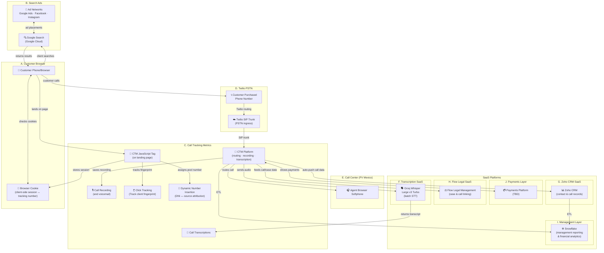

## 2. Customer Acquisition (Layers A–B)

### 2.1 Customer Phone/Browser (Layer A)

The customer journey begins on a mobile phone or desktop browser. The prospective
customer — typically someone seeking legal services — initiates a search that
eventually leads to a phone call with our call center.

**Customer profiles:**

- Mobile (majority): searching on iPhone/Android, may click-to-call directly from ad
- Desktop: searching on laptop/desktop, calls from cell phone after viewing landing page
- Returning visitor: may have previously visited the site, cookie may or may not persist

### 2.2 Google Search (Layer B)

Customers discover our services through search engines, predominantly Google Search.
The typical query pattern is service + location (e.g., "personal injury lawyer near me",
"car accident attorney Houston"). These searches trigger paid ads from the ad networks
described below, as well as organic search results pointing to our landing pages.

### 2.3 Ad Networks (Layer B)

Paid advertising across three platforms drives the majority of inbound call volume:

| Platform | Ad Format | Tracking Parameter | Click ID |
|----------|-----------|-------------------|----------|
| Google Ads | Search ads, display ads, call-only ads | `utm_source=google&utm_medium=cpc` | `gclid` (auto-appended) |
| Facebook Ads | News feed ads, story ads, lead forms | `utm_source=facebook&utm_medium=paid` | `fbclid` (auto-appended) |
| Instagram Ads | Feed ads, story ads, reels ads | `utm_source=instagram&utm_medium=paid` | `fbclid` (shared with Facebook) |

Each platform appends its own click identifier to the landing page URL. CTM's JavaScript
captures these parameters to attribute the eventual phone call back to the originating
ad click, campaign, and keyword.

**Google Ads call-only ads** are a special case: the customer taps to call directly from
the search results page without ever visiting a landing page. In this flow, Google
forwards the call to a Google forwarding number, which routes to CTM. Attribution
relies on Google's own call conversion tracking rather than CTM's DNI JavaScript.

---

## 3. Click Tracking & Source Attribution (Layer C)

### 3.1 CTM JavaScript Tag (Layer C)

Every landing page includes a CTM-provided JavaScript snippet that loads on page render.
This script performs two functions: tracking the visit and swapping the phone number.

**How it works today:**

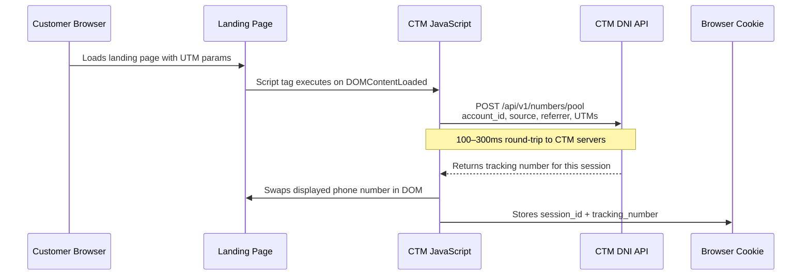

**CTM JavaScript snippet (typical):**

```html
<script type="text/javascript">
  var __ctm_loaded = false;
  (function() {
    var s = document.createElement('script');
    s.type = 'text/javascript';
    s.async = true;
    s.src = ('https:' == document.location.protocol ? 'https://' : 'http://')
            + 'ACCOUNT_ID.ctm.com/t.js';
    var p = document.getElementsByTagName('script')[0];
    p.parentNode.insertBefore(s, p);
  })();
</script>
```

The script identifies phone number elements on the page (by CSS class, data attribute,
or content matching) and replaces the static business number with a dynamically
assigned tracking number unique to that visitor session.

### 3.2 Dynamic Number Insertion — DNI (Layer C)

DNI is the mechanism that ties an ad click to a phone call. CTM maintains a pool of
phone numbers and assigns one to each visitor session. When the customer eventually
calls that number, CTM knows which ad, campaign, keyword, and landing page drove the
call.

**Number pool management:**

| Aspect | Current Behavior |
|--------|-----------------|
| Pool size | CTM manages the pool; numbers are provisioned through Twilio |
| Assignment | One tracking number per visitor session |
| Recycling | Number returns to pool after session expires (configurable timeout) |
| Shortage handling | If pool is exhausted, falls back to default business number (no attribution) |
| Number format | US local numbers matching the area code of the landing page's target market |

**Attribution chain:**

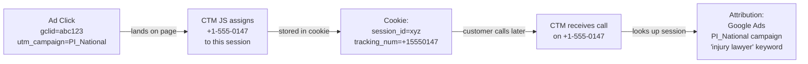

**Cookie dependency:** The entire attribution chain relies on the browser cookie
persisting between the page visit and the phone call. This is fragile — cookies
can be cleared, blocked by Safari ITP, stripped by ad blockers, or absent entirely
in incognito mode. When the cookie is lost, the call still arrives at CTM but
without source attribution, appearing as an "unattributed" or "direct" call.

---

## 4. PSTN Call Path (Layer D)

When the customer dials the tracking number, the call traverses the public telephone
network (PSTN) through Twilio's infrastructure before reaching CTM.

### 4.1 Call Flow: Customer to CTM

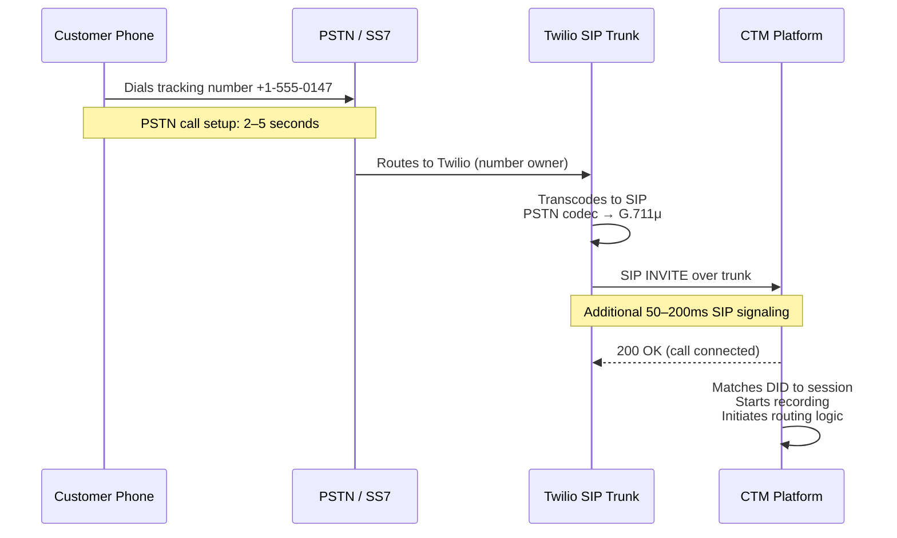

### 4.2 Twilio SIP Trunking

Twilio serves as the PSTN-to-SIP bridge. CTM uses Twilio SIP trunking to receive
inbound calls and make outbound calls.

| Parameter | Value |
|-----------|-------|
| Service | Twilio Elastic SIP Trunking |
| Inbound | Twilio owns the tracking numbers, routes to CTM via SIP trunk |
| Outbound | CTM sends SIP to Twilio for PSTN termination |
| Codec | G.711μ (PCMU) — Twilio transcodes from PSTN as needed |
| Recording | CTM handles recording (not Twilio) |
| Billing model | Per-minute: ~$0.0085/min inbound PSTN + ~$0.005/min SIP trunk |
| Combined cost | ~$0.0135/min (double billing — PSTN leg + SIP leg) |
| Number porting | 2–4 weeks to port numbers away from Twilio |

---

## 5. CTM Platform (Layer C)

CallTrackingMetrics (CTM) is the central hub of the legacy architecture. It receives
calls from Twilio, routes them to agents, records conversations, provides basic
transcription, and pushes data to downstream systems.

### 5.1 Core CTM Functions

| Function | How It Works Today |
|----------|-------------------|
| **Call routing** | GUI-configured routing rules: time-of-day, geo, round-robin, sequential ring |
| **IVR** | Basic auto-attendant with DTMF menu trees |
| **Call recording** | Automatic recording of all calls; stored in CTM cloud |
| **Transcription** | CTM's built-in transcription (provider unknown, likely third-party ASR) |
| **Call scoring** | Manual agent scoring via CTM interface |
| **Reporting** | Web dashboard with call volume, duration, source attribution, agent performance |
| **Number management** | CTM manages tracking number pools provisioned via Twilio |
| **Whisper/announce** | Pre-connect message to agent ("This call is from Google Ads - PI campaign") |

### 5.2 CTM Call Routing

When a call arrives from Twilio, CTM's routing engine determines which agent or
group should receive it.

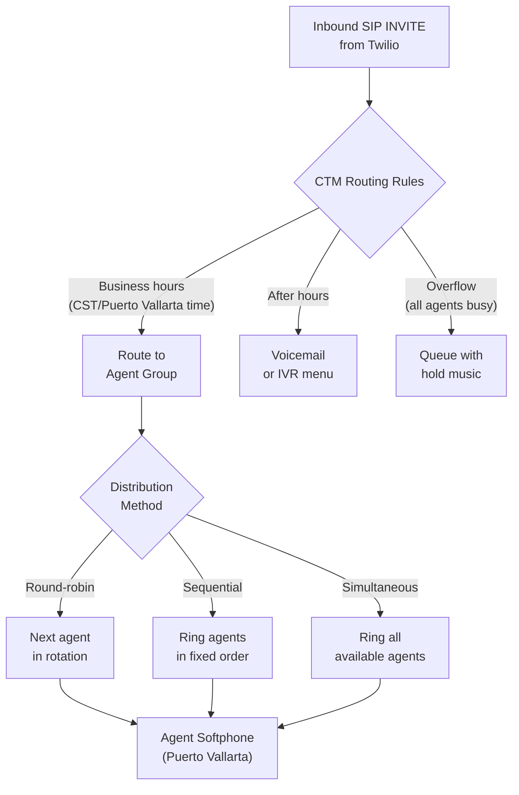

### 5.3 Call Recording & Storage

CTM records all calls automatically. Recordings are stored in CTM's cloud
infrastructure with no direct access to raw files.

| Aspect | Current State |
|--------|--------------|
| Format | Proprietary; accessible via CTM dashboard and API |
| Storage location | CTM cloud (vendor-controlled) |
| Retention | Per CTM account settings |
| Download | Manual download through CTM UI; API access with rate limits |
| Bulk export | Limited; subject to API rate limiting |
| Ownership | Recordings are in CTM's infrastructure — portability is a concern |

### 5.4 CTM Billing

CTM adds its own per-minute charges on top of Twilio's charges, creating a
two-layer billing structure:

| Cost Layer | Rate | Monthly (50K min) |
|------------|------|-------------------|
| Twilio PSTN + SIP | ~$0.0135/min | ~$675 |
| CTM platform fee | Per-minute + subscription | Varies by plan |
| **Total carrier + platform** | ~$0.02+/min | **~$1,000+** |

---

## 6. Call Center Agents (Layer E)

### 6.1 Agent Location: Puerto Vallarta, Mexico

The call center operates from **Puerto Vallarta, Jalisco, Mexico**. All agents
connect to CTM from this location, which introduces cross-border networking
considerations.

**Network topology:**

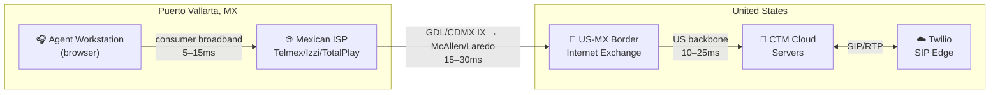

**Latency profile (Puerto Vallarta → CTM):**

| Segment | Typical RTT |
|---------|-------------|
| Agent → Mexican ISP PoP | 5–15ms |
| Mexican ISP → US border crossing | 15–30ms |
| US border → CTM cloud | 10–25ms |
| **Total round-trip** | **30–70ms** |

This is within acceptable limits for voice (ITU-T G.114 recommends < 150ms one-way),
but leaves limited headroom for packet loss and jitter on consumer-grade ISPs.

### 6.2 Agent Experience

Agents interact with CTM through a browser-based interface. The current agent
experience has several limitations that affect productivity.

**What agents have today:**

| Capability | Status | Notes |
|------------|--------|-------|
| Browser softphone | ✅ | CTM's built-in WebRTC softphone |
| Call controls (answer, hold, transfer, hangup) | ✅ | Standard CTM interface |
| Caller ID / source display | ✅ | CTM shows tracking source before connect |
| Whisper message | ✅ | Pre-connect audio: "Google Ads - PI National" |
| Call recording indicator | ✅ | Visible in CTM dashboard |
| Queue visibility | ⚠️ Limited | Basic queue stats, no real-time agent dashboard |
| Live transcription | ❌ | Not available during calls |
| AI coaching / suggestions | ❌ | Not available |
| Real-time sentiment | ❌ | Not available |
| Dynamic call scripts | ❌ | Static scripts only (no context adaptation) |
| Supervisor live monitoring | ⚠️ Limited | Listen-only; no whisper or barge |
| Post-call disposition | ✅ | Manual entry after each call |
| CRM screen pop | ⚠️ Limited | Basic integration; no form pre-fill |

### 6.3 Internet Reliability Concerns

Agents rely on consumer-grade Mexican ISPs with no dedicated circuits. This
creates reliability risks:

| ISP | Service | Known Issues |
|-----|---------|-------------|
| Telmex/Infinitum | DSL/Fiber | Frequent micro-outages, congestion during peak hours |
| Izzi | Cable | Speed fluctuations, regional outages |
| TotalPlay | Fiber | Better reliability but limited availability |
| **Failover** | Telcel 4G/5G mobile hotspot | Manual switch; adequate for voice but variable latency |

**Current failover strategy:** Largely manual. If an agent's internet drops during
a call, the call is lost. There is no automatic device failover, no ICE restart
capability, and no secondary ISP auto-switching at the network level.

---

## 7. Call Transcription (Layer F)

Call transcription operates in two tiers: CTM's built-in transcription and a
supplemental Groq Whisper pipeline for higher-accuracy results.

### 7.1 CTM Native Transcription

CTM provides post-call transcription as a platform feature. Transcripts appear in
the CTM dashboard after call completion.

| Aspect | Current State |
|--------|--------------|
| Timing | Post-call only (no live transcription) |
| Latency | 1–15 minutes after call ends |
| Accuracy | Moderate — CTM's ASR provider is not disclosed |
| Speaker diarization | Basic (caller vs. agent) |
| Searchability | Within CTM dashboard only |
| Export | Via CTM API (rate-limited) |
| Custom vocabulary | Not available |
| Languages | English primarily |

### 7.2 Groq Whisper Large v3 Turbo (Supplemental)

For higher-accuracy transcription, call recordings are processed through
**Groq Whisper Large v3 Turbo** — a hosted inference endpoint running
OpenAI's Whisper Large v3 Turbo model on Groq's LPU hardware.

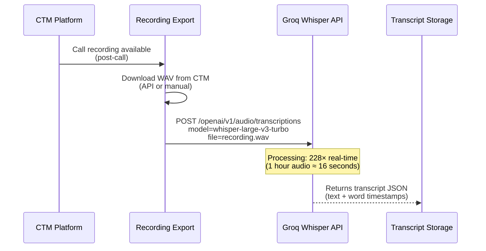

**Groq Whisper specs:**

| Parameter | Value |
|-----------|-------|
| Model | `whisper-large-v3-turbo` |
| API endpoint | `https://api.groq.com/openai/v1/audio/transcriptions` |
| API compatibility | OpenAI-compatible (drop-in replacement) |
| Processing speed | 228× real-time |
| Cost | $0.04/hour ($0.00067/min) |
| Monthly cost (50K min/mo) | ~$33 |
| Max file size | 25 MB per request |
| Word-level timestamps | ✅ |
| Speaker diarization | ❌ Not built-in (Whisper limitation) |
| Languages | 100+ (Whisper multilingual) |
| Custom vocabulary | Prompt-only (224 token limit) |
| Accuracy (WER) | ~10–12% (Whisper v3 Turbo baseline) |

**Current workflow limitations:**

- Recordings must be exported from CTM before Groq processing (manual or scripted)
- No real-time / streaming transcription (batch only)
- No automatic pipeline — requires orchestration outside CTM
- Two transcripts exist (CTM's and Groq's) with no single source of truth
- No speaker diarization without additional post-processing

---

## 8. Zoho CRM Integration (Layer G)

CTM auto-pushes call data to Zoho CRM after each call completes. This is the
primary CRM where contact records, call history, and lead information are maintained.

### 8.1 Integration Flow

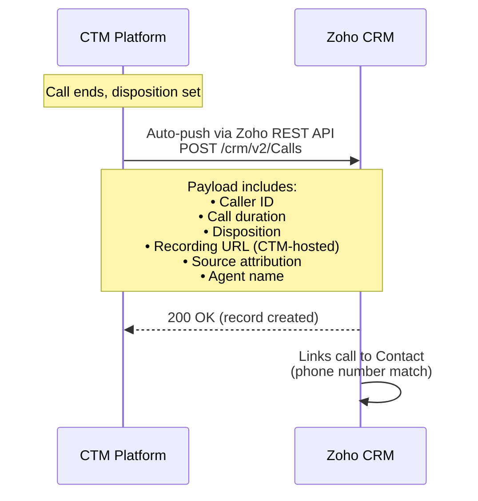

### 8.2 Data Pushed to Zoho

| Field | Source | Notes |
|-------|--------|-------|
| Caller phone number | CTM call record | Used to match/create Contact |
| Call duration | CTM call record | |
| Call type | CTM | Inbound / Outbound |
| Disposition | Agent (manual) | Set by agent post-call |
| Recording URL | CTM-hosted link | Plays back through CTM; breaks if CTM is decommissioned |
| Source / campaign | CTM attribution | From DNI session tracking |
| Agent name | CTM | Who handled the call |
| Call timestamp | CTM | When the call occurred |
| CTM transcript | CTM (if enabled) | CTM's native transcription text |

### 8.3 Zoho CRM Role

Zoho serves as the contact and lead management system:

| Function | How It's Used |
|----------|--------------|
| Contact records | Phone number, name, email, lead source |
| Call history | Log of all calls associated with a contact |
| Lead tracking | New callers create leads; repeat callers link to existing contacts |
| Pipeline management | Move leads through stages (New → Qualified → Retained → Closed) |
| Reporting | Call volume by source, conversion rates, agent performance |
| Team access | Agents and managers access Zoho for contact context |

> **Critical dependency:** Recording URLs in Zoho point to CTM-hosted files. If CTM
> is decommissioned, all historical recording links in Zoho will break unless recordings
> are migrated and URLs are updated.

---

## 9. Flow Legal Management Integration (Layer H)

CTM feeds call and case data to Flow Legal Management, the system used to manage
legal cases and client matters. This integration connects incoming calls to active
cases, enabling case managers to track client communication history.

### 9.1 Integration Flow

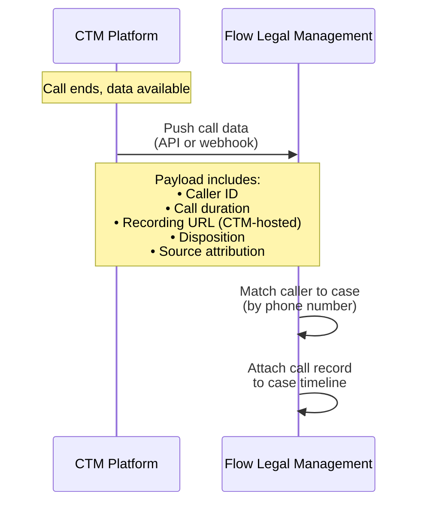

### 9.2 Data Pushed to Flow Legal

| Field | Source | Notes |
|-------|--------|-------|
| Caller phone number | CTM | Used to match to existing case/client |
| Call duration | CTM | |
| Recording URL | CTM-hosted | Same CTM dependency as Zoho |
| Disposition | Agent (manual) | |
| Call timestamp | CTM | |
| Source attribution | CTM | Ad source that drove the call |

### 9.3 Flow Legal's Role

| Function | How It's Used |
|----------|--------------|
| Case management | Track legal matters from intake through resolution |
| Client communication log | All calls linked to the relevant case |
| Document management | Case files, correspondence, recordings |
| Task management | Follow-ups, deadlines, assignments |
| Intake workflow | New callers can trigger intake case creation |

> **Critical dependency:** Like Zoho, recording links in Flow Legal point to CTM.
> CTM decommissioning requires recording migration and URL rewriting for both
> downstream systems.

---

## 10. Snowflake — Management Reporting & Analytics (Layer I)

### 10.1 Role in the Legacy Architecture

Snowflake serves as the data warehouse for management reporting, aggregating data
from multiple upstream systems into a single analytics layer.

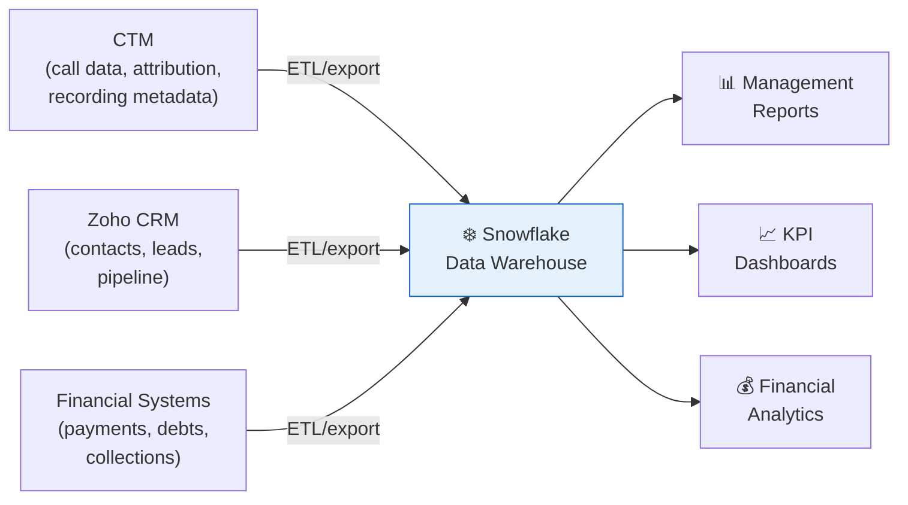

### 10.2 Data Sources

| Source | Data Fed to Snowflake |
|--------|----------------------|
| CTM | Call volumes, duration, disposition, source attribution, agent performance |
| Zoho CRM | Lead pipeline, contact history, conversion rates |
| Financial/payments | Client payments, outstanding debts, collections status |

### 10.3 Reporting Capabilities

Snowflake enables cross-system queries that no individual vendor can provide on its
own — for example, correlating ad spend attribution (CTM) with case conversion rates
(Zoho) and revenue collected (financial data).

| Report Category | Example Queries |
|----------------|-----------------|
| Call center performance | Calls per agent, average handle time, disposition rates |
| Marketing attribution | Cost per lead by campaign, conversion rate by ad source |
| Financial | Revenue per case type, outstanding debt aging, collection rates |
| Cross-system | Ad spend → call → case → payment (full funnel ROI) |

> **Vendor dependency:** Snowflake queries depend on data exports from CTM and Zoho.
> Replacing CTM requires redirecting the call data ETL pipeline. Replacing Zoho
> requires redirecting the CRM data pipeline. Both pipelines must be replicated
> or replaced before Snowflake (or its successor) can produce accurate reports.

---

## 11. Payments (Layer J)

The payments layer is planned but not yet implemented. The specific platform (e.g.,
LawPay, Stripe, or a custom integration) is TBD. This layer will handle client
payments, billing, and collections data — feeding into the management reporting
layer (Snowflake / Layer I) for full-funnel ROI analysis from ad spend through
to revenue collected.

---

## 12. End-to-End Data Flow Summary

The complete legacy data flow, showing how information moves through all ten layers (A–J):

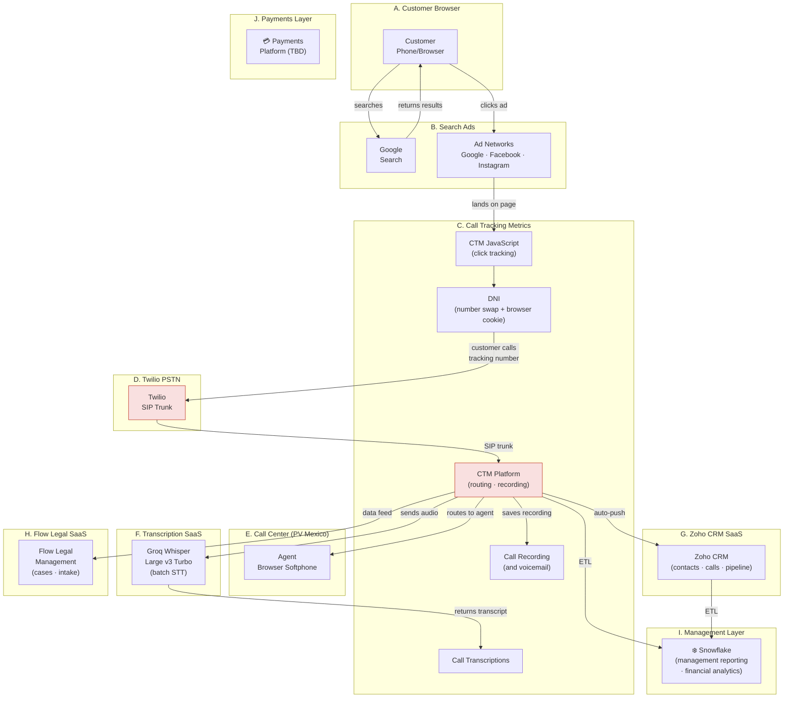

> **The red nodes (CTM + Twilio) are the components targeted for replacement.**
> CTM is the single point of failure for routing, recording, transcription, and
> all downstream integrations. Twilio is the sole PSTN carrier with 2–4 week
> number porting timelines.

---

## 13. Technology Stack (Legacy)

| Layer | Technology | Role |
|-------|-----------|------|
| **A. Customer Browser** | Mobile/desktop browser | Customer search, ad click, page visit |
| **B. Search Ads** | Google Ads, Facebook Ads, Instagram Ads | Customer acquisition, paid search/social |
| **C. Call Tracking** | CTM JavaScript tag, CTM Platform | DNI, session tracking, source attribution, routing, recording |
| **C. Session Storage** | Browser cookies (via CTM JS) | Links page visit to phone call |
| **D. PSTN Carrier** | Twilio Elastic SIP Trunking | Inbound/outbound PSTN ↔ SIP bridge |
| **E. Call Center** | CTM browser softphone (WebRTC) | Call handling, disposition, basic CRM view |
| **E. Agent Location** | Puerto Vallarta, Jalisco, Mexico | Consumer ISPs (Telmex/Izzi/TotalPlay) |
| **F. Transcription** | Groq Whisper Large v3 Turbo | Batch post-call, high accuracy, $0.04/hr |
| **F. Transcription (native)** | CTM built-in ASR | Post-call, moderate accuracy |
| **G. CRM** | Zoho CRM | Contact records, call history, lead pipeline |
| **H. Case Management** | Flow Legal Management | Legal case tracking, intake, call-case linking |
| **I. Data Warehouse** | Snowflake | Management reporting from CTM, Zoho, and financial/payments data |
| **J. Payments** | TBD | Client payments, billing, collections |

---

## 14. Vendor Dependencies & Decommissioning Risks

CTM is the hub that all other systems depend on. Removing it requires replacing
every integration it provides.

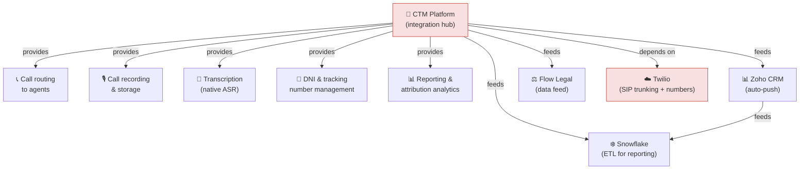

**Decommissioning prerequisites (CTM cannot be removed until all are met):**

1. ✅ Alternative call routing operational (agent calls connect without CTM)
2. ✅ Call recording with accessible storage (not vendor-locked)
3. ✅ Transcription pipeline producing searchable transcripts
4. ✅ DNI / click tracking / source attribution operational
5. ✅ Zoho CRM receiving call data via new integration
6. ✅ Flow Legal Management receiving call/case data via new integration
7. ✅ Historical recordings migrated from CTM (or acceptance of data loss)
8. ✅ Twilio numbers ported to new carrier (Telnyx) or new numbers provisioned
9. ✅ Snowflake ETL pipelines redirected from CTM/Zoho to new data sources

---

## 15. Cross-References

| Document | Purpose |
|----------|---------|
| [ARCHITECTURE_OPPORTUNITIES.md](./ARCHITECTURE_OPPORTUNITIES.md) | Inefficiency analysis and five redesign opportunities |
| ARCHITECTURE_VISION.md *(forthcoming)* | Target-state RustPBX platform design, technology decisions, and implementation stages |
| [TESTING_PLAN_OF_ACTION.md](./TESTING_PLAN_OF_ACTION.md) | Nine-stage testing strategy for the replacement platform |
| [PROJECT_OVERVIEW.md](./PROJECT_OVERVIEW.md) | High-level project summary and RustPBX capabilities |
