# Architecture Opportunities: Legacy CTM → RustPBX Platform

> **Document Purpose:** Step-by-step analysis of the current CallTrackingMetrics (CTM) + Twilio
> call tracking workflow, identifying latency, cost, and control inefficiencies at every layer,
> with concrete redesign opportunities for the RustPBX replacement platform.
>
> **Last Updated:** 2026-02-22

---

## Executive Summary

Preliminary architectural analysis indicates that we can dramatically improve system functionality, decrease system latency, and reduce overall system costs (better, faster, cheaper).

The current architecture routes every customer interaction through
**6+ external vendors** and **7+ disconnected data silos**, creating
compounding cost, latency, and control problems at every layer. The
eight redesign opportunities below eliminate these inefficiencies by
bringing ownership in-house — replacing vendor-locked middleware with
direct integrations and a unified PostgreSQL data layer.

**Latency improvements across the stack.** The legacy CTM + Twilio
architecture introduces compounding delays at every layer. Replacing it
with Telnyx SIP trunking and Linode-hosted RustPBX eliminates entire
network hops and vendor processing stages. The table below summarizes
before-and-after latency based on vendor-published specifications:

| Layer | Legacy (CTM + Twilio) | Target (Telnyx + RustPBX) | Improvement |
|---|---|---|---|
| **Page load (DNI number swap)** | 100–300ms (external CTM API round-trip per page view) | <10ms (self-hosted Linode endpoint, same-region) | 10–30× faster |
| **Call setup (post-dial delay)** | 5–10s typical (Twilio double-hop: PSTN GW → transcoder → SIP trunk → CTM routing) | <1s WebRTC / 2–4s PSTN via Telnyx single-hop | 60–90% reduction |
| **Audio path (per-packet RTT)** | 200–400ms (3 processing stages: Twilio PSTN GW → transcoder → SIP trunk → CTM → agent) | 50–100ms (single SIP hop: Telnyx private network → RustPBX → agent) | 75% reduction |
| **Agent path (US → PV, Mexico)** | +30–80ms RTT added (consumer ISP, no failover, no edge PoP) | +10–30ms RTT (Telnyx AnchorSite or Linode regional proxy + cellular backup) | 50–60% reduction |
| **Transcription availability** | 1–15 min post-call (CTM batch ASR, locked vendor) | <300ms streaming during live call (Deepgram Nova-3, 150ms first-word) | Real-time vs. batch |
| **Management reporting** | Hours (Snowflake batch ETL from 3+ vendor pipelines) | <1s (PostgreSQL materialized views, live data) | Real-time vs. batch |

**Cumulative system latency (end-to-end audio round-trip through full stack):**
The legacy architecture's multi-vendor chain — Twilio PSTN
gateway, Twilio transcoder, Twilio SIP trunk, CTM call router, and
Mexico ISP path — accumulates **~300–600ms round-trip audio latency**
before the caller hears the agent speak.
The target architecture's single-hop path — Telnyx private network direct
to RustPBX on Linode delivers **~80–150ms round-trip**, well within the industry-standard
150ms one-way threshold where latency becomes imperceptible (per Twilio
and Telnyx published guidelines). For WebRTC calls that bypass PSTN
entirely, round-trip latency drops to **~40–80ms** — competitive with
local phone calls.

*Sources: Twilio PDD documentation (5s typical North America), Twilio
Voice Insights FAQ (150ms one-way acceptable), Telnyx AnchorSite
documentation (20ms normal VoIP), Deepgram Nova-3 benchmarks (sub-300ms
streaming ASR, 150ms first-word latency).*

**4.1 — Own the Click: First-Party Ad Tracking API.** Replaces CTM's JavaScript tag and DNI API with a self-hosted tracking endpoint. Eliminates the 100–300ms external API penalty on every page load, breaks the dependency on third-party cookies for attribution, and creates a unified click → call → outcome database. Server-side conversion APIs (Google Ads, Meta CAPI) provide cookie-independent attribution that survives ITP, ad blockers, and incognito mode.

**4.2 — Own the Form: Integrated Lead Capture.** Unifies form submissions and phone calls under a single session identity. Agents receive a screen pop with the caller's form data before answering — name, inquiry, and ad source all visible in one view. Eliminates the need for separate form tools (HubSpot, Typeform) and enables single-query conversion analytics across clicks, forms, and calls.

**4.3 — Own the Call Path: Click-to-Call via WebRTC.** Offers an internet-only call option that bypasses PSTN entirely. Call setup drops from 5–10 seconds to under 1 second. Per-minute cost drops from ~$0.0135 to $0.00 for WebRTC calls. Opus wideband audio delivers superior quality over G.711 PSTN. Video calling becomes possible — a capability the legacy stack cannot support at all. Customers stay on the landing page during the call, preserving full session context.

**4.4 — Own the Intelligence: Real-Time Transcription & AI Coaching.** Streams live call audio to Deepgram Nova-3 for real-time transcription visible to agents during the call — not 1–15 minutes after it ends. An LLM coaching engine surfaces suggested responses, objection handling, and compliance alerts (HIPAA/TCPA/PCI) while the agent can still act on them. Post-call, Groq Whisper Turbo generates a final high-accuracy transcript at $0.04/hour. Auto-generated summaries and disposition codes eliminate manual post-call work.

**4.5 — Own the Numbers: Direct Telnyx Integration.** Cuts out both CTM and Twilio from the number management chain. Inbound per-minute cost drops from ~$0.0135 (Twilio PSTN + SIP combined) to ~$0.005 (Telnyx direct) — a **63% reduction**. Numbers are provisioned and ported under our control via Telnyx API, eliminating the 2–4 week Twilio porting timeline. Single SIP trunk with built-in redundancy replaces the current double-hop architecture.

**4.6 — Own the CRM Feed: Direct Zoho Integration.** Replaces CTM's auto-push with a direct RustPBX → Zoho pipeline that delivers richer data: searchable transcript text, AI-generated call summaries, sentiment scores, compliance flags, and correlated form submissions. Self-hosted recording URLs eliminate the risk of broken links if CTM is decommissioned. Full control over field mapping replaces CTM's fixed schema.

**4.7 — Own the Case Pipeline: Direct Flow Legal Integration.** Builds a direct RustPBX → Flow Legal feed with searchable transcripts for case discovery, AI intake summaries that replace manual agent notes, and automatic compliance flagging. Self-hosted recordings and form-call correlation provide complete intake context. Reduces manual data entry for legal staff and enables transcript-based case search that the legacy stack cannot support.

**4.8 — Own the Analytics: Replace Snowflake with PostgreSQL.** Once all data lives in PostgreSQL (calls, clicks, forms, CRM, cases, payments), Snowflake becomes redundant. Real-time dashboards replace batch-lag reports. Full-funnel queries — ad click → call → case → payment — run in a single SQL statement. New metrics require a SQL view, not a multi-system ETL change. Eliminates Snowflake compute billing and ETL pipeline maintenance entirely.

**Combined financial impact (annual vendor spend):**

| Vendor / Cost Center | Annual Spend | Replaced By | Target Cost |
| --- | --- | --- | --- |
| CTM (includes Twilio PSTN) | $300,000 | RustPBX + Telnyx SIP | — |
| Zoho CRM | $200,000 | Rust CRM engine + PostgreSQL | — |
| Flow Legal Management | $200,000 | Rust case engine + PostgreSQL | — |
| Snowflake | $50,000 | PostgreSQL materialized views | — |
| SysTango Development | $250,000 | In-house developers | — |
| **Total legacy SaaS** | **$1,000,000/yr** | | |

**Estimated RustPBX platform cost:**

| Cost Center | Annual Estimate | Notes |
| --- | --- | --- |
| Linode VPS + storage | $50,000 | 3 servers + 5 TB storage |
| Telnyx PSTN | $50,000 | ~500K min @ $0.01/min + 100 lines |
| IT infrastructure staff (×2) | $100,000 | Two for redundancy, not 100% utilized |
| Rust + SQL developers (×2) | $100,000 | Platform development and maintenance |
| **Total RustPBX platform** | **$300,000/yr** | |

Net Annual SAVINGS: **~$700,000/yr (70% reduction).**

Remaining variable costs (Deepgram/Groq transcription usage) are
incremental and scale with call volume.

Beyond direct cost savings, the platform gains capabilities the legacy
stack cannot provide at any price: real-time transcription, real-time
AI agent coaching, video calling, cookie-independent attribution, and
single-database full-funnel analytics.

---

## Table of Contents

- [Architecture Opportunities: Legacy CTM → RustPBX Platform](#architecture-opportunities-legacy-ctm--rustpbx-platform)
  - [Executive Summary](#executive-summary)
  - [Table of Contents](#table-of-contents)
  - [1. Current Workflow Overview](#1-current-workflow-overview)
  - [2. Step-by-Step Legacy Flow](#2-step-by-step-legacy-flow)
    - [Step 1: Customer Searches and Clicks an Ad (Layers A–B)](#step-1-customer-searches-and-clicks-an-ad-layers-ab)
    - [Step 2: Landing Page Loads CTM JavaScript (Layer C)](#step-2-landing-page-loads-ctm-javascript-layer-c)
    - [Step 3: Cookie Storage and Number Swap (Layer C)](#step-3-cookie-storage-and-number-swap-layer-c)
    - [Step 4: Customer Calls the Tracking Number (Layer D)](#step-4-customer-calls-the-tracking-number-layer-d)
    - [Step 5: Twilio Receives and Trunks the Call (Layer D)](#step-5-twilio-receives-and-trunks-the-call-layer-d)
    - [Step 6: CTM Routes, Records, and Transcribes (Layer C)](#step-6-ctm-routes-records-and-transcribes-layer-c)
    - [Step 7: Agent Handles the Call (Layer E — Puerto Vallarta, Mexico)](#step-7-agent-handles-the-call-layer-e--puerto-vallarta-mexico)
    - [Step 8: CTM Transcribes the Call (Layer F — Vendor-Locked ASR)](#step-8-ctm-transcribes-the-call-layer-f--vendor-locked-asr)
    - [Step 9: CTM Pushes Data to Zoho CRM (Layer G)](#step-9-ctm-pushes-data-to-zoho-crm-layer-g)
    - [Step 10: CTM Feeds Data to Flow Legal Management (Layer H)](#step-10-ctm-feeds-data-to-flow-legal-management-layer-h)
    - [Step 11: CTM and Zoho Feed Snowflake for Management Reporting (Layer I)](#step-11-ctm-and-zoho-feed-snowflake-for-management-reporting-layer-i)
  - [3. Inefficiency Analysis by Layer](#3-inefficiency-analysis-by-layer)
    - [3.1 Ad Click Attribution (Layer B)](#31-ad-click-attribution-layer-b)
    - [3.2 Browser-Side Tracking (Layer C)](#32-browser-side-tracking-layer-c)
    - [3.3 PSTN Call Path (Layer D)](#33-pstn-call-path-layer-d)
    - [3.4 Twilio SIP Trunking (Layer D)](#34-twilio-sip-trunking-layer-d)
    - [3.5 CTM Platform (Layer C)](#35-ctm-platform-layer-c)
    - [3.6 Agent Experience (Layer E)](#36-agent-experience-layer-e)
    - [3.7 Agent Geographic Location (Layer E)](#37-agent-geographic-location-layer-e)
    - [3.8 Transcription (Layer F)](#38-transcription-layer-f)
    - [3.9 CRM Integration (Layer G — Zoho via CTM)](#39-crm-integration-layer-g--zoho-via-ctm)
    - [3.10 Case Management (Layer H — Flow Legal via CTM)](#310-case-management-layer-h--flow-legal-via-ctm)
    - [3.11 Management Reporting (Layer I — Snowflake)](#311-management-reporting-layer-i--snowflake)
  - [4. Redesign Opportunities](#4-redesign-opportunities)
    - [4.1 Own the Click: First-Party Ad Tracking API](#41-own-the-click-first-party-ad-tracking-api)
    - [4.2 Own the Form: Integrated Lead Capture](#42-own-the-form-integrated-lead-capture)
    - [4.3 Own the Call Path: Click-to-Call via WebRTC](#43-own-the-call-path-click-to-call-via-webrtc)
    - [4.4 Own the Intelligence: Real-Time Transcription \& AI Coaching](#44-own-the-intelligence-real-time-transcription--ai-coaching)
    - [4.5 Own the Numbers: Direct Telnyx Integration](#45-own-the-numbers-direct-telnyx-integration)
    - [4.6 Own the CRM Feed: Direct Zoho Integration](#46-own-the-crm-feed-direct-zoho-integration)
    - [4.7 Own the Case Pipeline: Direct Flow Legal Integration](#47-own-the-case-pipeline-direct-flow-legal-integration)
    - [4.8 Own the Analytics: Replace Snowflake with PostgreSQL](#48-own-the-analytics-replace-snowflake-with-postgresql)
  - [5. Target Architecture Summary](#5-target-architecture-summary)
    - [Before (Legacy)](#before-legacy)
    - [After (RustPBX Platform)](#after-rustpbx-platform)
  - [6. Implementation Priority](#6-implementation-priority)

---

## 1. Current Workflow Overview

The legacy call tracking architecture spans **ten layers (A–J)**, each owned by a different
vendor or system. A customer's journey from Google Search through ad click, phone call, agent
conversation, and downstream CRM/case management traverses all ten, accumulating latency, cost,
and data fragmentation at every boundary.

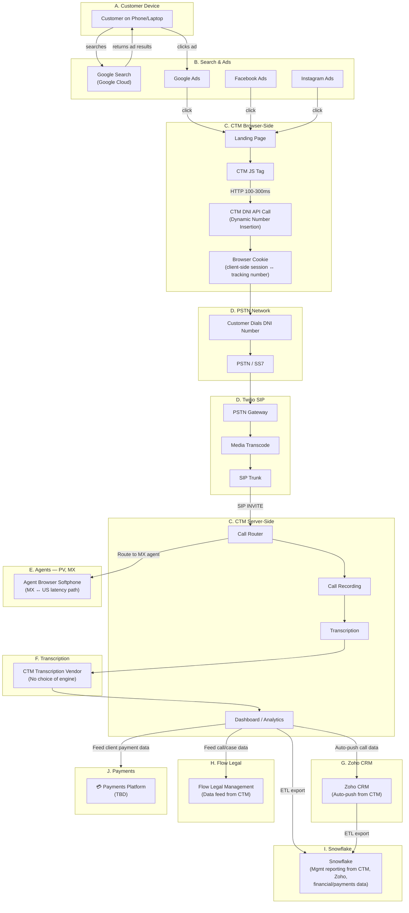

**Vendor dependencies:** 9+ external platforms (Twilio, CTM, Zoho, Flow Legal, Snowflake, AWS, Azure, GCC)

**Billing redundancies:** 3 separate per-call cost centers (ad spend, Twilio per-minute, CTM per-minute + platform fee)

**Data silos:** 7+ disconnected systems (each ad platform, Twilio logs, CTM analytics, Zoho CRM, Flow Legal, Snowflake, separate form tools)

**Integration hub:** CTM is the single point of failure — it feeds Zoho CRM, Flow Legal, and Snowflake. Removing CTM requires replacing all downstream integrations.

**Reporting layer:** Snowflake aggregates data from CTM and Zoho plus financial/payments data for management reporting. Both CTM and Zoho ETL pipelines must be redirected before Snowflake (or its replacement) can produce accurate reports.

**Geographic consideration:** Agents operate from Puerto Vallarta, Mexico — all SIP media and signaling traverses the US-Mexico internet path, adding latency and introducing internet reliability concerns.

---

## 2. Step-by-Step Legacy Flow

### Step 1: Customer Searches and Clicks an Ad (Layers A–B)

A prospective customer — on their phone or desktop browser — performs a **Google Search**
(or browses Facebook/Instagram) and sees a paid advertisement. They click through to our
landing page.

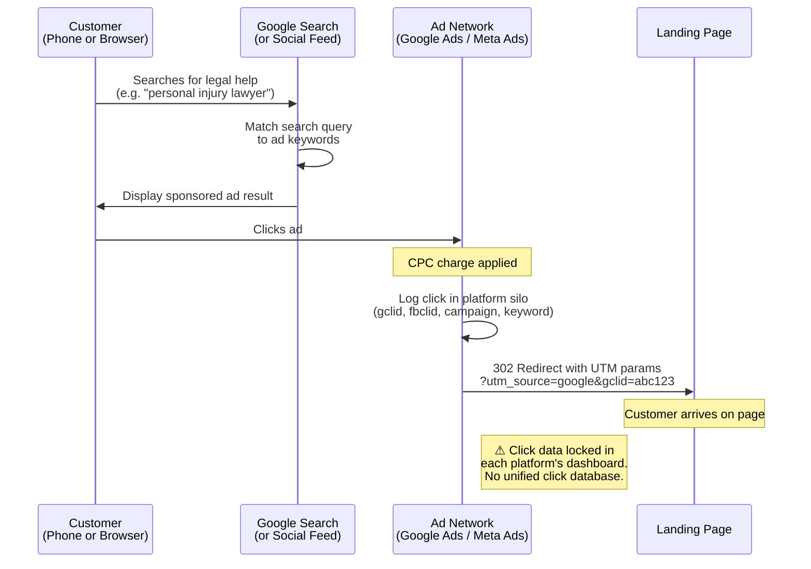

**What happens technically:**

- Customer initiates a **Google Search** query (or browses a social media feed) on their phone or desktop browser
- Google's ad auction matches the search query to our keyword bids and displays a sponsored result
- Customer clicks the ad; the ad platform registers a click event and charges our ad account (CPC or CPM model)
- Customer's browser is redirected to our landing page URL with UTM parameters and/or
  platform-specific click identifiers (gclid, fbclid, etc.) appended as query strings
- The ad platform logs the click in its own analytics silo (Google Ads dashboard, Meta Ads
  Manager, etc.)

**Data generated:** Search query (Google only), click ID, campaign ID, ad group, keyword match type,
placement (social), timestamp, device type (phone/desktop/tablet), geographic IP, referrer URL.

**Where data lives:** Locked inside each ad platform's proprietary dashboard. No unified
click-level data store under our control. Google Search query data requires separate Search Console
or Google Ads API access.

---

### Step 2: Landing Page Loads CTM JavaScript (Layer C)

The landing page HTML includes a CTM JavaScript tracking tag that fires on page load.

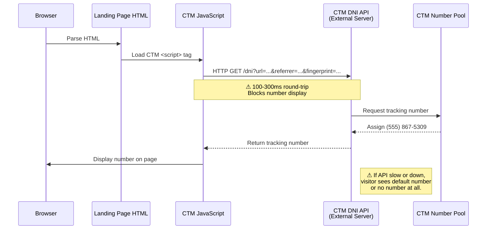

**Latency introduced:** 100–300ms for the external API round-trip to CTM servers. This blocks
the phone number from appearing on the page until the response returns. On slow connections or
CTM API degradation, the visitor may see the default number or no number at all.

---

### Step 3: Cookie Storage and Number Swap (Layer C)

The CTM JavaScript stores tracking data in the visitor's browser and performs the number swap.

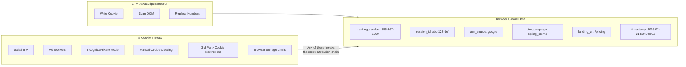

**Fragility:** The entire attribution chain depends on this cookie surviving. Browser cookie
clearing, private/incognito mode, ITP (Safari Intelligent Tracking Prevention), third-party
cookie restrictions, and ad blockers can all break the chain — silently. There is no fallback
attribution mechanism.

---

### Step 4: Customer Calls the Tracking Number (Layer D)

The customer sees the dynamically inserted phone number and dials it from their phone.

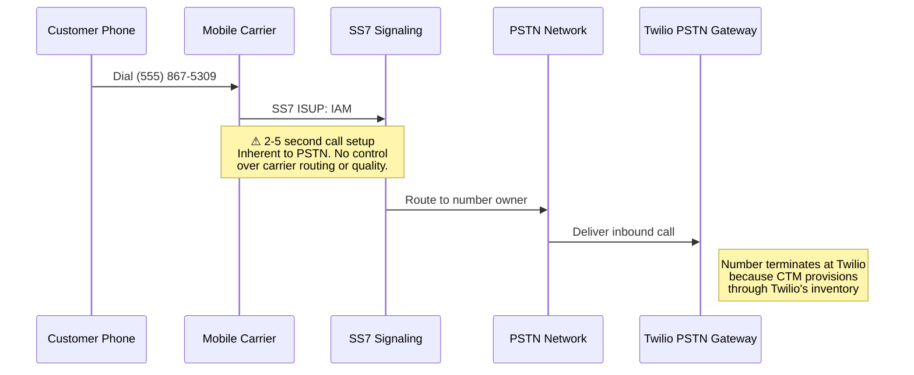

**Latency introduced:** Standard PSTN call setup (SS7 signaling) adds 2–5 seconds before the
first ring. This is inherent to the telephone network and applies to any PSTN-based architecture.
There is no control over carrier routing quality or path selection.

---

### Step 5: Twilio Receives and Trunks the Call (Layer D)

Twilio's PSTN gateway receives the inbound call and bridges it to CTM via SIP.

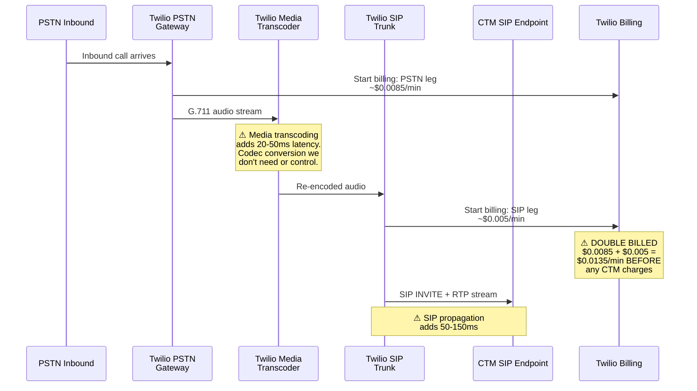

**Cost impact:** Twilio charges for both the inbound PSTN termination AND the outbound SIP
trunk — you pay twice for the same call. Current Twilio rates: ~$0.0085/min inbound +
~$0.005/min SIP = ~$0.0135/min combined before any CTM charges.

---

### Step 6: CTM Routes, Records, and Transcribes (Layer C)

CTM's platform receives the SIP INVITE and handles call management.

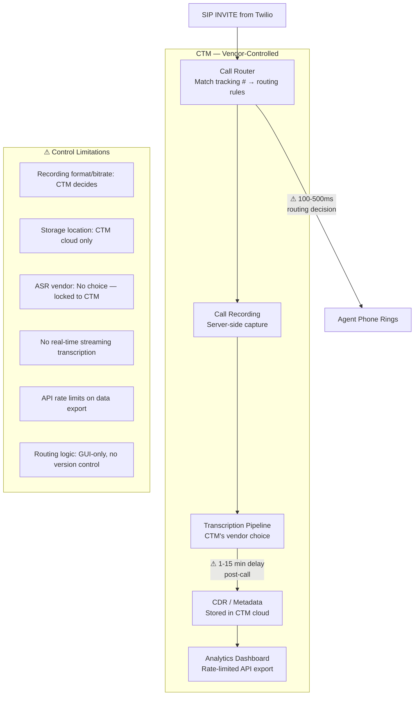

**Latency introduced:** CTM's routing decision adds 100–500ms before the agent's phone rings.
Transcription is typically available 1–15 minutes post-call depending on duration and queue depth.

**Control limitations:**

- Recording format, bitrate, and storage location are CTM's decisions, not ours
- Transcription vendor/model is whatever CTM has contracted — no ability to choose Deepgram
  vs. Groq vs. OpenAI Whisper based on our accuracy/cost preferences
- No real-time transcription streaming during live calls (post-call only on most tiers)
- API rate limits constrain data export for custom analytics
- Call data lives in CTM's cloud — we don't own the storage

---

### Step 7: Agent Handles the Call (Layer E — Puerto Vallarta, Mexico)

The agent — located in **Puerto Vallarta, Mexico** — receives the call via browser softphone
or desktop SIP client. All SIP signaling and RTP media traverse the US-Mexico internet path,
adding latency and introducing reliability concerns.

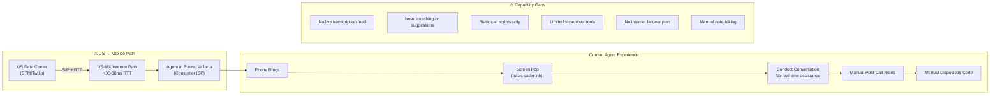

**Geographic and reliability concerns:**

- SIP signaling from CTM/Twilio US data centers to Puerto Vallarta adds **30-80ms round-trip**
  latency on top of PSTN call setup time
- Agent relies on **consumer-grade Mexican ISP** — no dedicated circuit or failover
- Internet outages in PV mean agents go completely offline with no automatic rerouting
- RTP media quality degrades if the US-MX path experiences jitter or packet loss
- No codec optimization for the international path (CTM/Twilio control codec selection)

**Capability gaps:**

- No live transcription feed visible to the agent during the call
- No real-time AI coaching or suggested responses
- Call scripts are static documents, not dynamically adapted to the conversation
- Supervisor monitoring is limited to CTM's barge/whisper features
- Post-call review is the only analysis option — no in-call intervention
- No failover strategy if Puerto Vallarta internet drops mid-call

---

### Step 8: CTM Transcribes the Call (Layer F — Vendor-Locked ASR)

After the call ends, CTM sends the recording to its own transcription vendor. We have
**no choice** of ASR engine, model, or pricing.

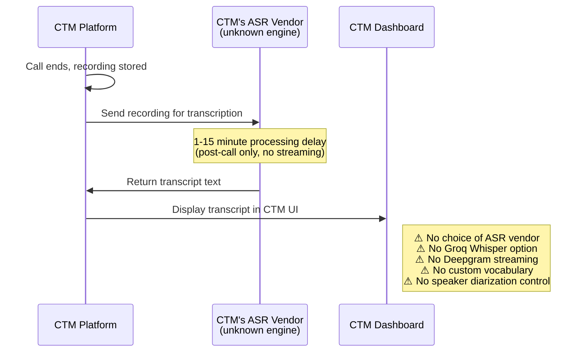

**What we cannot control today:**

- Which ASR model processes our recordings (CTM chooses the vendor)
- Transcription latency — always post-call, typically 1-15 minutes after call ends
- No real-time streaming transcription during live calls
- No custom vocabulary for legal/medical terminology our callers use
- No speaker diarization control (separating agent vs. caller)
- Transcript accuracy and language support are whatever CTM's vendor provides

**What we want (to be detailed in ARCHITECTURE_VISION.md):**

- **Groq Whisper Large v3 Turbo** for batch post-call transcription at $0.04/hour
- **Deepgram Nova-3** for real-time streaming transcription during live calls
- Full control over custom vocabulary, diarization, and model selection

---

### Step 9: CTM Pushes Data to Zoho CRM (Layer G)

CTM automatically pushes call data to **Zoho CRM** after each call. This is our CRM
system of record for customer contacts and sales pipeline.

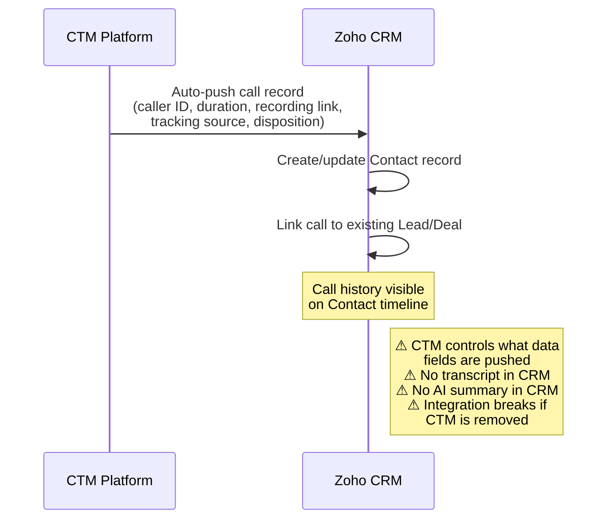

**What gets pushed today:**

- Caller phone number, call duration, timestamp
- Call recording link (points back to CTM-hosted recording)
- Tracking source / campaign attribution from DNI
- Agent who handled the call, disposition code

**What doesn't get pushed:**

- Full transcript text (too large for standard CRM push)
- AI-generated call summary or action items
- Sentiment analysis or compliance flags
- Form submission data correlated with the call

**Integration dependency:** Zoho CRM integration is **entirely dependent on CTM** as the middleware.
When we remove CTM, RustPBX must replicate this data push via Zoho's Telephony API or REST API.

---

### Step 10: CTM Feeds Data to Flow Legal Management (Layer H)

CTM feeds call and case data to **Flow Legal Management**, our case management system for
tracking legal matters tied to incoming calls.

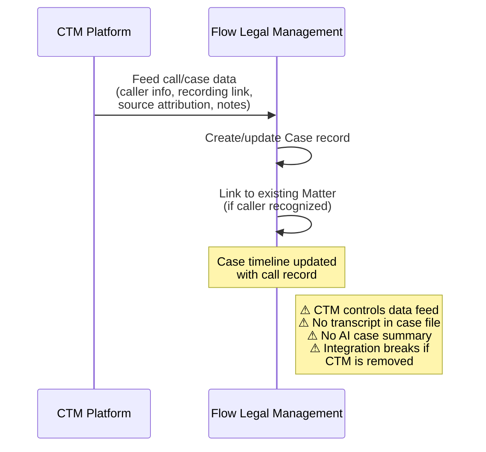

**What gets fed today:**

- Caller information and call metadata
- Call recording link (CTM-hosted)
- Source attribution from call tracking
- Agent notes and disposition

**What doesn't get fed:**

- Searchable transcript text for case discovery
- AI-generated case summary or intake notes
- Compliance flags (HIPAA/TCPA mentions detected during call)
- Linked form submissions from the same caller session

**Integration dependency:** Like Zoho, the Flow Legal integration runs through CTM.
Removing CTM requires building a direct RustPBX → Flow Legal data pipeline, likely via
Flow Legal's API or webhook integration.

---

### Step 11: CTM and Zoho Feed Snowflake for Management Reporting (Layer I)

Data from CTM and Zoho CRM is exported (ETL) into **Snowflake**, a cloud data warehouse
used for cross-system management reporting and financial analytics.

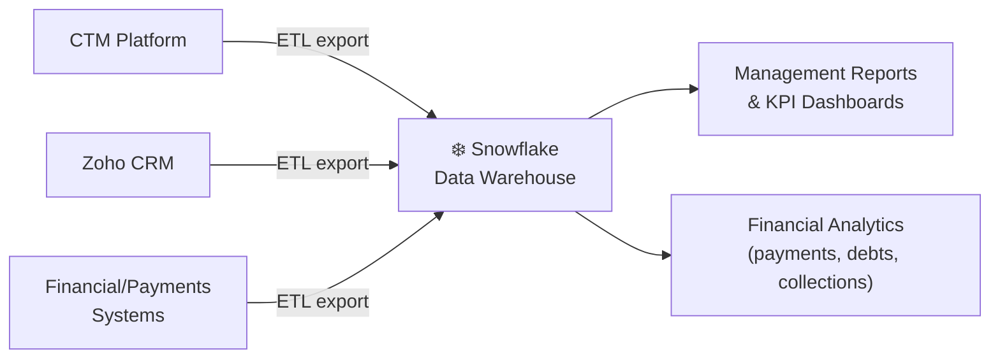

**What Snowflake enables today:**

- Cross-system queries (ad attribution → call → case → payment full-funnel ROI)
- Call center performance reporting (volume, handle time, disposition rates)
- Marketing attribution analytics (cost per lead by campaign, conversion rates)
- Financial reporting (revenue per case type, outstanding debt aging, collection rates)

**What doesn't work well:**

- Reports are only as current as the last ETL run — no real-time dashboards
- Data quality depends on CTM and Zoho exports being complete and consistent
- Adding new metrics requires modifying ETL pipelines across multiple source systems
- Three separate billing relationships (Snowflake compute, CTM data export, Zoho API)

**Data dependency:** Snowflake queries depend on data from CTM and Zoho. Replacing
either upstream system requires redirecting the corresponding ETL pipeline, or
Snowflake reports will go stale or break.

---

## 3. Inefficiency Analysis by Layer

### 3.1 Ad Click Attribution (Layer B)

| Inefficiency | Impact | Severity |
|---|---|---|
| Click data siloed per ad platform | No unified funnel view across Google, Meta, etc. | High |
| No server-side click logging | Dependent on client-side JS + cookies for attribution | High |
| UTM parameters are fragile | Users can modify URLs, parameters get stripped by redirects | Medium |
| No first-party click database | Cannot correlate clicks → calls → outcomes in one query | High |
| Platform-reported conversions lag | Google/Meta conversion APIs have 24-72hr attribution delays | Medium |

### 3.2 Browser-Side Tracking (Layer C)

| Inefficiency | Impact | Severity |
|---|---|---|
| External API dependency for DNI | 100-300ms page load penalty per visit | High |
| Cookie-based tracking chain | Breaks under ITP, ad blockers, private browsing | Critical |
| No form capture integration | Separate tools needed for lead forms vs. call tracking | Medium |
| Single-vendor number pool | CTM controls number inventory, porting, and pricing | High |
| No offline conversion bridge | Clicks that lead to in-store visits have no tracking path | Low |

### 3.3 PSTN Call Path (Layer D)

| Inefficiency | Impact | Severity |
|---|---|---|
| 2-5 second call setup latency | Inherent to PSTN, unavoidable for traditional calls | Medium |
| No internet-only call option | Every call must traverse PSTN even if both parties have broadband | High |
| Per-minute carrier charges | Applies to every call regardless of internal routing capability | Medium |
| No video call option | PSTN is audio-only by definition | Medium |

### 3.4 Twilio SIP Trunking (Layer D)

| Inefficiency | Impact | Severity |
|---|---|---|
| Double billing (PSTN + SIP legs) | ~$0.0135/min combined cost before CTM fees | High |
| Unnecessary media transcoding | 20-50ms latency for codec conversion we don't need | Medium |
| Vendor lock-in | Number porting from Twilio requires 2-4 week lead time | High |
| No codec negotiation control | Cannot optimize for Opus or wideband audio | Medium |
| Geographic routing opacity | No visibility into Twilio's internal call path decisions | Low |

### 3.5 CTM Platform (Layer C)

| Inefficiency | Impact | Severity |
|---|---|---|
| Second per-minute fee layer | CTM charges on top of Twilio charges | Critical |
| No real-time transcription | Post-call only on most plan tiers | High |
| Locked recording storage | Cannot choose format, retention, or storage location | High |
| Transcription vendor locked | No ability to benchmark or swap ASR providers | High |
| API rate limits on export | Constrains custom analytics and data warehousing | Medium |
| No agent coaching hooks | Platform has no LLM integration points | High |
| Routing logic is GUI-only | Cannot version-control or programmatically manage routes | Medium |

### 3.6 Agent Experience (Layer E)

| Inefficiency | Impact | Severity |
|---|---|---|
| No live transcription | Agent cannot see real-time text of conversation | High |
| No AI-assisted coaching | No suggested responses, objection handling, or compliance alerts | High |
| Static call scripts | Scripts don't adapt to conversation context | Medium |
| Limited supervisor tools | Barge/whisper only, no real-time dashboard of all active calls | Medium |
| Manual post-call work | Agent must hand-type notes and disposition codes | Medium |

### 3.7 Agent Geographic Location (Layer E)

| Inefficiency | Impact | Severity |
|---|---|---|
| US-MX internet path adds 30-80ms RTT | Voice quality degradation on international SIP path | High |
| Consumer-grade ISP in Puerto Vallarta | No dedicated circuit, no SLA for uptime or bandwidth | Critical |
| No internet failover strategy | ISP outage = agents completely offline, no automatic rerouting | Critical |
| No codec optimization for international path | CTM/Twilio control codec selection, cannot optimize for jitter | Medium |
| Jitter/packet loss on cross-border path | RTP media quality degrades unpredictably on consumer ISP | High |
| No regional SIP proxy | All signaling routes through US data center, no MX-local optimization | Medium |

### 3.8 Transcription (Layer F)

| Inefficiency | Impact | Severity |
|---|---|---|
| No choice of ASR engine | Cannot use Groq Whisper Turbo ($0.04/hr) or Deepgram Nova-3 | High |
| Post-call only transcription | 1-15 minute delay, no real-time streaming during live calls | High |
| No custom vocabulary | Cannot optimize for legal/medical terminology callers use | Medium |
| No speaker diarization control | Cannot reliably separate agent vs. caller in transcripts | Medium |
| Transcript locked in CTM | Cannot export/search transcripts outside CTM's dashboard | High |
| No transcript push to CRM/case mgmt | Zoho and Flow Legal don't receive searchable transcript text | High |

### 3.9 CRM Integration (Layer G — Zoho via CTM)

| Inefficiency | Impact | Severity |
|---|---|---|
| CTM is the sole integration middleware | Removing CTM breaks Zoho call data feed completely | Critical |
| No transcript text in CRM records | Zoho contact timeline has call metadata but not transcript | High |
| No AI summary in CRM | Agent must manually write call notes; no auto-generated summary | High |
| Recording links point to CTM-hosted files | If CTM account closes, all recording links in Zoho break | High |
| CTM controls pushed field mapping | Cannot customize which data fields Zoho receives | Medium |
| No form-to-call correlation in CRM | Web form submissions and related calls are not linked in Zoho | Medium |

### 3.10 Case Management (Layer H — Flow Legal via CTM)

| Inefficiency | Impact | Severity |
|---|---|---|
| CTM is the sole data feed source | Removing CTM breaks Flow Legal call/case data pipeline | Critical |
| No searchable transcript in case files | Legal case discovery cannot search call transcript text | High |
| No AI-generated intake summary | Agents manually create intake notes instead of auto-generated | High |
| Recording links depend on CTM hosting | CTM account closure orphans all recordings linked in cases | High |
| No compliance flag automation | HIPAA/TCPA/PCI mentions in calls not auto-flagged in case files | Medium |
| No form submission linkage | Web form submissions not correlated with related case calls | Medium |

### 3.11 Management Reporting (Layer I — Snowflake)

| Inefficiency | Impact | Severity |
|---|---|---|
| Reports lag behind reality (batch ETL) | Decisions made on stale data; no real-time dashboards | High |
| Depends on CTM + Zoho ETL pipelines | Replacing either upstream system breaks Snowflake reports | Critical |
| Three separate vendor billing layers | Snowflake compute + CTM data export + Zoho API costs compound | Medium |
| Adding new metrics requires multi-system ETL changes | Weeks of work to surface a new cross-system KPI | High |
| Financial/debt data pipeline is separate from call data | No unified view linking call activity to payment outcomes | High |
| No AI-enriched data in warehouse | Transcripts, sentiment, compliance flags not available for analytics | High |

---

## 4. Redesign Opportunities

### 4.1 Own the Click: First-Party Ad Tracking API

**Current state:** Ad clicks are logged only in each ad platform's dashboard. Our landing page
relies on CTM's JavaScript to capture attribution. We have no unified click database.

**Opportunity:** Build a lightweight first-party tracking API that our landing page calls on
every click event, logging attribution data directly into our PostgreSQL database before any
third-party dependency enters the picture.

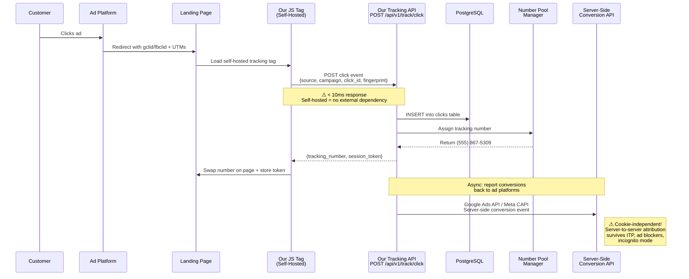

**Database schema (clicks table):**

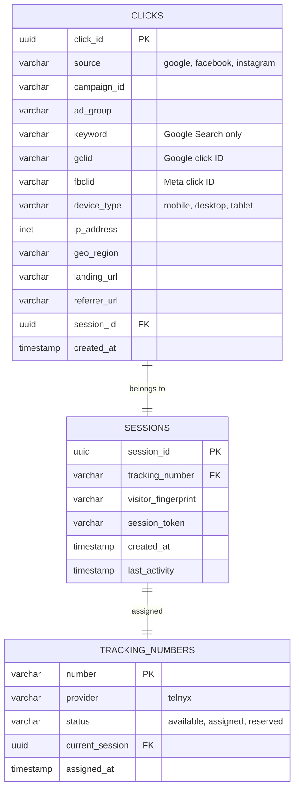

**Implementation approach:**

- Lightweight REST endpoint: `POST /api/v1/track/click` accepts source, campaign, click ID,
  and visitor fingerprint. Returns a JSON response with the assigned tracking number and a
  session token.
- Our own JavaScript tag (replacing CTM's) calls this endpoint on page load. The tag is
  self-hosted — zero external API dependency, sub-10ms response time since it hits our own
  infrastructure.
- Server-side click logging with Google Ads API / Meta Conversions API integration for
  bidirectional attribution (we report conversions back to the ad platforms via their
  server-side APIs, eliminating client-side cookie dependency for conversion reporting).
- Unified clicks table in PostgreSQL that can be JOINed directly to call records, form
  submissions, and outcomes in a single query.

**Benefits:**

- Eliminate 100-300ms CTM DNI API latency
- Cookie-independent server-side attribution (session tokens + server-side ad platform APIs)
- Unified click → call → outcome analytics in one database
- Full control over number pool management and assignment logic
- No per-request API rate limits from third parties

---

### 4.2 Own the Form: Integrated Lead Capture

**Current state:** Form submissions on landing pages use separate tools (HubSpot, Typeform,
Google Forms, etc.) that don't natively connect to call tracking data. Correlating "this person
filled out a form AND called" requires manual data stitching across platforms.

**Opportunity:** Build form capture directly into the tracking platform so that form submissions
and phone calls share the same session identity and attribution chain.

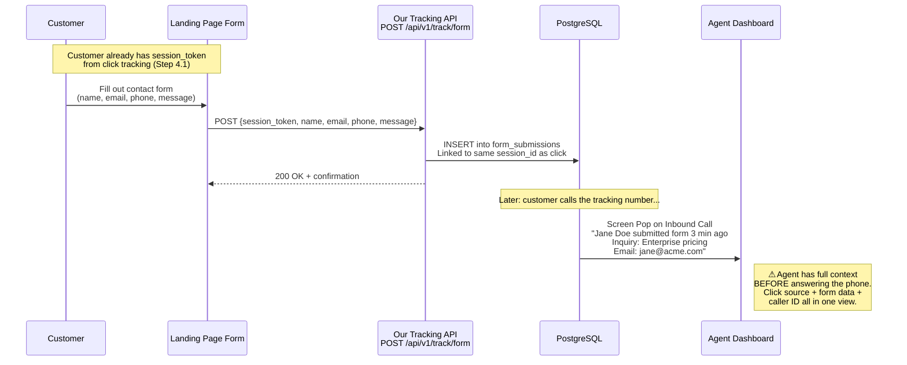

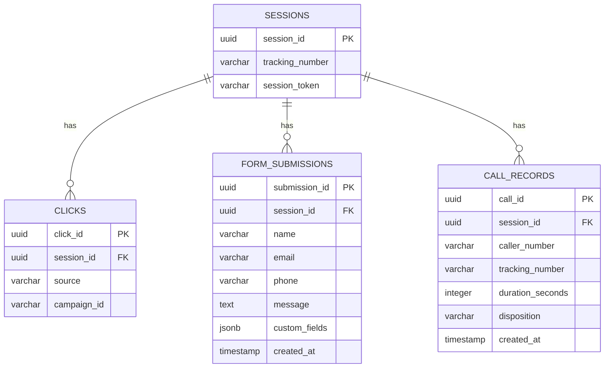

**Implementation approach:**

- Embeddable form component (Leptos WASM widget or lightweight JS) that submits to
  `POST /api/v1/track/form` with the session token from click tracking
- Form data stored in PostgreSQL with foreign key to the sessions/clicks table
- When the same visitor later calls, the agent gets a screen pop showing: "This caller
  submitted a form 3 minutes ago — Name: Jane Doe, Inquiry: Pricing for Enterprise plan"
- Form submissions can trigger automated actions: send confirmation email, create CRM contact,
  schedule callback, or initiate a proactive outbound call

**Benefits:**

- Single session identity across clicks, forms, and calls
- Agent context before they even answer the phone
- No separate form tool subscription
- Form + call conversion data in one analytics query

---

### 4.3 Own the Call Path: Click-to-Call via WebRTC

**Current state:** Every customer call must traverse the PSTN network, even when both the
customer (on a smartphone with LTE/WiFi) and the agent (on a SIP softphone with broadband)
have internet connectivity. This forces PSTN call setup latency, carrier charges, and audio
quality limitations onto every interaction.

**Opportunity:** Offer a click-to-call button on landing pages that initiates a direct
internet-based audio or video call from the customer's smartphone browser to our call center,
completely bypassing PSTN.

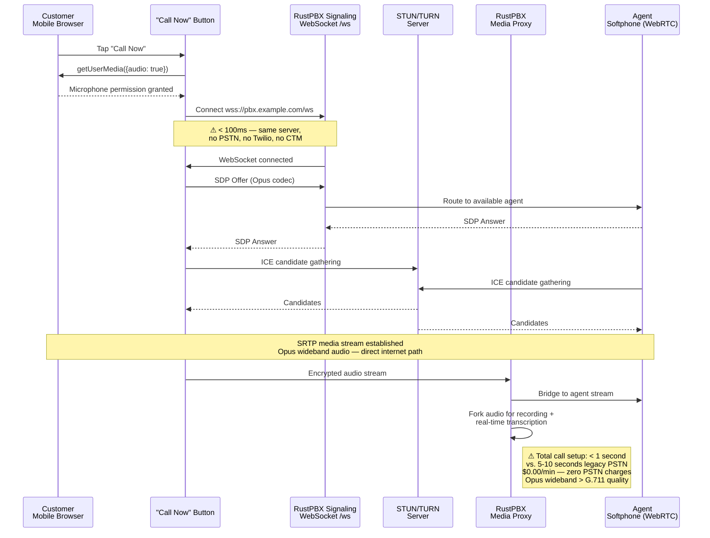

**Three implementation phases:**

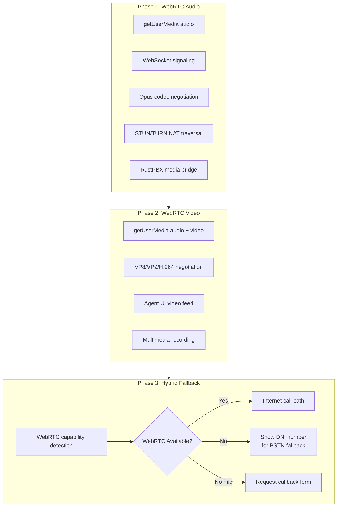

**Benefits:**

- Sub-second call setup (vs. 2-5 seconds for PSTN)
- Zero PSTN charges — internet-only media path
- Opus wideband audio quality (superior to G.711 PSTN)
- Video capability opens entirely new service modalities
- Customer stays on the landing page during the call (no app switch to phone dialer)
- Full call context preserved: we know exactly which page, ad, campaign, and session triggered
  the call because the same JavaScript that tracked the click initiates the call

**Technical requirements:**

- STUN/TURN server (coturn or Telnyx TURN service)
- RustPBX WebRTC gateway (already has WebRTC support for softphone — extend to customer-facing)
- Leptos UI component for the click-to-call button widget
- Secure WebSocket signaling (wss://)
- SRTP media encryption (mandatory for WebRTC)

---

### 4.4 Own the Intelligence: Real-Time Transcription & AI Coaching

**Current state:** CTM provides post-call transcription only. No real-time text during live
calls. No AI analysis until after the call ends.

**Opportunity:** Stream call audio to ASR engines in real-time during the call, feed the live
transcript to an LLM for agent coaching, and surface insights while the agent can still act.

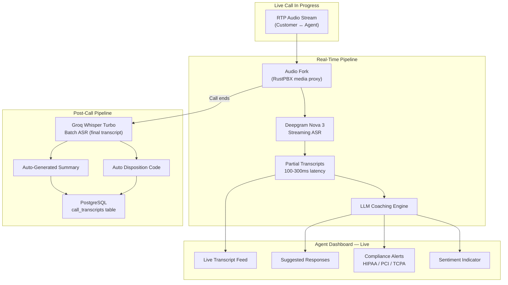

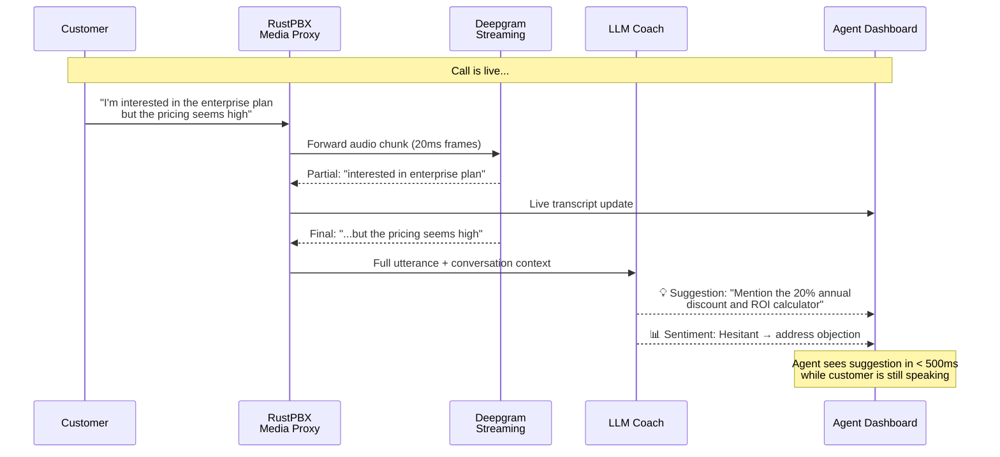

**Capabilities unlocked:**

- Live transcript visible to agent and supervisor during the call
- AI-suggested responses based on conversation context
- Compliance keyword detection (HIPAA, PCI, TCPA triggers)
- Automatic disposition and summary generation at call end
- Sentiment analysis trending during the call (escalation detection)
- Groq Whisper Turbo batch processing for final high-accuracy transcript post-call

---

### 4.5 Own the Numbers: Direct Telnyx Integration

**Current state:** Tracking numbers are provisioned through CTM, which provisions them through
Twilio. Two intermediaries between us and the actual phone numbers.

**Opportunity:** Provision and manage tracking numbers directly through Telnyx's API, cutting
out both CTM and Twilio from the number management chain.

```mermaid
flowchart TB
    subgraph LEGACY["Legacy: 2 Middlemen"]
        direction LR
        L_US["Us"] -->|"$$$ CTM fee"| L_CTM["CTM"]
        L_CTM -->|"$$$ Twilio fee"| L_TW["Twilio"]
        L_TW -->|"Provisions"| L_NUM["Phone Numbers"]
    end

    subgraph TARGET["Target: Direct Ownership"]
        direction LR
        T_US["Us"] -->|"$ Telnyx rate"| T_TEL["Telnyx API"]
        T_TEL -->|"Provisions"| T_NUM["Phone Numbers"]
    end

    subgraph TELNYX_CAPS["Telnyx Capabilities"]
        T1["Instant number provisioning via API"]
        T2["Number porting under our control"]
        T3["SIP trunk health monitoring<br/>(Mission Control Portal)"]
        T4["Built-in redundancy and failover"]
        T5["~$0.005/min inbound<br/>vs $0.0135/min Twilio+CTM"]
    end

    LEGACY -->|"REPLACE WITH"| TARGET
    TARGET --- TELNYX_CAPS
```

```mermaid
sequenceDiagram
    participant APP as RustPBX App
    participant API as Telnyx API<br/>api.telnyx.com
    participant SIP as Telnyx SIP<br/>sip.telnyx.com
    participant PBX as RustPBX SIP Proxy

    Note over APP,PBX: Number Provisioning (automated)
    APP->>API: POST /v2/number_orders<br/>{phone_number: "+15558675309"}
    API-->>APP: 200 OK — Number active
    APP->>API: PATCH /v2/phone_numbers/{id}<br/>{connection_id: our_sip_trunk}
    API-->>APP: Number pointed to our trunk

    Note over APP,PBX: Inbound Call Flow (single hop)
    SIP->>PBX: SIP INVITE from Telnyx<br/>(customer dialed our number)
    PBX->>PBX: Route → Record → Transcribe → Connect
    Note right of PBX: ⚠ ONE vendor hop.<br/>No Twilio. No CTM.<br/>~63% cost reduction.
```

**Benefits:**

- Single SIP trunk: Telnyx → RustPBX (eliminate Twilio entirely)
- Direct number provisioning via Telnyx API (instant, programmable)
- Number porting under our control
- Per-minute cost reduction: Telnyx rates ~$0.005/min inbound vs. Twilio's combined
  ~$0.0135/min
- Telnyx Mission Control Portal for trunk health monitoring
- SIP trunk redundancy and failover built into Telnyx's network

---

### 4.6 Own the CRM Feed: Direct Zoho Integration

**Current state:** CTM automatically pushes call data to Zoho CRM after each call. Call
metadata, recording links, tracking source, and agent info flow into Zoho contact timelines.
This integration is **entirely dependent on CTM** — removing CTM severs the Zoho data pipeline.

**Opportunity:** Build a direct RustPBX → Zoho CRM integration that pushes richer data
than CTM ever could, including transcript text, AI summaries, and correlated form submissions.

```mermaid
sequenceDiagram
    participant PBX as RustPBX
    participant DB as PostgreSQL
    participant ZOHO as Zoho CRM<br/>(Telephony API / REST)

    PBX->>DB: Call ends → CDR + transcript stored
    DB->>DB: Generate AI call summary<br/>(via LLM pipeline)
    PBX->>ZOHO: POST /crm/v2/Calls<br/>(or Telephony Integration API)
    Note over ZOHO: Payload includes:<br/>• Call metadata (duration, source, agent)<br/>• Recording URL (self-hosted)<br/>• Transcript text (searchable)<br/>• AI summary + action items<br/>• Sentiment score<br/>• Linked form submission data
    ZOHO->>ZOHO: Create/update Contact
    ZOHO->>ZOHO: Link to Lead/Deal
    ZOHO->>ZOHO: Update Contact timeline
    Note right of ZOHO: ✅ We control the data<br/>✅ Recordings self-hosted<br/>✅ Transcripts searchable<br/>✅ AI summaries included<br/>✅ Form+call correlated
```

**Integration approach options:**

| Approach | Pros | Cons |
|---|---|---|
| Zoho Telephony API (PhoneBridge) | Native dialer integration in Zoho UI, click-to-call | Requires Zoho marketplace registration |
| Zoho REST API (v2 Calls module) | Simpler, direct HTTP POST, no marketplace overhead | No native Zoho UI integration |
| Zoho Webhook (Notification URL) | Zoho can call us for events (new lead → screen pop) | Bidirectional, more complex |

**Recommended:** Start with **Zoho REST API** for call data push (simplest), then evaluate
**PhoneBridge Telephony API** for native click-to-call and screen pop inside Zoho.

**Benefits vs. CTM:**

- Self-hosted recording URLs that never break (no vendor dependency)
- Searchable transcript text in CRM records
- AI-generated call summaries replace manual agent notes
- Form submissions correlated with calls via shared session_id
- Sentiment scores and compliance flags attached to each call record
- Full control over field mapping and data schema

---

### 4.7 Own the Case Pipeline: Direct Flow Legal Integration

**Current state:** CTM feeds call and case data into Flow Legal Management, our case
management system for tracking legal matters. Like Zoho, this integration runs entirely
through CTM and breaks when CTM is removed.

**Opportunity:** Build a direct RustPBX → Flow Legal pipeline that provides searchable
transcripts, AI intake summaries, and compliance flags — data that CTM never provided.

```mermaid
sequenceDiagram
    participant PBX as RustPBX
    participant DB as PostgreSQL
    participant AI as AI Pipeline<br/>(LLM Summary + Compliance)
    participant FLOW as Flow Legal Management

    PBX->>DB: Call ends → CDR + transcript stored
    DB->>AI: Generate intake summary<br/>+ compliance scan
    AI->>AI: Detect HIPAA/TCPA/PCI mentions<br/>Flag for legal review
    AI->>DB: Store summary + flags
    PBX->>FLOW: Push case data via API/webhook
    Note over FLOW: Payload includes:<br/>• Call metadata + recording URL<br/>• Full transcript (searchable)<br/>• AI intake summary<br/>• Compliance flags<br/>• Linked form submission<br/>• Caller session history
    FLOW->>FLOW: Create/update Case
    FLOW->>FLOW: Link to existing Matter
    Note right of FLOW: ✅ Searchable transcripts<br/>for case discovery<br/>✅ AI intake notes<br/>✅ Compliance auto-flags<br/>✅ Self-hosted recordings
```

**Integration approach:** This depends on Flow Legal Management's API capabilities.
The integration should be built as a pluggable RustPBX addon that:

1. Listens for call-complete events from the CDR pipeline
2. Enriches call data with transcript, AI summary, and compliance flags from PostgreSQL
3. Pushes the enriched payload to Flow Legal's API endpoint
4. Handles retry logic for transient failures

**Benefits vs. CTM:**

- Searchable transcript text enables case discovery across all call records
- AI-generated intake summaries replace manual agent case notes
- Automatic compliance flagging (HIPAA/TCPA/PCI keyword detection)
- Self-hosted recording URLs that survive vendor changes
- Form + call correlation provides complete intake context
- Richer case data means less manual data entry for legal staff

---

### 4.8 Own the Analytics: Replace Snowflake with PostgreSQL

**Current state:** Snowflake serves as the data warehouse for management reporting,
aggregating ETL exports from CTM, Zoho CRM, and financial/payments systems. Reports
cover call center performance, marketing attribution, and financial analytics
(payments, debts, collections). Adding new cross-system metrics requires modifying
ETL pipelines across multiple vendors.

**Opportunity:** With all call, CRM, case management, and click tracking data living
in PostgreSQL (once Horizons 1–2 are complete), Snowflake becomes redundant. The
same management reports can be generated directly from PostgreSQL using views,
materialized views, and a lightweight reporting layer.

```mermaid
flowchart TB
    subgraph BEFORE["Before: 3 ETL → SF"]
        B_CTM["CTM"] -->|"ETL"| B_SF["❄️ Snowflake"]
        B_ZOHO["Zoho CRM"] -->|"ETL"| B_SF
        B_FIN["Financial Systems"] -->|"ETL"| B_SF
        B_SF --> B_RPT["Management Reports"]
    end

    subgraph AFTER["After: Unified PG"]
        A_PBX["RustPBX CDRs"] --> A_PG["PostgreSQL<br/>(unified data store)"]
        A_CRM["Rust CRM Engine"] --> A_PG
        A_CASE["Rust Case Engine"] --> A_PG
        A_FIN2["Financial Data"] --> A_PG
        A_PG --> A_MV["Materialized Views<br/>+ Reporting Queries"]
        A_MV --> A_RPT["Management Reports<br/>& Real-Time Dashboards"]
    end

    style BEFORE fill:#FFEBEE
    style AFTER fill:#E8F5E9
```

**What this enables:**

- Real-time dashboards instead of batch-lag reports (queries run against live data)
- Full-funnel analytics in one query: ad click → call → case → payment → collection
- AI-enriched analytics: sentiment trends, compliance flag rates, coaching effectiveness
- No ETL pipeline maintenance — data is already in PostgreSQL
- No Snowflake compute billing — reporting is a PostgreSQL workload
- New metrics added with a single SQL view, no multi-system pipeline changes

**PostgreSQL capabilities that replace Snowflake:**

- Materialized views with `REFRESH CONCURRENTLY` for dashboard-speed aggregates
- Window functions for time-series KPIs (rolling averages, period-over-period)
- `JSONB` querying for flexible metadata analytics
- `pg_cron` for scheduled report generation
- Full-text search on transcripts for compliance auditing

**Dependency:** This opportunity is only viable after Zoho CRM and Flow Legal are
replaced by Rust-native services in Horizon 2. Until then, Snowflake (or a
transitional PostgreSQL analytics schema fed by the same ETL pipelines) continues
to serve management reporting.

---

## 5. Target Architecture Summary

### Before (Legacy)

```mermaid
flowchart TB
    subgraph BEFORE["LEGACY — 6+ Vendors"]
        B_SEARCH["Customer Device"] -->|"searches"| B_GOOG["Google Search<br/>(Google Cloud)"]
        B_GOOG -->|"returns ads"| B_SEARCH
        B_SEARCH -->|"clicks ad"| B_AD["Ad Platforms<br/>Google / Meta / IG"]
        B_AD -->|"click"| B_JS["CTM JavaScript<br/>(client browser)"]
        B_JS -->|"100-300ms"| B_API["CTM DNI API<br/>(Dynamic Number Insertion)"]
        B_API --> B_COOKIE["Browser Cookie<br/>(client-side session)"]

        B_CALL["Customer Dials DNI Number"] --> B_PSTN["PSTN<br/>2-5s setup"]
        B_PSTN --> B_TW["Twilio PSTN GW<br/>$0.0085/min"]
        B_TW --> B_SIP["Twilio SIP Trunk<br/>+$0.005/min"]
        B_SIP --> B_CTM["CTM Router<br/>+CTM $/min fee"]
        B_CTM --> B_REC["CTM Recording<br/>(vendor controlled)"]
        B_REC --> B_TRANS["CTM Transcription<br/>(post-call, locked ASR)"]
        B_TRANS --> B_DASH["CTM Dashboard<br/>(rate-limited API)"]
        B_CTM -->|"SIP+RTP via US-MX path"| B_AGENT["Agent in Puerto Vallarta, MX<br/>(+30-80ms latency, no failover)"]
        B_DASH -->|"Auto-push"| B_ZOHO["Zoho CRM<br/>(no transcript, no AI summary)"]
        B_DASH -->|"Data feed"| B_FLOW["Flow Legal<br/>(no transcript, no compliance flags)"]
        B_DASH -->|"ETL"| B_SNOW["❄️ Snowflake<br/>(batch reporting)"]
        B_ZOHO -->|"ETL"| B_SNOW
    end

    style BEFORE fill:#FFEBEE,color:#333
```

| Metric | Legacy Value |
|---|---|
| External vendors | 6+ (Ad platforms, Twilio, CTM, Zoho, Flow Legal, Snowflake) |
| Per-call cost layers | 3 (PSTN carrier, Twilio, CTM) |
| Data silos | 7+ (each ad platform, Twilio, CTM, Zoho, Flow Legal, Snowflake, form tools) |
| Integration hub / SPOF | CTM (sole middleware feeding Zoho + Flow Legal + Snowflake) |
| Transcription control | None — CTM picks the ASR vendor |
| Real-time intelligence | None |
| Video capability | None |
| Call setup latency | 5-10 seconds |
| Agent location latency | +30-80ms US-MX path, no failover |
| CRM transcript in records | No |
| Case mgmt transcript search | No |
| Cost per minute | ~$0.02+ (Twilio + CTM combined) |

### After (RustPBX Platform)

```mermaid
flowchart TB
    subgraph AFTER["TARGET — 1 Vendor"]
        A_SEARCH["Customer Device"] -->|"searches"| A_GOOG["Google Search<br/>(Google Cloud)"]
        A_GOOG -->|"returns ads"| A_SEARCH
        A_SEARCH -->|"clicks ad"| A_AD["Ad Platforms<br/>Google / Meta / IG"]
        A_AD -->|"click"| A_JS["Our JS Tag<br/>(client browser, self-hosted)"]
        A_JS -->|"< 10ms"| A_API["Our Tracking API<br/>POST /api/v1/track/click"]
        A_API --> A_DB["PostgreSQL<br/>(our servers — unified data store)"]

        A_FORM["Form Submission"] -->|"session_token"| A_API2["POST /api/v1/track/form"]
        A_API2 --> A_DB

        subgraph PSTN_PATH["Path A: PSTN Call"]
            A_CALL["Customer Dials"] --> A_TEL["Telnyx SIP<br/>$0.005/min"]
            A_TEL --> A_PBX["RustPBX<br/>(our servers)"]
        end

        subgraph WEBRTC_PATH["Path B: Click-to-Call"]
            A_CTC["Customer Taps Call Now"] --> A_WS["WebSocket Signaling"]
            A_WS --> A_PBX2["RustPBX<br/>WebRTC Gateway<br/>(our servers)"]
        end

        A_PBX --> A_REC["Recording<br/>(our storage, our format)"]
        A_PBX2 --> A_REC
        A_REC --> A_DG["Deepgram Nova-3 Streaming<br/>(real-time ASR)"]
        A_DG --> A_LLM["LLM Coaching<br/>(live suggestions)"]
        A_LLM --> A_AGENT["Agent Dashboard in PV, MX<br/>(remote call center)"]
        A_REC --> A_GROQ["Groq Whisper Large v3 Turbo<br/>(final transcript @ $0.04/hr)"]
        A_GROQ --> A_DB
        A_DB -->|"REST API push"| A_ZOHO["Zoho CRM<br/>(transcript + AI summary + form data)"]
        A_DB -->|"API/webhook push"| A_FLOW["Flow Legal<br/>(transcript + intake summary + compliance flags)"]
        A_DB -->|"materialized views"| A_RPT["📊 Management Reports<br/>& Real-Time Dashboards<br/>(replaces Snowflake)"]
    end

    style AFTER fill:#E8F5E9,color:#333
    style PSTN_PATH fill:#FFF3E0,color:#333
    style WEBRTC_PATH fill:#E3F2FD,color:#333
```

| Metric | Legacy | Target | Improvement |
|---|---|---|---|
| Carrier vendors | 2 (Twilio + CTM) | 1 (Telnyx for PSTN only) | -50% vendor dependency |
| Integration hub / SPOF | CTM (feeds Zoho + Flow Legal + Snowflake) | RustPBX (direct integrations) | Eliminated single point of failure |
| Per-call cost layers | 3 | 1 | -67% cost overhead |
| Data silos | 7+ | 0 (all in PostgreSQL, pushed to Zoho/Flow) | Unified analytics |
| Transcription engine | CTM-locked (no choice) | Groq Whisper Turbo + Deepgram Nova-3 | Full ASR control |
| Real-time intelligence | None | Live transcription + AI coaching | New capability |
| Video capability | None | WebRTC video | New capability |
| Call setup latency | 5-10s | <1s (WebRTC) / 3-5s (PSTN) | Up to 90% reduction |
| Agent failover (PV, MX) | None — ISP outage = offline | Cellular backup + regional proxy option | New capability |
| CRM transcript in records | No | Yes (searchable text + AI summary) | New capability |
| Case mgmt transcript search | No | Yes (full text + compliance flags) | New capability |
| Cost per minute | ~$0.02+ | $0.005 (PSTN) / $0.00 (WebRTC) | 63-100% reduction |
| Management reporting | Snowflake (batch ETL, 3 vendor pipelines) | PostgreSQL views (real-time, unified) | Eliminates ETL + Snowflake billing |
| Full-funnel analytics | Not possible (data in 7+ silos) | Single-query: click → call → case → payment | New capability |

---

## 6. Implementation Priority

Redesign opportunities ordered by impact and dependency chain:

```mermaid
flowchart LR
    subgraph P0["P0 — Immediate"]
        T["4.5 Telnyx Direct<br/>SIP Integration"]
    end

    subgraph P1["P1 — Foundation"]
        CLICK["4.1 First-Party<br/>Ad Tracking API"]
        INTEL["4.4 Real-Time<br/>Transcription"]
    end

    subgraph P2["P2 — Extend"]
        FORM["4.2 Integrated<br/>Form Capture"]
        ZOHO["4.6 Direct Zoho<br/>CRM Integration"]
        FLOW["4.7 Direct Flow Legal<br/>Integration"]
    end

    subgraph P3["P3 — Transform"]
        AUDIO["4.3a WebRTC<br/>Audio Click-to-Call"]
    end

    subgraph P4["P4 — Differentiate"]
        VIDEO["4.3b WebRTC<br/>Video Click-to-Call"]
        ANALYTICS["4.8 Replace Snowflake<br/>with PostgreSQL Analytics"]
    end

    T -->|"enables"| CLICK
    T -->|"enables"| INTEL
    CLICK -->|"enables"| FORM
    INTEL -->|"transcript data"| ZOHO
    INTEL -->|"transcript data"| FLOW
    FORM -->|"form data"| ZOHO
    FORM -->|"form data"| FLOW
    T -->|"enables"| AUDIO
    AUDIO -->|"enables"| VIDEO
    ZOHO -->|"data consolidated"| ANALYTICS
    FLOW -->|"data consolidated"| ANALYTICS
```

| Priority | Opportunity | Depends On | Impact |
|---|---|---|---|
| **P0** | 4.5 — Telnyx Direct SIP Integration | RustPBX core | Eliminates Twilio cost + latency immediately |
| **P1** | 4.1 — First-Party Ad Tracking API | PostgreSQL, RustPBX API | Eliminates CTM DNI dependency, owns attribution |
| **P1** | 4.4 — Real-Time Transcription & Coaching | Telnyx integration, Deepgram/Groq accounts | Core differentiator vs. CTM; enables enriched CRM/case data |
| **P2** | 4.2 — Integrated Form Capture | Tracking API (P1) | Unifies click + form + call data |
| **P2** | 4.6 — Direct Zoho CRM Integration | Transcription (P1), Form Capture (P2) | Replaces CTM→Zoho auto-push with richer data (transcripts, AI summaries) |
| **P2** | 4.7 — Direct Flow Legal Integration | Transcription (P1), Form Capture (P2) | Replaces CTM→Flow Legal feed with searchable transcripts + compliance flags |
| **P3** | 4.3a — WebRTC Click-to-Call (Audio) | RustPBX WebRTC, STUN/TURN infrastructure | Eliminates PSTN for internet-connected callers |
| **P4** | 4.3b — WebRTC Click-to-Call (Video) | WebRTC Audio (P3) | New capability not possible in legacy stack |
| **P4** | 4.8 — Replace Snowflake with PostgreSQL Analytics | Zoho (P2), Flow Legal (P2), financial data migration | Eliminates Snowflake billing, enables real-time full-funnel reporting |

> **Note on CTM removal sequencing:** CTM cannot be fully decommissioned until **both** 4.6 (Zoho)
> and 4.7 (Flow Legal) integrations are operational, since CTM is the sole middleware feeding
> both downstream systems today. Snowflake ETL pipelines from CTM must also be redirected (or
> Snowflake replaced per 4.8). P2 completion is the gate for CTM shutdown.

---

*This document should be reviewed alongside [ARCHITECTURE.md](./ARCHITECTURE.md) for the
legacy system baseline, [ARCHITECTURE_VISION.md](./ARCHITECTURE_VISION.md) for the target-state
platform design, and [TESTING_PLAN_OF_ACTION.md](./TESTING_PLAN_OF_ACTION.md) for the testing
strategy that validates each redesigned component.*
