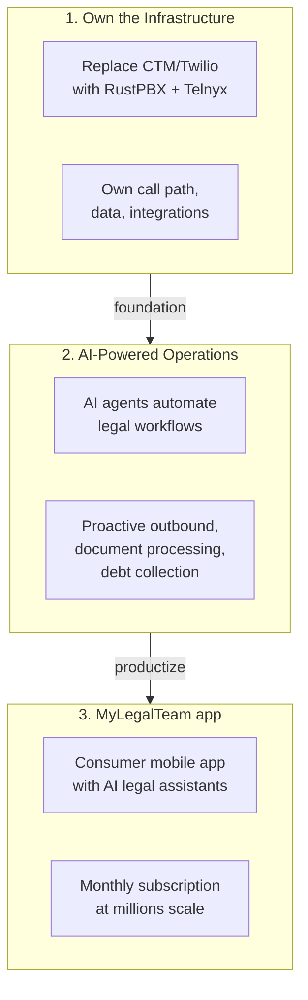
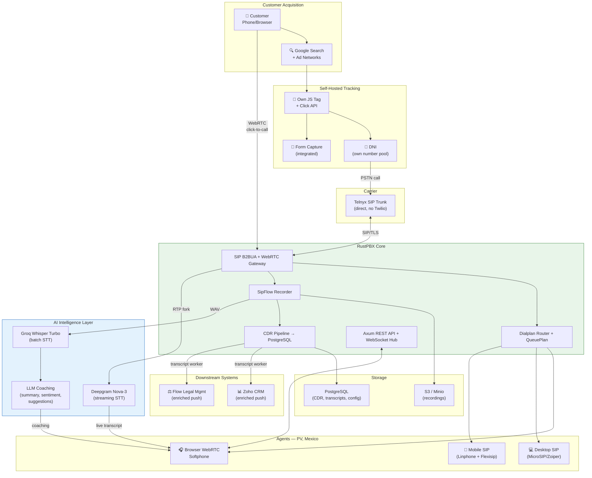
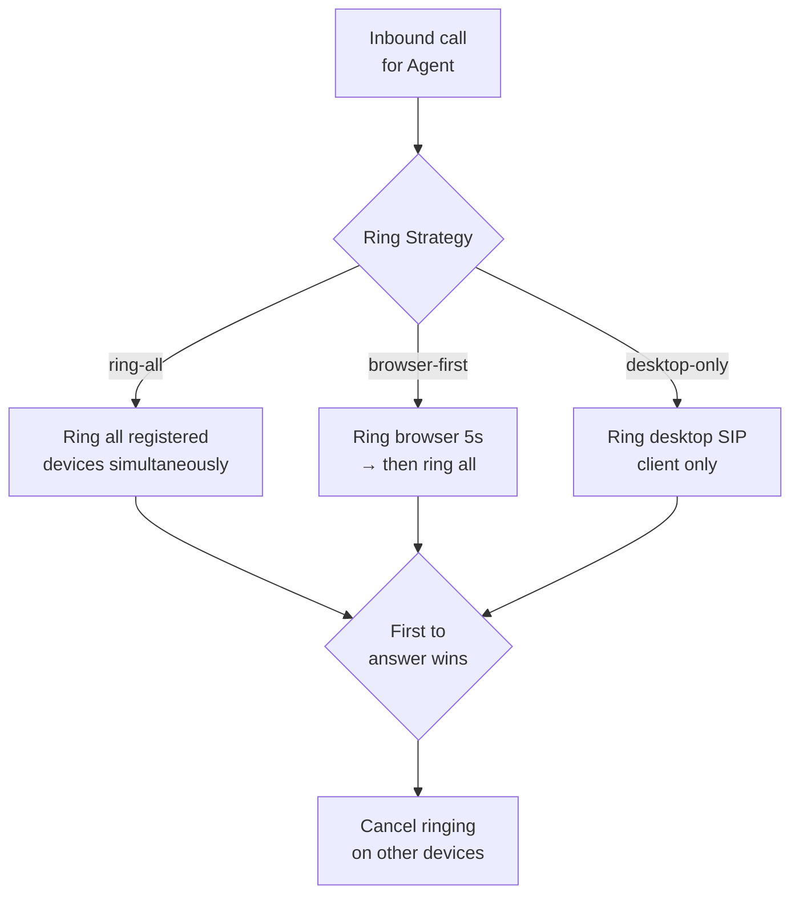
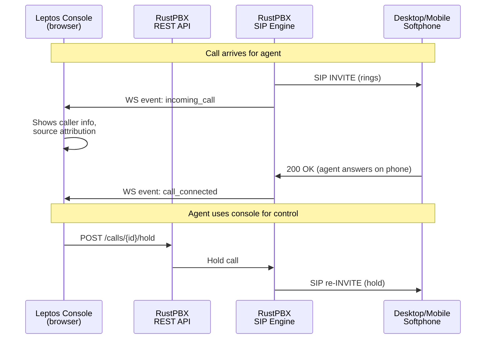
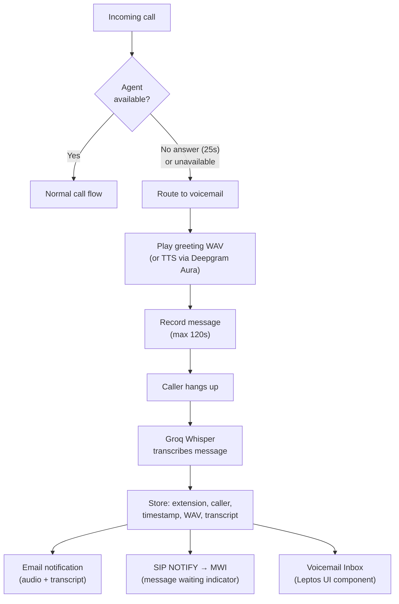
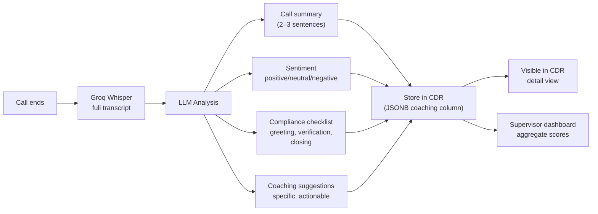
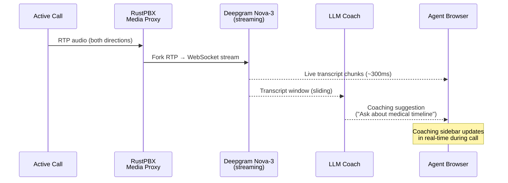
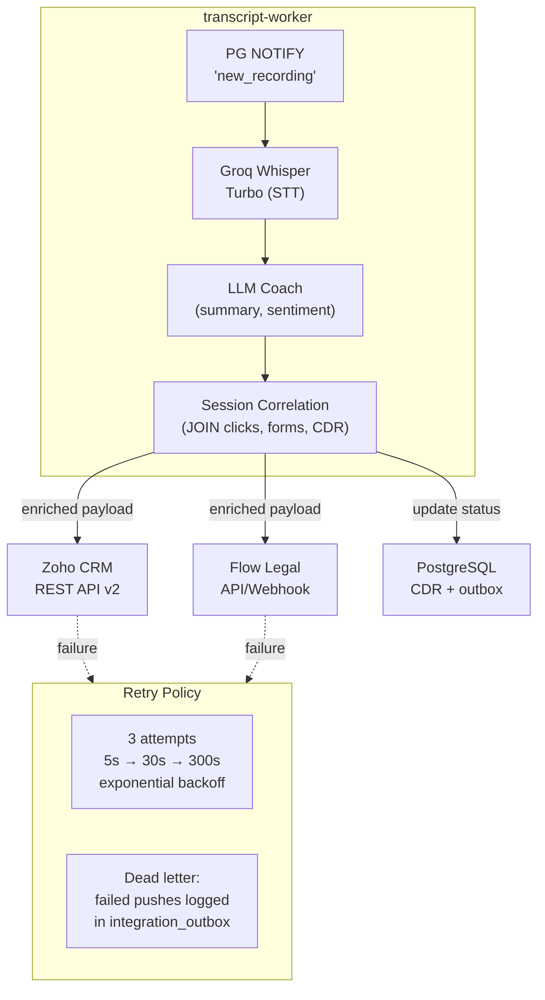

# Architecture Vision — Target State

## Document Purpose

This document defines the **target-state architecture** for the platform that will
replace the legacy CTM/Twilio call tracking system and evolve into a scalable,
AI-powered legal services platform.

**Scope:** Future state design, technology decisions, and implementation roadmap.
For the legacy system baseline, see [ARCHITECTURE.md](./ARCHITECTURE.md). For
inefficiency analysis and redesign rationale, see
[ARCHITECTURE_OPPORTUNITIES.md](./ARCHITECTURE_OPPORTUNITIES.md).

---

## Executive Summary

The strategic goal is to help DienerLaw become the largest immigration law firm in the United States, and to offer cost, speed, and quality levels that no other firm can match. They also help DienerLaw achieve best-in-class profitability and margins because of size, scale, automation, and AI.

The architecture described in this document improves operational effectiveness, increases efficiencies, reduces technical limitations, and enables a strategic shift towards **MyLegalTeam** — a subscription-based legal services
platform targeting 1 million customers at $100/year, creating a
**$100 million annual recurring revenue stream** on top of the firm's
existing legal services income.

### MyLegalTeam

MyLegalTeam gives every subscriber a persistent, personalized legal
workspace — accessible via web and mobile apps — that fundamentally
changes how immigration clients interact with their attorneys and legal advisors:

- **Document scanning.** Clients can scan or take call-phone photos of key documents which are then pixel-corrected and translated into markdown so the AI can answer questions and engest the information into the system.
- **Case organization.** Clients manage all immigration matters in one
  place: documents, forms, deadlines, and filing status — organized
  automatically, not buried in email threads and paper folders.
- **AI legal assistant.** A specialized immigration AI engine that knows
  each client's specific situation — their case history, filing status,
  family composition, and jurisdiction — and answers legal questions in
  context, not generically.
- **Attorney coordination.** Every interaction with attorneys and
  paralegals is logged, searchable, and tied to the relevant case.
  Clients see what was discussed, what was filed, and what comes next
  — eliminating the "what's happening with my case?" call.
- **Law and policy alerts.** When immigration laws change, court rulings
  shift precedent, or USCIS updates processing times, subscribers
  receive personalized alerts explaining how the change affects *their*
  specific situation — not a generic newsletter.

This platform is not a replacement for legal counsel — it is the
delivery mechanism that makes DienerLaw's legal services dramatically
more accessible, organized, and valuable than any competitor can offer.

**Why this matters competitively.** No immigration law firm offers
anything like this today. The web and mobile apps create differentiation
that cannot be replicated by hiring more attorneys or buying more ads.
They build customer stickiness: clients who organize their legal life
inside MyLegalTeam do not switch firms. And they drive repeat business
— when a subscriber's spouse, parent, or sibling needs immigration
help, the referral is automatic because the family already lives inside
the platform.

**Revenue model.** The $100/year subscription revenue is *additive* to
existing per-case legal fees. A client paying $100/year for the platform
is also paying thousands for legal representation. The subscription
covers the AI assistant, case organization tools, and alert service;
legal work remains billable. At scale, the subscription revenue alone
exceeds total current firm revenue — and the platform's stickiness
increases the lifetime value of every legal engagement.

**How we get there.** The three horizons described in this document
build toward MyLegalTeam incrementally:

- **Horizon 1** replaces the legacy vendor stack (CTM, Twilio, Zoho,
  Flow Legal, Snowflake) with owned infrastructure — RustPBX, Telnyx,
  and PostgreSQL — saving ~$450K/yr and establishing the technical
  foundation.
- **Horizon 2** adds AI-powered operations at the firm level: real-time
  transcription, agent coaching, automated intake, and intelligent
  routing — proving the AI capabilities that will later face customers.
- **Horizon 3** packages those capabilities into the MyLegalTeam
  consumer platform — the subscription app that scales to millions.

Everything in this architecture — every SIP trunk, every database
schema, every AI pipeline — is designed to serve Horizon 3. The
infrastructure decisions made in Horizon 1 are not just cost savings;
they are the foundation of a $100M ARR platform.

---

## 1. North Star: MyLegalTeam

The infrastructure work described in this document is Phase 1 of a three-horizon
evolution that transforms the firm from a transactional legal practice into
**MyLegalTeam** (working name) — a subscription-based, AI-powered legal services
platform capable of serving millions of customers.



### Horizon 1: Own the Infrastructure

Replace CTM and Twilio with a self-hosted RustPBX platform connected directly to
Telnyx SIP trunking. Own the call path, call data, recordings, transcriptions, and
all downstream integrations to Zoho CRM and Flow Legal Management. Eliminate vendor
lock-in and double billing. **This is the focus of this document.**

### Horizon 2: AI-Powered Operations (Future)

Deploy AI agents on the backend to organize incoming information, convert legacy
documents into legal data and forms, orchestrate call center staff proactive workloads
(outbound campaigns, customer information collection, debt collection), and oversee
legal workflows for attorneys and paralegal assistants. Automate as much operational
overhead as possible to increase firm capacity without proportional headcount growth.

**Vendor replacement:** Horizon 2 also replaces the remaining SaaS vendors — Zoho CRM,
Flow Legal Management, and Snowflake — with custom Rust-based programs backed by
PostgreSQL. The Zoho and Flow Legal integrations built in Horizon 1 (§11) are
transitional: they keep the firm operational during the migration, but the long-term
architecture consolidates all CRM, case management, and analytics into a single
self-hosted Rust backend with PostgreSQL as the unified data store.

### Horizon 3: MyLegalTeam Consumer Platform (Future)

Launch a customer-facing mobile app and subscription service providing: a client
portal with all legal information and attorney communications; AI agents that help
customers input information, answer attorney questions, and cross-reference legal
documents; proactive updates when laws change; and ongoing automated legal guidance.
Revenue model shifts from per-case transactions to monthly subscriptions at
millions-of-users scale.

### Business Model Evolution

```text
TODAY (Legacy)                      HORIZON 3 (MyLegalTeam)
──────────────────────────────────  ──────────────────────────────────
Transactional legal factory         Ongoing automated legal service
Per-case revenue                    Monthly subscription revenue
Manual intake + processing          AI-orchestrated workflows
Attorney-dependent scaling          AI-agent scaling
Hundreds of active cases            Millions of subscribers
Call center as cost center          Call center as onboarding engine
CTM/Twilio vendor lock-in           Fully self-hosted platform
Zoho CRM + Flow Legal + Snowflake   Custom Rust + PostgreSQL backend
Data fragmented across vendors      Unified data under full ownership
```

> **Horizon 2 and 3 will be detailed in future revisions of this document.**
> The remainder focuses on Horizon 1.

---

## 2. Horizon 1: System Overview

RustPBX replaces CTM as the central platform. It connects directly to Telnyx
(eliminating Twilio), routes calls to agents, records and transcribes them,
provides real-time AI coaching, and pushes enriched data to Zoho CRM and Flow
Legal Management.



### What Changes from Legacy

| Aspect | Legacy (ARCHITECTURE.md) | Target (this document) |
|--------|--------------------------|----------------------|
| PSTN carrier | Twilio (via CTM) | Telnyx (direct) |
| Call platform | CTM (vendor SaaS) | RustPBX (self-hosted) |
| Click tracking | CTM JavaScript + API | Self-hosted JS tag + API |
| DNI numbers | CTM-managed (Twilio pool) | Self-managed (Telnyx pool) |
| Recording | CTM cloud (locked) | SipFlow → S3/Minio (owned) |
| Transcription | CTM native + Groq supplemental | Groq batch + Deepgram streaming |
| Agent coaching | None | LLM-powered (post-call + real-time) |
| CRM push | CTM → Zoho (basic) | RustPBX → Zoho (enriched) |
| Case mgmt push | CTM → Flow Legal (basic) | RustPBX → Flow Legal (enriched) |
| Agent UI | CTM browser widget | Leptos WASM console |
| Cost (50K min/mo) | ~$2,000–5,000+/mo | ~$725/mo |

---

## 3. Telnyx Integration: Pure SIP Trunking

**Decision:** Telnyx operates exclusively as a PSTN carrier. No webhooks, no Call
Control API, no cloud recording, no Telnyx-managed transcription. RustPBX owns all
call intelligence.

### SIP Connection Configuration

| Parameter | Value |
|-----------|-------|
| Connection Type | Credential-based (dynamic IP, supports NAT) |
| Auth Method | SIP REGISTER with username/password |
| Outbound Proxy | sip.telnyx.com:5060 (UDP/TCP) or :5061 (TLS) |
| Transport | TLS preferred; UDP acceptable behind NAT with STUN |
| Codecs (priority) | 1. PCMU (G.711μ) 2. PCMA (G.711A) 3. G.722 4. Opus |
| DTMF | RFC 2833 (in-band RTP events) |
| RTP Port Range | 16384–32768 (configure firewall accordingly) |
| Outbound Voice Profile | Created in Telnyx Mission Control; applied to connection |
| Webhook URL | **NONE** — leave blank to stay in SIP trunking mode |

> ⚠️ **Critical**: Setting a webhook URL on a Telnyx SIP Connection converts it
> to programmable voice mode and can anchor media in distant regions. Leave it blank.

### RustPBX Trunk Config (rustpbx.toml)

```toml
[trunks.telnyx]
server = "sip.telnyx.com"
transport = "tls"
port = 5061
username = "<telnyx_sip_username>"
password = "<telnyx_sip_password>"
register = true
register_expires = 300
codecs = ["PCMU", "PCMA", "G722"]
outbound_proxy = "sip.telnyx.com"
```

---

## 4. Softphone & Agent Endpoint Architecture

### Decision: Hybrid Model — Agents Choose Their Audio Path

The Leptos WASM web console is **always** the command-and-control interface for every
agent. It displays queue state, live transcripts, coaching notes, CDR history, and
provides call control buttons. The audio path is flexible — agents select the endpoint
that best fits their environment.

> **Agent Location:** The call center operates from **Puerto Vallarta, Mexico**.
> All SIP signaling and RTP media traverse the US-Mexico internet path, adding
> approximately **30–80ms round-trip latency**. Codec selection prioritizes
> resilience to jitter (Opus with FEC enabled). Agents rely on consumer-grade
> Mexican ISPs — internet failover strategy is a critical infrastructure concern.

### Puerto Vallarta Network Architecture

**Latency profile:**

| Path Segment | Typical RTT | Notes |
|--------------|-------------|-------|
| Agent → Mexican ISP PoP | 5–15ms | Last-mile, consumer broadband |
| Mexican ISP → US border crossing | 15–30ms | Guadalajara/Mexico City IX → McAllen/Laredo |
| US border → Telnyx SIP edge | 10–25ms | US backbone |
| **Total SIP signaling RTT** | **30–70ms** | Within ITU-T G.114 target (< 150ms one-way) |
| **Total RTP media one-way** | **15–35ms** | Well within conversational quality thresholds |

**Codec selection (optimized for Mexico path):**

| Priority | Codec | Bandwidth | Why |
|----------|-------|-----------|-----|
| 1 | Opus (WebRTC) | 24–48 kbps | Built-in FEC, adaptive bitrate, jitter resilience |
| 2 | G.722 (desktop SIP) | 64 kbps | Wideband quality, good jitter tolerance |
| 3 | G.711μ / PCMU | 64 kbps | Fallback — no FEC, sensitive to packet loss |

**Internet failover strategy:**

| Layer | Primary | Failover | Detection | RTO |
|-------|---------|----------|-----------|-----|
| Internet link | Wired broadband (Telmex/Izzi) | Telcel 4G/5G hotspot | Router WAN failover | 30–60s |
| SIP registration | Auto-re-register on IP change | Multi-device ring | REGISTER expiry (300s) | 5–10s |
| Active call | WebRTC ICE restart (browser) | Call routes to other device | ICE connectivity check | 2–5s |
| Agent status | Auto-away on heartbeat timeout | Supervisor dashboard alert | WebSocket heartbeat (15s) | 15–30s |

> **Recommendation:** Equip each agent workstation with USB tethering-capable phone
> (Telcel plan) and configure router for automatic WAN failover. Prefer browser-mode
> WebRTC softphone (Opus FEC) over desktop SIP for jitter resilience.

### Three Endpoint Modes

| Mode | Transport | Audio Path | Control Path | Platforms |
|------|-----------|------------|-------------|-----------|
| **Browser** (default) | SIP-over-WSS (WebRTC) | Browser microphone → RustPBX WebRTC GW | Leptos console (same tab) | All |
| **Desktop SIP** | SIP/TLS + SRTP | MicroSIP / Zoiper → RustPBX registrar | Leptos console (separate browser tab) | Win / Mac |
| **Mobile SIP** | SIP/TLS + SRTP via Flexisip | Linphone → Flexisip push GW → RustPBX | Leptos console (optional) | iOS / Android |

### Recommended Software per Mode

| Platform | Software | License | Notes |
|----------|----------|---------|-------|
| Windows desktop | MicroSIP | Open source (free) | SIP/TLS/SRTP, compact |
| Mac desktop | Zoiper 5 PRO | ~€40/seat one-time | SIP/TLS/SRTP, polished UI |
| iOS | Linphone | GPLv3 (free) | CallKit integration, push wake |
| Android | Linphone | GPLv3 (free) | Firebase push wake |
| All platforms | Browser (Leptos WebRTC) | Free | Default, zero install |

### Softphone Cost (50 agents)

| Item | Cost |
|------|------|
| MicroSIP (Windows) | $0 (open source) |
| Zoiper 5 PRO (Mac) | ~€40 × Mac count (one-time) |
| Linphone (iOS/Android) | $0 (open source) |
| Browser WebRTC | $0 (built-in) |
| Flexisip push gateway | $0 (self-hosted, AGPLv3) |

### Multi-Device Ring Strategy

When a call arrives for an agent, RustPBX can ring multiple registered devices
simultaneously or in sequence, configurable per agent/queue:



### Desktop/Mobile Control Flow

When an agent uses a desktop SIP client or mobile phone for audio, the Leptos
browser console remains the control surface. Call control commands flow through
the REST API:



---

## 5. Database: PostgreSQL

### Decision: PostgreSQL via sqlx

PostgreSQL is the right fit for a VoIP platform workload: concurrent read/write
(agents generate CDRs while supervisors run reports), JSONB columns for variable
metadata, full-text search for transcripts via `tsvector`/`tsquery`, LISTEN/NOTIFY
for event-driven transcript pipeline, and `sqlx` is Tokio-native with compile-time
query verification.

### sqlx Integration

```rust
// rustpbx-shared/src/db.rs
use sqlx::postgres::PgPool;

pub async fn connect(database_url: &str) -> Result<PgPool, sqlx::Error> {
    PgPool::connect(database_url).await
}

// Compile-time verified query:
let cdr = sqlx::query_as!(
    CdrRecord,
    r#"SELECT id, call_id, caller, callee, start_time, duration,
              recording_path, transcript_id, coaching_json
       FROM cdrs WHERE call_id = $1"#,
    call_id
).fetch_one(&pool).await?;
```

### Key Tables

```sql
-- CDR with JSONB for flexible metadata
CREATE TABLE cdrs (
    id              BIGSERIAL PRIMARY KEY,
    call_id         UUID NOT NULL UNIQUE,
    caller          TEXT NOT NULL,
    callee          TEXT NOT NULL,
    direction       TEXT NOT NULL,        -- 'inbound' | 'outbound' | 'internal'
    start_time      TIMESTAMPTZ NOT NULL,
    answer_time     TIMESTAMPTZ,
    end_time        TIMESTAMPTZ,
    duration_secs   INTEGER,
    disposition     TEXT,                 -- 'answered' | 'no-answer' | 'busy' | 'failed'
    agent_id        TEXT,
    queue_name      TEXT,
    recording_path  TEXT,
    transcript_id   BIGINT REFERENCES transcripts(id),
    metadata        JSONB DEFAULT '{}',   -- source DID, CRM data, tags
    coaching        JSONB,                -- LLM analysis results
    created_at      TIMESTAMPTZ DEFAULT NOW()
);
CREATE INDEX idx_cdrs_start ON cdrs(start_time DESC);
CREATE INDEX idx_cdrs_agent ON cdrs(agent_id, start_time DESC);
CREATE INDEX idx_cdrs_caller ON cdrs(caller);

-- Transcripts with full-text search
CREATE TABLE transcripts (
    id              BIGSERIAL PRIMARY KEY,
    call_id         UUID NOT NULL REFERENCES cdrs(call_id),
    provider        TEXT NOT NULL,        -- 'groq' | 'deepgram'
    content         TEXT NOT NULL,
    word_timestamps JSONB,
    diarization     JSONB,
    search_vector   TSVECTOR GENERATED ALWAYS AS (to_tsvector('english', content)) STORED,
    created_at      TIMESTAMPTZ DEFAULT NOW()
);
CREATE INDEX idx_transcripts_search ON transcripts USING GIN(search_vector);

-- Voicemail
CREATE TABLE voicemails (
    id              BIGSERIAL PRIMARY KEY,
    extension_id    TEXT NOT NULL,
    caller          TEXT NOT NULL,
    recording_path  TEXT NOT NULL,
    transcript      TEXT,
    is_read         BOOLEAN DEFAULT FALSE,
    created_at      TIMESTAMPTZ DEFAULT NOW()
);

-- Click tracking sessions
CREATE TABLE click_sessions (
    id              BIGSERIAL PRIMARY KEY,
    session_id      UUID NOT NULL UNIQUE,
    source          TEXT,                 -- 'google' | 'facebook' | 'instagram'
    campaign        TEXT,
    keyword         TEXT,
    gclid           TEXT,
    fbclid          TEXT,
    landing_url     TEXT,
    tracking_number TEXT,
    visitor_ip      INET,
    created_at      TIMESTAMPTZ DEFAULT NOW()
);

-- Integration outbox (transactional outbox pattern)
CREATE TABLE integration_outbox (
    id              BIGSERIAL PRIMARY KEY,
    cdr_id          BIGINT REFERENCES cdrs(id) NOT NULL,
    target_system   TEXT NOT NULL,        -- 'zoho_crm' | 'flow_legal'
    payload         JSONB NOT NULL,
    status          TEXT DEFAULT 'pending',
    attempts        INT DEFAULT 0,
    last_attempt_at TIMESTAMPTZ,
    last_error      TEXT,
    created_at      TIMESTAMPTZ DEFAULT NOW(),
    sent_at         TIMESTAMPTZ
);
CREATE INDEX idx_outbox_pending ON integration_outbox (target_system, status)
    WHERE status IN ('pending', 'failed');
```

### Deployment

| Environment | Database | Notes |
|-------------|----------|-------|
| Development | Docker: `postgres:16-alpine` | Local, disposable |
| Staging | Supabase free tier or Docker | Mirrors production schema |
| Production | Managed PostgreSQL (RDS/Supabase/DO) or self-hosted | Backups, replication |

---

## 6. Transcription Architecture: Dual-Provider Strategy

### Decision: Groq Whisper Turbo (batch) + Deepgram Nova (streaming)

Each engine serves a distinct use case. Groq provides the cheapest high-accuracy
batch transcription for post-call records. Deepgram provides the only viable
real-time streaming transcription for live agent coaching.

### Head-to-Head Comparison

| Dimension | Groq Whisper Large v3 Turbo | Deepgram Nova-2 | Deepgram Nova-3 |
|-----------|---------------------------|-----------------|-----------------|
| **Pricing** | **$0.04/hour** ($0.00067/min) | $0.0043/min | $0.0077/min streaming |
| **Cost at 50K min/mo** | **$33** | $215 | $385 |
| **Speed** | 228× real-time (batch) | 29.8s per hour (batch) | Sub-300ms streaming |
| **Real-time streaming** | ❌ No | ✅ WebSocket | ✅ WebSocket |
| **Accuracy (WER)** | ~10–12% | ~8.4% | ~6.84% |
| **Speaker diarization** | ❌ | ✅ Native | ✅ Native |
| **Custom vocabulary** | Prompt-only (224 tokens) | ✅ Custom model | ✅ Keyterm Prompting |
| **API style** | OpenAI-compatible (file upload) | REST + WebSocket | REST + WebSocket |

> **Never use Telnyx STT passthrough** — it resells Deepgram at 3.5× markup
> ($0.015/min vs. $0.0043/min direct).

### Transcription Pipeline

```mermaid
flowchart TB
    subgraph LIVE ["Live — Deepgram Nova-3"]
        L1["RTP audio fork<br/>from media proxy"]
        L2["Deepgram WebSocket<br/>streaming ASR"]
        L3["Live transcript<br/>→ agent browser"]
        L4["LLM coaching<br/>suggestions"]
        L1 --> L2 --> L3
        L2 --> L4 --> L3
    end

    subgraph BATCH ["Batch — Groq Whisper"]
        B1["SipFlow saves WAV<br/>dual-channel"]
        B2["PG NOTIFY<br/>'new_recording'"]
        B3["Transcript worker<br/>uploads to Groq API"]
        B4["Full transcript<br/>+ word timestamps"]
        B5["LLM analysis:<br/>summary, sentiment,<br/>compliance, coaching"]
        B6["Store in PostgreSQL<br/>+ push to Zoho/Flow Legal"]
        B1 --> B2 --> B3 --> B4 --> B5 --> B6
    end

    style LIVE fill:#e3f2fd,stroke:#1565c0
    style BATCH fill:#fff3e0,stroke:#e65100
```



---

## 7. Web UI: Leptos + DaisyUI + WASM Agent Console

### Existing Framework

RustPBX ships with a built-in Axum web server. The current upstream console uses
Alpine.js + MiniJinja templates at `/console/`. We replace it with a Leptos 0.8
WASM SPA using the `leptos-daisyui-rs` component library (80+ DaisyUI components
already implemented in Leptos).

| Component | Technology | Notes |
|-----------|-----------|-------|
| UI Framework | Leptos 0.8 | Rust → WASM, reactive, fine-grained updates |
| Component Library | leptos-daisyui-rs | 80+ pre-built DaisyUI components |
| CSS | DaisyUI (Tailwind-based) | Theme switching, responsive |
| Build Tool | Trunk | WASM compilation + asset bundling |
| WebSocket | Built-in RustPBX WS hub | Events, call state, live transcript |
| API | RustPBX REST API (Axum) | Call control, CDR, config |

### Agent Console Layout

```text
┌─────────────────────────────────────────────────────────────────────┐
│  [Logo]  Agent: Maria G.  ● Online  ▼Queue: Intake    🔔 3 VMs    │
├────────────┬───────────────────────────────┬────────────────────────┤
│            │                               │                        │
│  QUEUE     │     ACTIVE CALL               │   SIDEBAR              │
│  PANEL     │                               │                        │
│            │  ☎ +1-555-123-4567            │   📝 Live Transcript   │
│  ● Agent 1 │  Source: Google Ads — PI_Natl │   ─────────────────    │
│    Idle     │  Duration: 4:32              │   Caller: "I was in    │
│  ● Agent 2 │                               │   an accident last..." │
│    On Call  │  [Answer][Hold][Mute]         │                        │
│  ○ Agent 3 │  [Transfer][Notes][End]       │   🤖 AI Suggestions    │
│    Offline  │                               │   ─────────────────    │
│            │                               │   "Ask about medical   │
│  Waiting: 2│                               │    treatment timeline" │
│  Avg: 0:45 │                               │                        │
│            │                               │   📊 Sentiment: 😐     │
├────────────┴───────────────────────────────┴────────────────────────┤
│  [CDR History]  [Voicemail (3)]  [Settings]  [Supervisor Dashboard]│
└─────────────────────────────────────────────────────────────────────┘
```

### Key Components to Build

| Component | leptos-daisyui-rs Base | Custom Logic |
|-----------|----------------------|--------------|
| WebRTC softphone | — | Full custom: SIP-over-WS, getUserMedia, ICE |
| Call control dock | `button`, `button_group` | REST API integration |
| Queue dashboard | `table`, `badge`, `indicator` | WebSocket live updates |
| Live transcript | `chat` | Deepgram WS → text stream rendering |
| Coaching sidebar | `card`, `alert` | LLM suggestion display |
| CDR viewer | `table`, `pagination`, `input` | PostgreSQL full-text search |
| Voicemail inbox | `table`, `badge` | Audio player + transcript |
| Settings | `form`, `select`, `toggle` | Agent preferences |

### Shared Rust Types (WASM ↔ Server)

```rust
// rustpbx-shared/src/models.rs — compiled to both server and WASM
#[derive(Serialize, Deserialize, Clone)]
pub struct CallEvent {
    pub call_id: Uuid,
    pub event_type: CallEventType,
    pub caller: String,
    pub callee: String,
    pub timestamp: DateTime<Utc>,
    pub metadata: Option<serde_json::Value>,
}

#[derive(Serialize, Deserialize, Clone)]
pub enum CallEventType {
    Ringing, Answered, Held, Resumed, Transferred, Ended,
    TranscriptChunk(String),
    CoachingSuggestion(String),
}
```

---

## 8. Call Recording & Storage

**Decision:** RustPBX SipFlow handles all recording. No Telnyx cloud recording.

### Pipeline

```text
Inbound/Outbound Call
    │
    ▼
SipFlow Recorder (unified SIP + RTP capture)
    │
    ├─→ WAV file (dual-channel: caller L, agent R)
    │     stored: /recordings/YYYY/MM/DD/{call_id}.wav
    │
    ├─→ CDR record → PostgreSQL
    │     includes: recording_path, duration, channels
    │
    └─→ Post-call event triggers transcript pipeline:
          1. Upload WAV → Groq Whisper Turbo API
          2. Transcript JSON → PostgreSQL
          3. LLM analysis → summary, sentiment, coaching → JSONB
          4. Push enriched data → Zoho CRM + Flow Legal
```

### Storage Backend Options

| Backend | Config Key | Use Case |
|---------|-----------|----------|
| Local disk | `recording.backend = "local"` | Development, single-server |
| S3 / Minio | `recording.backend = "s3"` | Production, multi-server |
| SCP / SFTP | `recording.backend = "sftp"` | Compliance archive |

---

## 9. Voicemail System (Custom Build)

Neither RustPBX nor Telnyx provides turnkey voicemail. Built as a dialplan
extension + addon.

### Voicemail Flow



---

## 10. Agent Coaching Architecture

### Phase 1: Post-Call Coaching (MVP)



### Phase 2: Real-Time Coaching (Future)



> **Note:** Phase 2 requires intercepting RTP at the media proxy level and forking
> to an external WebSocket. Architecturally possible (RustPBX relays all RTP) but
> requires custom development. Telnyx Media Forking is NOT available in SIP trunk mode.

---

## 11. External System Integrations

RustPBX replaces CTM as the integration hub. Both downstream pushes happen in the
same transcript worker job, ensuring consistency.

### 11.1 Zoho CRM Integration

> **Transitional:** This integration keeps the firm operational during migration.
> In Horizon 2, Zoho CRM is replaced by a custom Rust CRM engine backed by
> PostgreSQL. The data model and enrichment logic built here carry forward.

The `rustpbx-transcript-worker` daemon pushes enriched call data to Zoho CRM via
the Zoho REST API v2 after post-call processing.

**Enriched payload (vs. legacy CTM push):**

```text
Call Ends → SipFlow saves WAV → PG NOTIFY 'new_recording'
    │
    ▼
rustpbx-transcript-worker:
    ├── 1. Groq Whisper Turbo → full transcript
    ├── 2. LLM analysis → summary, sentiment, disposition
    ├── 3. Correlate with click/form session (PostgreSQL JOIN)
    │
    ▼
POST https://www.zohoapis.com/crm/v2/Calls
    Body: {
        "Subject": "Inbound call from +1-555-123-4567",
        "Call_Duration": "4:32",
        "Call_Type": "Inbound",
        "Who_Id": "<contact_id>",
        "Description": "<AI-generated summary>",
        "Transcript_URL": "https://pbx.example.com/api/v1/transcripts/12345",
        "Recording_URL": "https://pbx.example.com/api/v1/recordings/12345.wav",
        "Sentiment": "Positive",
        "Ad_Source": "Google Ads - Campaign: PI_National",
        "Landing_Page": "https://example.com/personal-injury",
        "Call_Disposition": "Qualified Lead"
    }
```

| Parameter | Value |
|-----------|-------|
| API Base | `https://www.zohoapis.com/crm/v2/` |
| Auth | OAuth 2.0 (refresh token grant, auto-renew every 55 min) |
| Module | `Calls` (standard) + custom fields |
| Rate Limit | 100 req/min (Standard), 500/min (Enterprise) |
| Contact Matching | `GET /crm/v2/Contacts/search?phone={number}` |

**Custom fields to create in Zoho:**

| Field | Type | Purpose |
|-------|------|---------|
| `Transcript_URL` | URL | Link to searchable transcript |
| `Recording_URL` | URL | Link to recording playback |
| `AI_Summary` | Multi-line | LLM-generated call summary |
| `Sentiment_Score` | Picklist | Positive / Neutral / Negative / Escalation |
| `Ad_Source` | Single-line | Click attribution (campaign, ad group, keyword) |
| `Landing_Page` | URL | Page customer was on when they called |
| `Session_ID` | Single-line | Links call to click tracking session |

### 11.2 Flow Legal Management Integration

> **Transitional:** This integration keeps the firm operational during migration.
> In Horizon 2, Flow Legal is replaced by a custom Rust case management engine
> backed by PostgreSQL. The enriched payload structure designed here informs the
> native data model.

Same transcript worker job pushes enriched data to Flow Legal alongside Zoho.

```text
rustpbx-transcript-worker:
    ├── Push to Zoho CRM (§11.1)
    │
    └── Push to Flow Legal Management
            Body: {
                "caller_phone": "+1-555-123-4567",
                "caller_name": "Jane Doe",
                "call_datetime": "2026-02-21T14:30:00Z",
                "duration_seconds": 272,
                "recording_url": "https://pbx.example.com/...",
                "transcript_text": "<full transcript>",
                "ai_intake_summary": "Caller reports slip-and-fall at...",
                "case_type_suggestion": "Personal Injury - Premises Liability",
                "compliance_flags": ["HIPAA_mention_detected"],
                "disposition": "Qualified - Schedule Consultation",
                "ad_attribution": { "source": "Google Ads", "campaign": "PI_National" }
            }
```

| Parameter | Value |
|-----------|-------|
| API Base | TBD — requires Flow Legal API documentation review |
| Auth | API key or OAuth (TBD) |
| Case Matching | Match by phone number to existing case, or create intake |

> ⚠️ **Action required:** Obtain Flow Legal Management API documentation to confirm
> endpoint structure, authentication method, and field mappings.

### 11.3 Unified Integration Data Flow



---

## 12. Technology Stack Summary

| Layer | Technology | Notes |
|-------|-----------|-------|
| **Carrier** | Telnyx SIP Trunking | Pure transport, credential auth, no Twilio |
| **PBX Core** | RustPBX (v0.3.15+) | Rust, SIP B2BUA, WebRTC gateway |
| **Web Server** | Axum (inside RustPBX) | REST API + WebSocket hub |
| **Agent UI** | Leptos 0.8 + DaisyUI + WASM | leptos-daisyui-rs (80+ components) |
| **UI Build** | Trunk | WASM compilation + asset bundling |
| **WebRTC** | Built-in RustPBX gateway | SIP-over-WS + ICE/DTLS/SRTP |
| **Desktop Softphone (Win)** | MicroSIP | Open source, SIP/TLS/SRTP |
| **Desktop Softphone (Mac)** | Zoiper 5 PRO | ~€40/seat one-time |
| **Mobile Softphone** | Linphone | GPLv3, iOS + Android |
| **Mobile Push Gateway** | Flexisip | AGPLv3, Docker, APNs + FCM |
| **Batch STT** | Groq Whisper Large v3 Turbo | $0.04/hr, 228× realtime |
| **Streaming STT** | Deepgram Nova-2/3 | $0.0043–0.0077/min, WebSocket |
| **TTS** | Deepgram Aura-2 | $0.030/1K chars, voicemail greetings |
| **LLM (coaching)** | OpenAI / Groq LLM / local | Post-call + real-time analysis |
| **Database** | PostgreSQL 16+ | Via sqlx (async, compile-time checked) |
| **Recording Store** | Local → S3/Minio (prod) | WAV files, lifecycle management |
| **Shared Types** | `rustpbx-shared` crate | Rust structs → server + WASM |
| **CRM** | Zoho CRM (REST API v2) | OAuth 2.0, enriched auto-push |
| **Case Management** | Flow Legal Management | API/webhook, case-call linking |

---

## 13. Monthly Cost Projection

Assuming 50 agents, ~50,000 minutes/month:

| Line Item | Provider | Unit Cost | Monthly Est. |
|-----------|----------|-----------|-------------|
| SIP Trunking (inbound) | Telnyx | ~$0.0085/min | $425 |
| SIP Trunking (outbound) | Telnyx | ~$0.005/min | $125 |
| Phone numbers (50 DIDs) | Telnyx | ~$1.00/mo each | $50 |
| Post-call transcription | Groq Whisper Turbo | $0.04/hr | $33 |
| Streaming STT (10% of calls) | Deepgram Nova-2 | $0.0043/min | $22 |
| LLM coaching analysis | Groq/OpenAI | ~$0.001/call | $50 |
| TTS (voicemail greetings) | Deepgram Aura-2 | $0.030/1K chars | $5 |
| Recording storage (S3) | AWS/Minio | ~$0.023/GB | $15 |
| PostgreSQL (managed) | Supabase/RDS | — | $0–25 |
| Flexisip push gateway | Self-hosted | $0 | $0 |
| **TOTAL** | | | **~$725–750/mo** |

One-time: ~€400 ($440) for Zoiper Mac licenses. All other softphones free.

**Legacy comparison:** CTM/Twilio typically $2,000–5,000+/month for similar volume.

---

## 14. Implementation Phases (Horizon 1)

### Phase 1: Foundation (Weeks 1–3)

- [ ] Configure Telnyx SIP Connection (credential auth, no webhook)
- [ ] Configure RustPBX trunk to Telnyx
- [ ] Basic dialplan: inbound DID → extension routing
- [ ] Verify SipFlow recording works end-to-end
- [ ] Set up PostgreSQL (Docker `postgres:16-alpine` for dev)
- [ ] Create sqlx migrations for cdrs, transcripts, voicemails, click_sessions, agents
- [ ] Create `rustpbx-shared` crate with core model types
- [ ] Scaffold `rustpbx-console` Leptos app with login + shell layout

### Phase 2: Agent Console MVP (Weeks 4–6)

- [ ] WebRTC softphone component (SIP-over-WS to RustPBX) — browser mode
- [ ] Call control dock (answer, hold, mute, transfer, hangup)
- [ ] REST API call control for desktop/mobile agents
- [ ] WebSocket event channel for real-time state updates
- [ ] Queue dashboard with live agent status
- [ ] CDR viewer with search/filter/pagination (Postgres full-text search)
- [ ] Test MicroSIP (Win) and Zoiper (Mac) registration to RustPBX
- [ ] Multi-device ring strategy in dialplan

### Phase 3: Transcription Pipeline (Weeks 7–8)

- [ ] Build `rustpbx-transcript-worker` daemon (PG LISTEN/NOTIFY)
- [ ] Groq Whisper Turbo integration for post-call batch STT
- [ ] Transcript storage in PostgreSQL with tsvector search index
- [ ] Transcript display in call detail view
- [ ] Voicemail system (record → transcribe → email notify → MWI)

### Phase 4: Coaching & Analytics (Weeks 9–10)

- [ ] LLM post-call analysis (summary, sentiment, coaching → JSONB)
- [ ] Coaching notes display in CDR detail view
- [ ] Supervisor dashboard (aggregate metrics, agent performance)
- [ ] Recording playback with synchronized transcript

### Phase 4b: External System Integrations (Weeks 10–11)

- [ ] Zoho CRM OAuth 2.0 token management (encrypted refresh token in PG)
- [ ] Create custom fields in Zoho CRM
- [ ] Zoho push in transcript worker (POST /crm/v2/Calls)
- [ ] Contact matching by phone number
- [ ] Obtain Flow Legal API documentation and confirm integration method
- [ ] Flow Legal push in transcript worker
- [ ] Integration outbox table + retry logic
- [ ] Supervisor dashboard: integration status panel
- [ ] Parallel CTM cutover testing (run RustPBX pushes alongside CTM)

### Phase 5: Real-Time Features (Weeks 11–12)

- [ ] Deepgram Nova streaming integration (WebSocket)
- [ ] Live transcript panel during active calls
- [ ] Real-time coaching sidebar (LLM suggestions)
- [ ] Click tracking API + self-hosted DNI
- [ ] Form capture integration

### Phase 6: Mobile & Production Hardening (Weeks 13–14)

- [ ] Deploy Flexisip push gateway (Docker, APNs + FCM)
- [ ] Configure Linphone for iOS (CallKit) + Android (Firebase)
- [ ] Test mobile push wake → register → ring flow end-to-end
- [ ] TLS everywhere (SIP-TLS, WSS, HTTPS)
- [ ] Authentication + authorization (agent/supervisor roles)
- [ ] S3/Minio for recording storage
- [ ] Monitoring, alerting, log aggregation
- [ ] Number porting from Twilio → Telnyx
- [ ] CTM decommissioning (after all integration validation passes)

---

## 15. Key Architectural Decisions Log

| # | Decision | Chosen | Rationale |
|---|----------|--------|-----------|
| 1 | Telnyx mode | Pure SIP Trunking | Full PBX control, no webhook latency, lowest cost |
| 2 | Call routing | RustPBX dialplan | Single routing authority, offline-capable |
| 3 | Recording | RustPBX SipFlow | Data sovereignty, no per-min cost |
| 4 | Batch STT | Groq Whisper Turbo | 6.5× cheaper than Deepgram for post-call |
| 5 | Streaming STT | Deepgram Nova-2/3 | Only option with WebSocket streaming + diarization |
| 6 | Agent UI | Leptos 0.8 + DaisyUI (WASM) | Existing library, shared Rust types |
| 7 | Softphone model | Hybrid — agent chooses | Browser WebRTC default; desktop/mobile SIP optional |
| 8 | Database | PostgreSQL via sqlx | JSONB, full-text search, LISTEN/NOTIFY, async |
| 9 | CRM integration | Zoho REST API v2 | Replace CTM auto-push with enriched payload |
| 10 | Case mgmt integration | Flow Legal API | Replace CTM data feed with enriched payload |
| 11 | Click tracking | Self-hosted API | Eliminate CTM DNI dependency, cookie-independent |
| 12 | Long-term direction | MyLegalTeam platform | H1→H2→H3 evolution toward subscription model |
| 13 | Vendor independence | Replace all SaaS | Zoho, Flow Legal, Snowflake → Rust + PostgreSQL in H2 |

---

## 16. Cross-References

| Document | Purpose |
|----------|---------|
| [ARCHITECTURE.md](./ARCHITECTURE.md) | Legacy system baseline — how it works today |
| [ARCHITECTURE_OPPORTUNITIES.md](./ARCHITECTURE_OPPORTUNITIES.md) | Inefficiency analysis and five redesign opportunities |
| [NORTH_STAR_CONCEPT.md](./NORTH_STAR_CONCEPT.md) | MyLegalTeam three-horizon vision (concept capture) |
| [TESTING_PLAN_OF_ACTION.md](./TESTING_PLAN_OF_ACTION.md) | Nine-stage testing strategy |
| [PROJECT_OVERVIEW.md](./PROJECT_OVERVIEW.md) | High-level project summary and RustPBX capabilities |
| ARCHITECTURE_VISION_DRAFT.md | Archived — raw material used to build this document |
