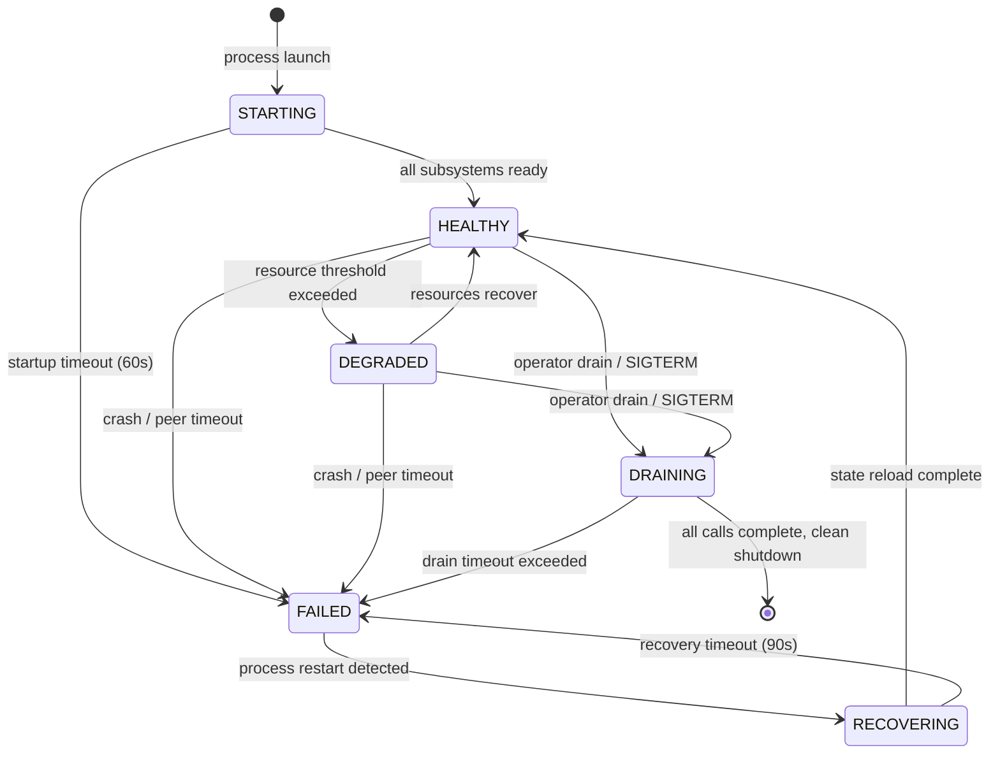
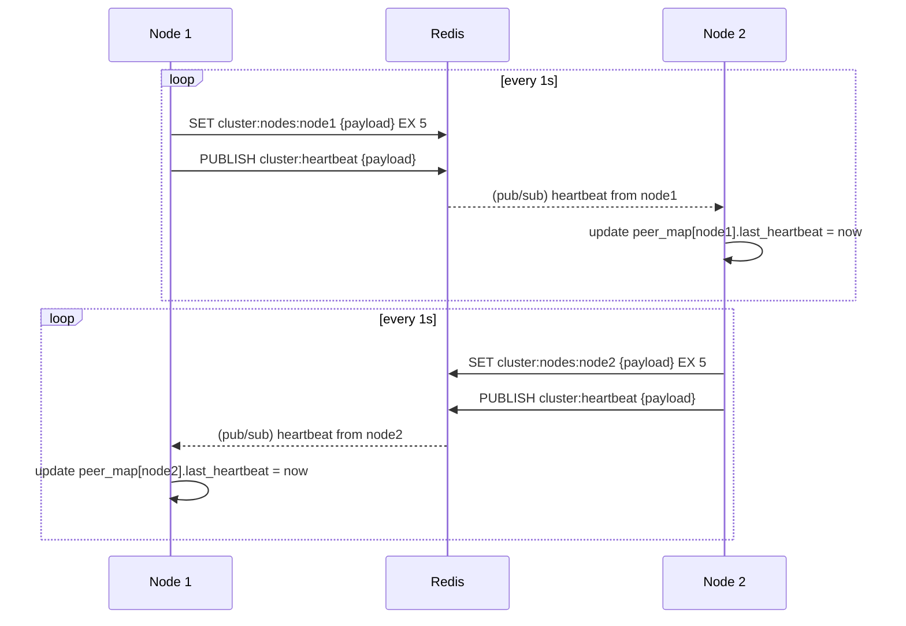
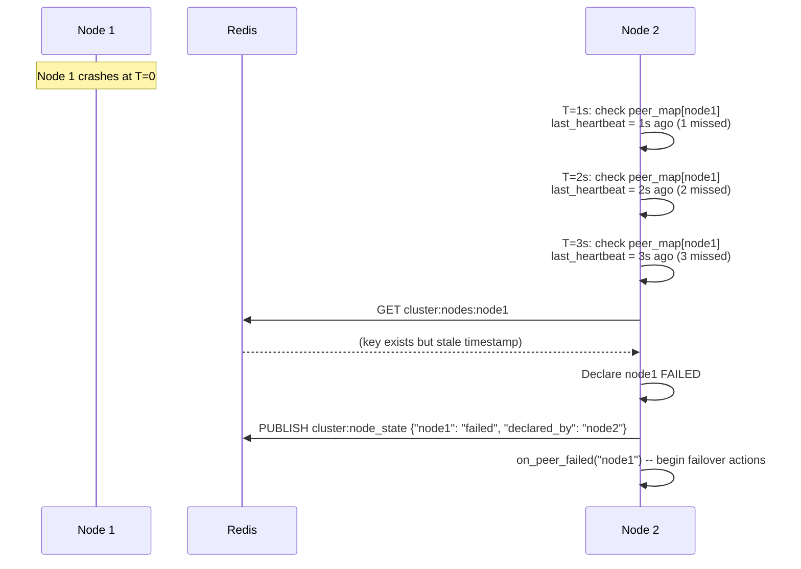
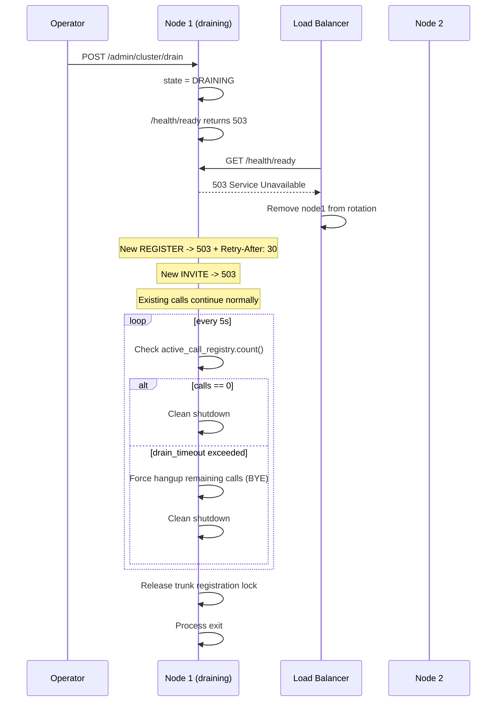

# RustPBX Health Monitoring and Automatic Failover Design

## Document Metadata

| Field | Value |
|-------|-------|
| Task | rpbx-mwi.4 |
| Parent | clustering-architecture.md (rpbx-mwi.1, rpbx-mwi.2) |
| Status | Draft |
| Created | 2026-02-24 |

---

## 1. Overview

This document specifies the health monitoring, failure detection, and automatic failover
subsystem for RustPBX clustering. It builds on the shared-state architecture described in
`clustering-architecture.md` (PostgreSQL + Redis, `ClusteredLocator`, dialog-to-node mapping)
and defines the mechanisms by which nodes detect failures, trigger failover, and avoid
split-brain conditions.

The design targets a 2--8 node active-active cluster and is implemented entirely within
Rust/tokio, using the existing `CancellationToken` shutdown pattern already present in
`src/bin/rustpbx.rs` and `src/app.rs`.

---

## 2. Node State Machine

Every RustPBX node maintains a local state machine that governs its participation in the
cluster. State transitions are driven by health checks, operator commands, and peer
observations.

### 2.1 States

| State | Description |
|-------|-------------|
| **STARTING** | Process is booting: loading config, running migrations, binding transports. Not accepting SIP or HTTP traffic. |
| **HEALTHY** | Fully operational. Accepting SIP registrations, new calls, and serving HTTP. Health endpoints return 200. |
| **DEGRADED** | Operational but under stress. Accepting traffic but advertising reduced capacity. Triggers alerting. |
| **DRAINING** | Preparing for shutdown. Rejecting new REGISTER and INVITE (503). Existing calls continue. |
| **FAILED** | Node is unreachable or has crashed. State is assigned by *peer nodes* observing missed heartbeats. |
| **RECOVERING** | Node is restarting after failure. Re-loading state from shared stores, re-establishing peer connections. Equivalent to STARTING but with stale-state cleanup. |

### 2.2 State Diagram



### 2.3 Transition Triggers

| Transition | Trigger | Mechanism |
|------------|---------|-----------|
| STARTING -> HEALTHY | SIP endpoint bound, DB connected, all modules started | `on_start()` returns Ok for all `ProxyModule` instances |
| HEALTHY -> DEGRADED | CPU > 80% for 30s, memory > 85%, packet loss > 2%, active calls > 90% capacity | Local `ResourceMonitor` task |
| DEGRADED -> HEALTHY | All resource metrics return below thresholds for 15s | Hysteresis in `ResourceMonitor` |
| HEALTHY/DEGRADED -> DRAINING | `POST /admin/cluster/drain` or SIGTERM received | Sets `draining: AtomicBool` in `AppStateInner` |
| DRAINING -> shutdown | `ActiveProxyCallRegistry::count() == 0` or drain timeout (configurable, default 300s) | Drain watchdog task |
| any -> FAILED | 0 heartbeats received for `missed_heartbeat_threshold` intervals | Peer `HeartbeatMonitor` task |
| FAILED -> RECOVERING | New heartbeat received from previously-failed node | Peer `HeartbeatMonitor` task |
| RECOVERING -> HEALTHY | Node reports HEALTHY in heartbeat payload | Heartbeat payload `status` field |

### 2.4 Implementation: `NodeState`

The node state is held as an `Arc<AtomicU8>` in `AppStateInner`, encoded as a u8 enum.
All state transitions are performed through a single `transition_to(new_state)` method that
validates the transition is legal (per the diagram above), logs it, publishes it to Redis
pub/sub (`cluster:node_state`), and updates the Prometheus gauge.

```rust
// src/cluster/state.rs
#[repr(u8)]
#[derive(Debug, Clone, Copy, PartialEq, Eq)]
pub enum NodeState {
    Starting    = 0,
    Healthy     = 1,
    Degraded    = 2,
    Draining    = 3,
    Failed      = 4,  // only assigned by peers
    Recovering  = 5,
}
```

---

## 3. Heartbeat Protocol

### 3.1 Transport: Redis Pub/Sub + Key Expiry

Rather than implementing raw UDP multicast or TCP peer-to-peer heartbeats (which add NAT
traversal complexity and require a separate discovery mechanism), heartbeats piggyback on
the Redis infrastructure already required for registration caching and dialog mapping.

Each node performs two operations every heartbeat interval:

1. **Publish** a heartbeat message to the `cluster:heartbeat` Redis pub/sub channel.
2. **Set** a Redis key `cluster:nodes:{node_id}` with the heartbeat payload and a TTL of
   `heartbeat_interval * (missed_threshold + 1)`.

The pub/sub channel provides low-latency notification to all peers. The key-with-TTL
provides persistence: if a peer misses the pub/sub messages (e.g., reconnecting to Redis),
it can still read the key to determine liveness.

### 3.2 Heartbeat Payload

```json
{
  "node_id": "node1",
  "status": "healthy",
  "timestamp_ms": 1709251200000,
  "seq": 142857,
  "load": {
    "active_calls": 42,
    "active_registrations": 150,
    "cpu_percent": 35.2,
    "memory_percent": 62.1,
    "rtp_ports_used": 84,
    "rtp_ports_total": 5000
  },
  "sip_endpoint": "ok",
  "database": "ok",
  "redis": "ok",
  "version": "0.3.18",
  "uptime_secs": 86400
}
```

The `seq` field is a monotonically increasing counter. Peers use it to detect duplicate or
out-of-order heartbeats (unlikely with Redis but defensive).

### 3.3 Timing Parameters

| Parameter | Default | Config Key | Rationale |
|-----------|---------|------------|-----------|
| Heartbeat interval | 1s | `cluster.heartbeat_interval_ms` | Fast enough for <5s crash detection without overloading Redis |
| Missed heartbeat threshold | 3 | `cluster.missed_heartbeat_threshold` | 3 missed = 3s before FAILED declaration |
| Heartbeat key TTL | 5s | (computed) | `interval * (threshold + 2)` -- extra margin for Redis latency |
| Peer check interval | 1s | (same as heartbeat) | Check peer liveness on every heartbeat cycle |

### 3.4 Heartbeat Sender Task

```rust
// src/cluster/heartbeat.rs (pseudocode)
async fn heartbeat_sender(
    node_id: String,
    state: Arc<AtomicU8>,  // NodeState
    app_state: AppState,
    redis: RedisPool,
    cancel: CancellationToken,
    interval: Duration,
) {
    let mut seq: u64 = 0;
    let mut ticker = tokio::time::interval(interval);

    loop {
        select! {
            _ = ticker.tick() => {
                seq += 1;
                let payload = build_heartbeat_payload(&node_id, &state, &app_state, seq);
                let key = format!("cluster:nodes:{}", node_id);
                let ttl_ms = interval.as_millis() as u64 * 5;

                // SET with TTL and PUBLISH are pipelined in a single round-trip
                let _: () = redis::pipe()
                    .set_ex(&key, &payload, ttl_ms / 1000)
                    .publish("cluster:heartbeat", &payload)
                    .query_async(&mut redis.get().await?)
                    .await?;
            }
            _ = cancel.cancelled() => break,
        }
    }
}
```

### 3.5 Heartbeat Receiver / Peer Monitor Task

Each node subscribes to `cluster:heartbeat` and maintains a `HashMap<String, PeerState>`
tracking the last-seen timestamp and payload for every peer.

```rust
struct PeerState {
    node_id: String,
    last_heartbeat: Instant,
    last_seq: u64,
    status: NodeState,
    load: LoadMetrics,
}
```

On every local heartbeat tick, the monitor scans all peers. If
`now - peer.last_heartbeat > interval * missed_threshold`, the peer is declared FAILED and
the `on_peer_failed(peer_id)` callback fires, which triggers failover actions (section 7).

### 3.6 Sequence Diagram: Normal Heartbeat Flow



### 3.7 Redis Connectivity Loss

If a node cannot reach Redis for heartbeat publishing:

1. After 3 failed Redis operations: node transitions to DEGRADED (it can still serve SIP but
   cannot participate in cluster coordination).
2. After 10 failed operations (10s at 1s interval): node enters a **read-only cluster mode**
   where it continues processing existing calls but rejects new INVITEs with 503, because it
   cannot update dialog-to-node mappings or verify trunk registration locks.
3. Redis reconnection is automatic (the `deadpool-redis` pool handles reconnection). Once
   successful, the node resumes heartbeat publishing and transitions back to HEALTHY/DEGRADED
   based on resource metrics.

---

## 4. Health Check Endpoints

### 4.1 HTTP Endpoints

These endpoints are served by the existing Axum router in `src/app.rs`. They extend the
current `/ami/v1/health` endpoint with standard Kubernetes-compatible paths.

| Endpoint | Auth | Purpose | Response |
|----------|------|---------|----------|
| `GET /health` | None | Liveness probe. Returns 200 if the process is running. | `{"status": "ok"}` |
| `GET /health/ready` | None | Readiness probe. Returns 200 when HEALTHY or DEGRADED, 503 when STARTING, DRAINING, or RECOVERING. | `{"ready": true/false, "state": "healthy"}` |
| `GET /health/detail` | AMI auth | Detailed component health. For monitoring dashboards and load balancer weighting. | Full JSON (see below) |

**`/health/detail` response:**

```json
{
  "node_id": "node1",
  "state": "healthy",
  "uptime_secs": 86400,
  "version": "0.3.18",
  "checks": {
    "sip_endpoint": {"status": "ok", "latency_ms": 0},
    "database": {"status": "ok", "latency_ms": 2},
    "redis": {"status": "ok", "latency_ms": 1},
    "rtp_ports": {"status": "ok", "used": 84, "total": 5000},
    "trunk_registrations": {
      "status": "ok",
      "trunks": {
        "telnyx": {"registered": true, "expires_in_secs": 245}
      }
    }
  },
  "load": {
    "active_calls": 42,
    "active_registrations": 150,
    "cpu_percent": 35.2,
    "memory_percent": 62.1
  },
  "cluster": {
    "peers": 1,
    "peers_healthy": 1,
    "is_trunk_leader": true
  }
}
```

### 4.2 SIP OPTIONS Ping

SIP OPTIONS is the standard keepalive mechanism in SIP (RFC 3261 Section 11). RustPBX
already handles OPTIONS as part of the `rsipstack` transaction layer.

**Internal health check (cluster peers):**

Each node periodically sends SIP OPTIONS to its peers' SIP endpoints. This validates the
full SIP stack (transport binding, transaction layer, module pipeline) rather than just
HTTP reachability.

- Interval: 10s (less frequent than heartbeat; this is a deeper check)
- Timeout: 2s per attempt
- Failure threshold: 3 consecutive failures triggers a SIP-specific DEGRADED sub-alert

**External health check (trunk providers):**

For each configured trunk with `register = true`, send SIP OPTIONS to the trunk's SIP
proxy. This detects upstream provider outages.

- Interval: 30s
- Timeout: 5s
- Logged as a trunk health metric, surfaced in `/health/detail`

### 4.3 RTP Echo Test

An optional self-test that validates the media path:

1. Allocate two RTP ports from the local pool.
2. Send a short burst of RTP packets (10 packets, PCMU silence) from port A to port B.
3. Verify all packets arrive within 50ms.
4. Release both ports.

This catches kernel-level networking issues (iptables misconfiguration, port exhaustion,
UDP buffer overflow) that would not be detected by SIP-only checks.

- Interval: 60s (expensive; involves real UDP I/O)
- Failure: transition to DEGRADED with alert

### 4.4 Database Connectivity Check

A lightweight query executed on the heartbeat interval:

```sql
SELECT 1
```

This uses the existing `SeaORM` `DatabaseConnection` pool. If the query fails or exceeds
500ms, the database check reports `degraded`. If it fails for 3 consecutive attempts, it
reports `failed`.

The check is run against both the main `database_url` connection and, if separate, the
`[proxy.locator]` database connection.

### 4.5 Trunk Registration Health

For each trunk with `register = true`, monitor the `Registration` state from `rsipstack`.
The existing `TrunkRegistrationModule` in `src/proxy/trunk_register.rs` spawns a
`Registration` task per trunk. Health monitoring reads the registration status:

| Status | Health |
|--------|--------|
| Registered, expires_in > 60s | `ok` |
| Registered, expires_in < 60s | `warning` (refresh may be failing) |
| Unregistered / failed | `failed` |

### 4.6 Composite Health Score

Individual checks are combined into a composite score for load-balancer consumption. The
`/health/ready` endpoint returns 503 if any critical check fails:

| Check | Critical | Weight |
|-------|----------|--------|
| SIP endpoint bound | Yes | -- |
| Database connected | Yes | -- |
| Redis connected | No (degrades cluster features) | -- |
| RTP port availability (>10% free) | Yes | -- |
| Node state is HEALTHY or DEGRADED | Yes | -- |
| CPU < 95% | No (DEGRADED, not FAILED) | -- |

---

## 5. Failure Detection Timing

### 5.1 Detection Classes

Different failure modes require different detection speeds. Faster detection risks more
false positives; slower detection risks longer outage windows.

| Failure Class | Target Detection Time | Mechanism | False Positive Mitigation |
|---------------|----------------------|-----------|--------------------------|
| **Node crash** (process exit, OOM kill, kernel panic) | < 3s | Heartbeat timeout (1s interval x 3 missed) | Redis key TTL as fallback confirmation |
| **Network partition** (node alive but unreachable) | < 15s | Heartbeat timeout + SIP OPTIONS cross-check | Require both heartbeat AND OPTIONS failure before declaring FAILED |
| **Gradual degradation** (CPU saturation, memory pressure, disk I/O) | < 30s | `ResourceMonitor` local sampling at 5s intervals, 6 consecutive threshold breaches | Hysteresis: must be below threshold for 15s before clearing DEGRADED |
| **Upstream trunk failure** (provider outage) | < 60s | SIP OPTIONS to trunk, registration expiry | Not a node failure; generates trunk-specific alert |
| **Database failure** (PostgreSQL unreachable) | < 5s | Connection pool health + `SELECT 1` on heartbeat interval | Retry with backoff before declaring failed |

### 5.2 Sequence Diagram: Node Crash Detection



### 5.3 Network Partition Detection

A network partition is harder to detect because both halves may be functional. Node 2 cannot
distinguish "node 1 crashed" from "the network between us is down." The dual-check approach:

1. **Heartbeat miss** (via Redis pub/sub): If node 1 cannot reach Redis, its heartbeat key
   expires. Node 2 sees this.
2. **SIP OPTIONS cross-check**: Node 2 sends SIP OPTIONS directly to node 1's SIP port. If
   this also fails, the combined evidence confirms unreachability.
3. **Redis reachability as arbiter**: If node 2 can reach Redis but node 1's key has expired,
   and direct SIP OPTIONS to node 1 fails, node 2 concludes node 1 is partitioned or down.

If node 2 *also* loses Redis connectivity, it enters DEGRADED/read-only mode (section 3.7)
rather than making failover decisions, because it has no quorum.

---

## 6. Automatic Failover Triggers and Procedures

### 6.1 Failover Trigger Matrix

| Condition | Action | Type |
|-----------|--------|------|
| Peer heartbeat missed >= threshold | Declare peer FAILED, assume trunk leader if needed, clean up peer's stale Redis keys | Emergency |
| Peer reports DEGRADED for > 60s | Log warning, increase own capacity weight in LB | Informational |
| Local node receives SIGTERM | Transition to DRAINING, begin call drain procedure | Graceful |
| `POST /admin/cluster/drain` | Same as SIGTERM but without process exit | Graceful |
| Database unreachable for > 10s | Transition to DEGRADED, reject new calls, continue existing | Emergency (partial) |
| Redis unreachable for > 10s | Transition to DEGRADED read-only cluster mode | Emergency (partial) |

### 6.2 Graceful Failover (Planned Maintenance)

Graceful failover is operator-initiated and ensures zero dropped calls.



**SIGTERM handling** (extends existing logic in `src/bin/rustpbx.rs`):

The current SIGTERM handler immediately cancels the `CancellationToken`. The new behavior
interposes a drain phase:

1. SIGTERM received: transition to DRAINING (do NOT cancel the token yet).
2. Start drain watchdog task with configurable timeout (default 300s).
3. Reject new REGISTER/INVITE in `RegistrarModule` and `CallModule`.
4. When `active_call_registry.count() == 0` OR drain timeout expires: cancel the
   `CancellationToken`, triggering normal shutdown.
5. If a second SIGTERM is received during drain: immediate shutdown (cancel token).

### 6.3 Emergency Failover (Node Crash)

Emergency failover is automatic and triggered by peer heartbeat timeout.

**Actions taken by surviving node(s) when a peer is declared FAILED:**

1. **Trunk registration leadership**: If the failed node held the trunk registration lock
   (`trunk_register_leader:{trunk_name}`), the lock's TTL will expire. Surviving nodes
   compete to acquire it. The winner sends a new REGISTER to the upstream provider, ensuring
   inbound calls continue to route.

2. **Stale Redis cleanup**: Remove the failed node's entries from:
   - `cluster:nodes:{node_id}` (may already be expired via TTL)
   - `active_calls` hash entries owned by the failed node
   - `dialog:{call-id}` keys pointing to the failed node

3. **Call record finalization**: For each active call that was on the failed node (read from
   the `active_calls` Redis hash before cleanup), write a call record to PostgreSQL with
   `hangup_cause = "node_failure"` and `duration` estimated from the call start time.

4. **Alert emission**: Fire a CRITICAL alert (section 9) with the failed node's identity and
   the number of affected calls.

5. **Optional: call recovery via re-INVITE** (Phase 4 only, requires dialog replication):
   - Read replicated dialog state from Redis for each call on the failed node.
   - Allocate local RTP ports.
   - Send re-INVITE to both call legs with updated SDP.
   - Establish new `MediaBridge` instances.
   - This recovers calls with a 1--5 second audio gap.

---

## 7. Split-Brain Prevention

### 7.1 The Problem

In a 2-node cluster, if the network link between the nodes fails but both nodes can still
reach their SIP clients, both nodes will declare the other FAILED and attempt to:
- Acquire trunk registration leadership (duplicate REGISTERs to provider)
- Accept new calls for the same extensions
- Potentially create conflicting call records

### 7.2 Quorum-Based Decision Making

For clusters of 3+ nodes, use a simple majority quorum: a node may only declare a peer
FAILED and perform failover actions if it can confirm that N/2+1 nodes (including itself)
agree the peer is unreachable.

**Implementation:**

When a node detects a peer heartbeat timeout, it does not immediately declare the peer
FAILED. Instead, it publishes a `cluster:vote_peer_failed` message to Redis with the
suspect peer's node_id. Each node that also observes the timeout publishes the same vote.
A node only proceeds with failover when it has collected votes from a quorum.

```rust
// Quorum check pseudocode
fn has_quorum(total_nodes: usize, votes: usize) -> bool {
    votes >= (total_nodes / 2) + 1
}
```

For a **2-node cluster**, quorum is impossible when one node fails (1 out of 2 is not a
majority). This is the classic "2-node split-brain" problem. The solution is one of:

### 7.3 Two-Node Fencing: Redis as Witness

In a 2-node cluster, Redis acts as the third vote (a "witness"). The surviving node can
only perform failover actions if it can reach Redis. This means:

- **Node A dies, Node B can reach Redis**: Node B acquires locks, performs failover. Correct.
- **Network partition, both reach Redis**: Both see the other's heartbeat key expire. Both
  attempt to acquire the trunk registration lock via `SET ... NX`. Only one succeeds (Redis
  serializes the `NX` operation). The loser backs off and enters DEGRADED. Correct.
- **Network partition, neither reaches Redis**: Both enter DEGRADED read-only mode. Neither
  performs failover actions. Calls in progress on each node continue, but no new calls are
  accepted. This is a safe (conservative) failure mode. Correct.

### 7.4 STONITH-Like Fencing for SIP

Traditional STONITH ("Shoot The Other Node In The Head") physically powers off the failed
node. In a SIP context, fencing means preventing the fenced node from interfering with
the cluster:

1. **Trunk registration fencing**: The surviving node immediately sends a REGISTER to the
   upstream trunk provider with the full set of contacts. Since the failed node's REGISTER
   will expire (or its keepalive will fail), the provider will naturally route to the
   survivor. The distributed lock in Redis prevents both nodes from simultaneously claiming
   trunk leadership.

2. **Registration fencing**: If both nodes can still accept REGISTER requests during a
   partition, the shared PostgreSQL database arbitrates. The last REGISTER to write to the
   `rustpbx_locations` table wins. When the partition heals, the stale node's registrations
   are overwritten.

3. **Call fencing**: During a partition, each half only serves calls for extensions whose
   clients are reachable from that half. This is naturally correct -- a phone connected to
   node 1's network can only be reached by node 1.

### 7.5 Partition Healing

When the network partition heals and both nodes can again see each other's heartbeats:

1. Both nodes exchange full heartbeat payloads.
2. The node with the stale trunk registration lock releases it (TTL may have already expired).
3. Both nodes re-validate their active registrations against PostgreSQL.
4. Both transition to HEALTHY.
5. An INFO-level alert is fired: "Cluster partition healed."

---

## 8. Resource Monitoring

### 8.1 `ResourceMonitor` Task

A background tokio task running on each node that samples system resources and updates the
node state accordingly.

```rust
// src/cluster/resource_monitor.rs (pseudocode)
struct ResourceMonitor {
    state: Arc<AtomicU8>,
    config: ResourceThresholds,
    degraded_since: Option<Instant>,
    cancel: CancellationToken,
}

struct ResourceThresholds {
    cpu_degraded_percent: f32,      // default: 80.0
    cpu_critical_percent: f32,      // default: 95.0
    memory_degraded_percent: f32,   // default: 85.0
    memory_critical_percent: f32,   // default: 95.0
    rtp_port_min_free: usize,       // default: 50
    packet_loss_degraded: f32,      // default: 2.0 (percent)
    call_capacity_degraded: f32,    // default: 90.0 (percent of max)
    degraded_hold_secs: u64,        // default: 30 (hysteresis)
    recovery_hold_secs: u64,        // default: 15 (hysteresis)
}
```

**Sampling method:**

- **CPU**: Read `/proc/stat` (Linux) or equivalent. Compute user+system percentage over
  the sampling interval. On Linux, use `procfs` crate. On other platforms, use `sysinfo`.
- **Memory**: Read `/proc/meminfo` or `sysinfo` crate. Track RSS of the RustPBX process
  plus system-wide available memory.
- **RTP ports**: Query `rtp_start_port..rtp_end_port` utilization from
  `RtpTrackBuilder` (count of allocated `PeerConnection` instances vs. total range).
- **Packet loss**: Aggregate from `CallQuality` / `LegQuality` metrics across active
  `MediaBridge` instances. The existing `LegQuality` in `src/media/call_quality.rs` already
  tracks `total_packets` and `lost_packets`.

### 8.2 Threshold Behavior

| Metric | DEGRADED threshold | CRITICAL (reject new calls) | Recovery |
|--------|-------------------|---------------------------|----------|
| CPU | > 80% for 30s | > 95% for 10s | < 70% for 15s |
| Memory | > 85% | > 95% | < 75% for 15s |
| RTP ports free | < 100 | < 10 | > 200 |
| Aggregate packet loss | > 2% | > 10% | < 1% for 15s |
| Active calls | > 90% of configured max | > 98% | < 80% |

Hysteresis prevents flapping: a node does not transition back to HEALTHY until the metric
has been below the recovery threshold for `recovery_hold_secs`.

---

## 9. Alerting Integration

### 9.1 Alert Severity Levels

| Level | Meaning | Examples |
|-------|---------|---------|
| **INFO** | Notable event, no action needed | Node started, partition healed, drain completed |
| **WARNING** | Potential issue, monitor closely | Node DEGRADED, trunk registration expiring, CPU > 80% |
| **CRITICAL** | Immediate action required | Node FAILED, database unreachable, all RTP ports exhausted, split-brain detected |

### 9.2 Alert Structure

```json
{
  "alert_id": "a1b2c3d4-uuid",
  "timestamp": "2026-02-24T12:00:00Z",
  "severity": "critical",
  "source_node": "node2",
  "category": "node_health",
  "title": "Node node1 declared FAILED",
  "detail": "Node node1 missed 3 consecutive heartbeats. 12 active calls affected.",
  "labels": {
    "cluster": "prod-east",
    "node": "node1",
    "affected_calls": 12
  },
  "fingerprint": "node_failed:node1"
}
```

### 9.3 Integration Points

Alerts are dispatched by an `AlertDispatcher` that supports multiple backends configured
in TOML:

```toml
[cluster.alerting]
enabled = true
dedup_window_secs = 300     # suppress duplicate alerts for 5 minutes

[[cluster.alerting.targets]]
type = "webhook"
url = "https://hooks.slack.com/services/T.../B.../xxx"
severity_min = "warning"    # only warning and critical
template = "slack"          # built-in Slack Block Kit template

[[cluster.alerting.targets]]
type = "webhook"
url = "https://events.pagerduty.com/v2/enqueue"
severity_min = "critical"   # only critical
headers = { "Content-Type" = "application/json" }
template = "pagerduty"

[[cluster.alerting.targets]]
type = "email"
smtp_host = "smtp.example.com"
smtp_port = 587
from = "rustpbx-alerts@example.com"
to = ["ops@example.com"]
severity_min = "warning"

[[cluster.alerting.targets]]
type = "log"                # always-on: write to tracing at appropriate level
severity_min = "info"
```

### 9.4 Deduplication and Escalation

- **Deduplication**: Alerts are deduplicated by `fingerprint`. If an alert with the same
  fingerprint has been sent within `dedup_window_secs`, it is suppressed. The fingerprint
  is derived from the alert category and key identifiers (e.g., `"node_failed:node1"`).

- **Escalation**: If a WARNING alert is not resolved (same fingerprint still firing) after
  `escalation_timeout_secs` (default 600s / 10 minutes), it is re-emitted as CRITICAL.

- **Resolution**: When the condition clears (e.g., node recovers, CPU drops), a
  resolution alert with the same fingerprint is sent. PagerDuty and OpsGenie integrations
  use this to auto-resolve incidents.

### 9.5 Built-In Alert Catalog

| Fingerprint Pattern | Severity | Condition |
|---------------------|----------|-----------|
| `node_failed:{id}` | CRITICAL | Peer declared FAILED |
| `node_degraded:{id}` | WARNING | Peer in DEGRADED state |
| `node_drain:{id}` | INFO | Peer entered DRAINING |
| `node_recovered:{id}` | INFO | Peer transitioned to HEALTHY from FAILED/RECOVERING |
| `partition_detected` | CRITICAL | Split-brain / partition detected |
| `partition_healed` | INFO | Partition resolved |
| `db_unreachable` | CRITICAL | Database connectivity lost for > 10s |
| `redis_unreachable` | WARNING | Redis connectivity lost for > 3s |
| `trunk_reg_failed:{name}` | WARNING | Trunk registration failed or expiring |
| `rtp_ports_low` | WARNING | < 100 free RTP ports |
| `rtp_ports_exhausted` | CRITICAL | < 10 free RTP ports |
| `cpu_high:{id}` | WARNING | CPU > 80% sustained |
| `memory_high:{id}` | WARNING | Memory > 85% |

---

## 10. Configuration

All health monitoring parameters are under the `[cluster]` section in the node's config
TOML, extending the schema proposed in `clustering-architecture.md` section 3.5:

```toml
[cluster]
enabled = true
node_id = "node1"                       # unique per node (default: hostname)
redis_url = "redis://10.0.0.20:6379"

# Heartbeat
heartbeat_interval_ms = 1000            # 1 second
missed_heartbeat_threshold = 3          # 3 missed = FAILED
peer_options_ping_interval_secs = 10    # SIP OPTIONS to peers
rtp_echo_test_interval_secs = 60        # RTP self-test

# Drain
drain_timeout_secs = 300                # max time to wait for calls to finish
drain_force_hangup = true               # BYE remaining calls on timeout

# Resource thresholds
max_calls = 500                         # capacity ceiling for this node
cpu_degraded_percent = 80.0
cpu_critical_percent = 95.0
memory_degraded_percent = 85.0
memory_critical_percent = 95.0
rtp_port_min_free = 50
packet_loss_degraded_percent = 2.0

# Hysteresis
degraded_hold_secs = 30
recovery_hold_secs = 15

# Alerting (see section 9.3 for target configuration)
[cluster.alerting]
enabled = true
dedup_window_secs = 300
escalation_timeout_secs = 600
```

---

## 11. Implementation Plan

### 11.1 New Source Files

| File | Purpose |
|------|---------|
| `src/cluster/mod.rs` | Module root; `ClusterManager` lifecycle (init, shutdown) |
| `src/cluster/state.rs` | `NodeState` enum, transition validation, atomic state holder |
| `src/cluster/heartbeat.rs` | `HeartbeatSender` and `PeerMonitor` tasks |
| `src/cluster/resource_monitor.rs` | CPU/memory/RTP sampling, threshold evaluation |
| `src/cluster/failover.rs` | `on_peer_failed()` handler, trunk lock acquisition, stale cleanup |
| `src/cluster/drain.rs` | Drain state machine, SIGTERM interception, drain watchdog |
| `src/cluster/alert.rs` | `AlertDispatcher`, deduplication, webhook/email/log backends |
| `src/cluster/split_brain.rs` | Quorum voting, Redis-as-witness fencing logic |
| `src/handler/health.rs` | `/health`, `/health/ready`, `/health/detail` HTTP handlers |

### 11.2 Modified Source Files

| File | Change |
|------|--------|
| `src/config.rs` | Add `ClusterConfig`, `ResourceThresholds`, `AlertConfig` structs |
| `src/app.rs` | Add `NodeState` to `AppStateInner`; initialize `ClusterManager` on startup; add `draining: AtomicBool` |
| `src/bin/rustpbx.rs` | Modify SIGTERM handler to enter DRAINING instead of immediate shutdown |
| `src/proxy/registrar.rs` | Check `draining` flag; respond 503 + Retry-After when draining |
| `src/proxy/call.rs` | Check `draining` flag; respond 503 for new INVITE when draining |
| `src/proxy/trunk_register.rs` | Acquire Redis distributed lock before sending REGISTER to upstream |
| `src/handler/ami.rs` | Add `/admin/cluster/drain`, `/admin/cluster/undrain`, `/admin/cluster/nodes` endpoints |

### 11.3 Dependencies

| Crate | Purpose | Version |
|-------|---------|---------|
| `deadpool-redis` | Async Redis connection pool | latest |
| `sysinfo` | Cross-platform CPU/memory metrics | 0.30+ |
| `reqwest` | Webhook HTTP POST (already in deps) | existing |
| `lettre` | SMTP email for alerts (optional feature) | 0.11+ |
| `moka` | In-memory LRU cache with TTL | 0.12+ |

### 11.4 Phasing

This work maps to **Phase 2** (registration sync and node awareness) and **Phase 3**
(dialog awareness and graceful operations) from `clustering-architecture.md`:

| Phase | Health Monitoring Deliverables |
|-------|-------------------------------|
| Phase 2 | Heartbeat sender/receiver, peer monitor, `/health` endpoints, `NodeState` machine, basic alerting (log + webhook), resource monitor, drain endpoint |
| Phase 3 | SIP OPTIONS cross-check, RTP echo test, full failover handler (`on_peer_failed`), split-brain quorum voting, alert escalation, email integration |
| Phase 4 | Call recovery via re-INVITE on failover (requires dialog replication from Phase 4 of clustering-architecture.md) |

---

## 12. Testing Strategy

### 12.1 Unit Tests

- `NodeState` transition validation: verify all legal transitions succeed and illegal
  transitions are rejected.
- Heartbeat payload serialization/deserialization round-trip.
- Quorum calculation: `has_quorum(3, 2) == true`, `has_quorum(2, 1) == false`.
- Alert deduplication: same fingerprint within window is suppressed; different fingerprint
  is not.
- Resource threshold hysteresis: simulate metric oscillation near threshold, verify no
  flapping.

### 12.2 Integration Tests

- **Two-node heartbeat**: Start two RustPBX instances pointing at the same Redis. Verify
  each sees the other in `/health/detail` cluster peers.
- **Node failure simulation**: Start two nodes, kill one with SIGKILL, verify the survivor
  declares it FAILED within 5 seconds and acquires the trunk registration lock.
- **Graceful drain**: Start a node with active calls (via SIPp or `sip_test_call.py`),
  send `POST /admin/cluster/drain`, verify new calls are rejected (503), existing calls
  complete normally, node exits cleanly.
- **Redis failure**: Start a node, stop Redis, verify node transitions to DEGRADED within
  3 seconds and continues serving existing calls.
- **Split-brain simulation**: Use `iptables` to block traffic between two nodes (but not
  to Redis). Verify only one node acquires the trunk lock. Restore connectivity and verify
  both return to HEALTHY.

### 12.3 Chaos Testing

For production readiness, run the following chaos scenarios on a staging cluster:

- Random node kill (SIGKILL) every 5 minutes during a sustained call load.
- Redis restart during active calls.
- PostgreSQL failover (promote replica) during active registrations.
- Network latency injection (50-200ms) between nodes.
- CPU stress (`stress-ng`) to trigger DEGRADED transitions.

---

## 13. Observability

### 13.1 Prometheus Metrics

All metrics use the `rustpbx_` prefix for namespace isolation.

| Metric | Type | Labels | Description |
|--------|------|--------|-------------|
| `rustpbx_node_state` | Gauge | `node_id` | Current state (0=starting, 1=healthy, 2=degraded, 3=draining, 4=failed, 5=recovering) |
| `rustpbx_heartbeat_sent_total` | Counter | `node_id` | Heartbeats sent |
| `rustpbx_heartbeat_received_total` | Counter | `node_id`, `peer_id` | Heartbeats received from each peer |
| `rustpbx_peer_failure_total` | Counter | `node_id`, `peer_id` | Times a peer was declared FAILED |
| `rustpbx_failover_total` | Counter | `node_id`, `type` | Failover events (graceful/emergency) |
| `rustpbx_active_calls` | Gauge | `node_id` | Current active calls |
| `rustpbx_drain_active` | Gauge | `node_id` | 1 if draining, 0 otherwise |
| `rustpbx_alert_fired_total` | Counter | `node_id`, `severity`, `category` | Alerts emitted |
| `rustpbx_health_check_duration_seconds` | Histogram | `node_id`, `check` | Latency of each health check component |
| `rustpbx_cpu_usage_percent` | Gauge | `node_id` | CPU usage |
| `rustpbx_memory_usage_percent` | Gauge | `node_id` | Memory usage |
| `rustpbx_rtp_ports_used` | Gauge | `node_id` | RTP ports in use |

### 13.2 Structured Logging

All cluster events are logged with structured fields for log aggregation:

```
INFO cluster::heartbeat: peer heartbeat received peer_id="node2" seq=142857 active_calls=42
WARN cluster::heartbeat: peer heartbeat missed peer_id="node2" missed_count=2
ERROR cluster::failover: peer declared FAILED peer_id="node2" affected_calls=12
INFO cluster::drain: drain started active_calls=5 timeout_secs=300
INFO cluster::drain: drain complete duration_secs=45
```

---

## 14. Risks and Mitigations

| Risk | Impact | Mitigation |
|------|--------|------------|
| Redis single point of failure | Cluster loses coordination, nodes degrade | Use Redis Sentinel (1 primary + 1 replica). Nodes continue serving calls in DEGRADED mode without Redis. |
| False positive failure detection | Healthy node declared FAILED, trunk registration flaps | Hysteresis thresholds, quorum voting, dual-check (heartbeat + OPTIONS) |
| Heartbeat storm on large cluster | Redis pub/sub overhead at 8 nodes x 1 heartbeat/sec = 8 msg/sec | Negligible for Redis. If scaling beyond 8 nodes, reduce frequency or switch to gossip protocol. |
| Alert fatigue | Operators ignore alerts due to volume | Deduplication, escalation, severity filtering per target |
| Drain timeout too short | Active calls force-terminated during maintenance | Default 300s is generous. Make configurable. Log warning when force-hangup triggers. |
| Split-brain in 2-node cluster without Redis | Both nodes serve independently, duplicate trunk registrations | Document that Redis is required for 2-node HA. Without Redis, failover is manual. |
