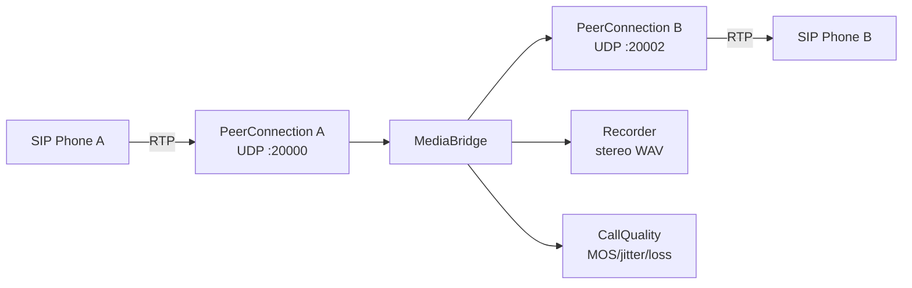
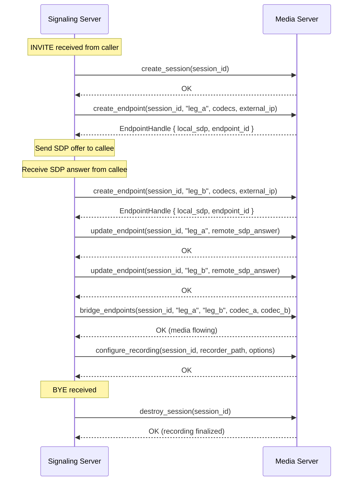
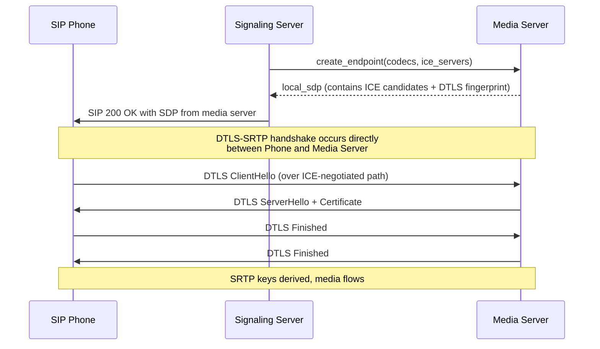
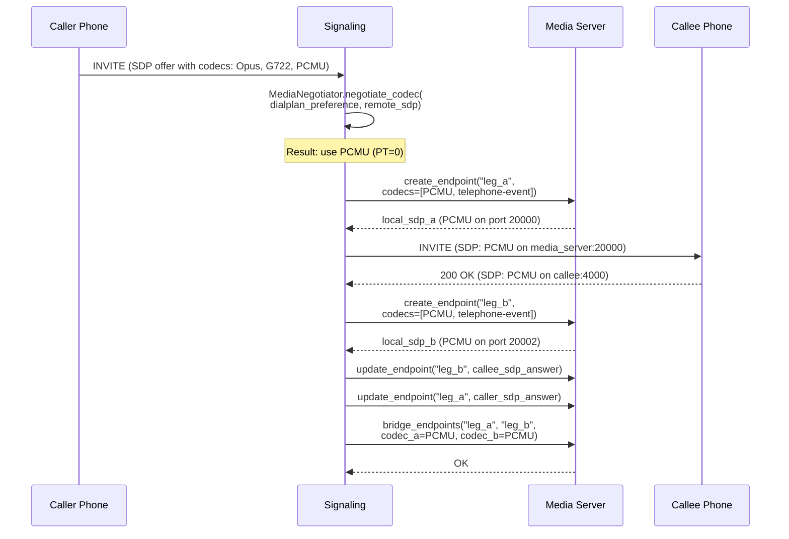
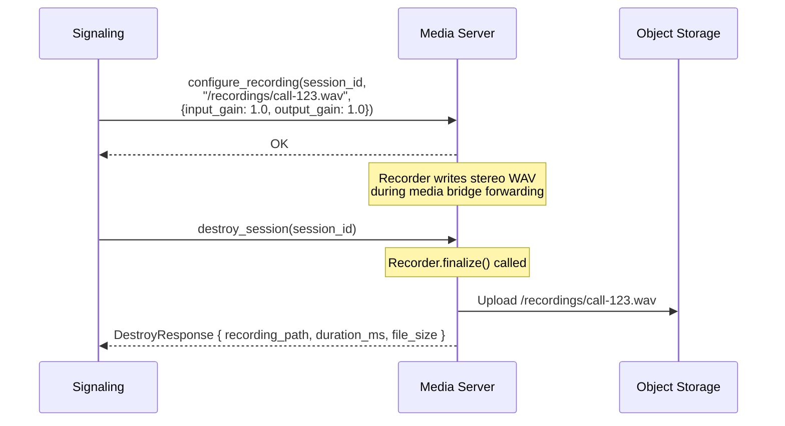

# Media Server Separation Design

## Document Metadata

| Field | Value |
|-------|-------|
| Task | rpbx-mwi.3 |
| Status | Draft |
| Created | 2026-02-24 |
| Depends On | rpbx-mwi.1 (SIP LB), rpbx-mwi.2 (Shared state) |

---

## 1. Current Architecture

### 1.1 How Media Works Today

RustPBX runs as a single process where signaling and media are tightly coupled. Every
call creates a `CallSession` (`src/proxy/proxy_call/session.rs`) that owns both the
SIP dialog state and the media pipeline. The media pipeline consists of three layers:

**Track layer** (`src/media/mod.rs`). The `Track` trait abstracts a single media
endpoint. Two concrete implementations exist:

- `RtcTrack` -- wraps a `rustrtc::PeerConnection` with a local UDP socket for
  RTP/SRTP. Used for both plain RTP (SIP phones) and WebRTC (browser clients).
- `FileTrack` -- plays audio files (ringback, hold music, announcements) into a
  `PeerConnection`.

`RtpTrackBuilder` constructs an `RtcTrack` by binding a UDP port from the configured
range (`rtp_start_port`..`rtp_end_port`), setting codec preferences, external IP, ICE
servers, and latching mode.

**Stream layer** (`MediaStream`, `MediaPeer`). A `MediaStream` holds a map of
track-id to `Track` instances. The `MediaPeer` trait (`media_peer.rs`) wraps a
`MediaStream` and exposes operations like `update_track`, `suppress_forwarding`,
`resume_forwarding`, and `stop`. Each call session has two `MediaPeer` instances:
`caller_peer` (leg A) and `callee_peer` (leg B).

**Bridge layer** (`MediaBridge` in `media_bridge.rs`). The bridge connects two
`MediaPeer` legs. It extracts the `PeerConnection` from each leg's track, listens
for incoming RTP packets via `track.recv()`, optionally transcodes between codecs
(e.g., Opus to PCMU), rewrites payload types, records to a stereo WAV file via
the `Recorder`, feeds call quality metrics (`CallQuality`), and forwards the
resulting `MediaSample` to the opposite leg's `PeerConnection`.

### 1.2 Data Flow Diagram



### 1.3 Key Coupling Points

The current architecture has several tight coupling points between signaling and media:

1. **Track creation in session.rs.** The `CallSession` directly calls
   `RtpTrackBuilder::new()` to allocate UDP ports and create `PeerConnection`
   instances. This happens inline during SIP offer/answer processing (lines ~573,
   ~755, ~898, ~1092 in `session.rs`).

2. **SDP generation is tied to PeerConnection.** `Track::local_description()` and
   `Track::handshake()` call `PeerConnection::create_offer()` /
   `create_answer()`, which depend on locally bound UDP ports and ICE candidates.

3. **MediaBridge created inline.** The `MediaBridge::new()` call happens inside
   `CallSession` during 183 Early Media or 200 OK processing. The session
   directly accesses `PeerConnection` objects from both legs.

4. **Recording is bridge-internal.** The `Recorder` is created inside
   `MediaBridge::new()` and receives samples in the `forward_track` loop.

5. **Codec negotiation is split.** `MediaNegotiator` parses SDP and extracts codec
   info. This info flows into both `RtpTrackBuilder` (for track creation) and
   `MediaBridge` (for transcoding decisions). The session orchestrates both.

---

## 2. Separation Model

### 2.1 Design Principles

The separation must satisfy these constraints:

- **Backward compatible.** The embedded mode (current behavior) remains the default.
  Separation is opt-in via configuration.
- **SDP stays at signaling.** The signaling layer continues to handle SIP
  transactions, SDP offer/answer, and codec negotiation. It tells the media server
  what to do, not vice versa.
- **Media server is stateless from the signaling perspective.** The signaling layer
  owns session state. The media server owns RTP state. If a media server dies, the
  signaling layer can re-allocate media on another server.
- **Minimal API surface.** The media server exposes the fewest operations needed.
  Complex call logic (transfer, queue, hold) stays in signaling.

### 2.2 Media Server API

The API defines six resource-oriented operations on media sessions:

| Operation | Purpose |
|-----------|---------|
| `create_session` | Allocate a new media session with a unique ID |
| `destroy_session` | Tear down all tracks and resources for a session |
| `create_endpoint` | Allocate a PeerConnection (UDP ports, ICE) for one call leg |
| `update_endpoint` | Apply a remote SDP answer/offer to an existing endpoint |
| `bridge_endpoints` | Start forwarding RTP between two endpoints |
| `configure_recording` | Start or stop recording on a bridged session |

### 2.3 Session Lifecycle



### 2.4 Request and Response Types

```rust
/// Identifies a media session on the media server.
#[derive(Debug, Clone)]
pub struct MediaSessionHandle {
    pub session_id: String,
    pub server_addr: String,
}

/// Parameters for creating an endpoint (one call leg).
#[derive(Debug, Clone)]
pub struct CreateEndpointRequest {
    pub session_id: String,
    pub endpoint_id: String,
    pub codecs: Vec<CodecInfo>,
    pub external_ip: Option<String>,
    pub rtp_start_port: Option<u16>,
    pub rtp_end_port: Option<u16>,
    pub transport_mode: TransportMode,
    pub ice_servers: Vec<IceServer>,
    pub enable_latching: bool,
}

/// Result of creating an endpoint.
#[derive(Debug, Clone)]
pub struct CreateEndpointResponse {
    pub endpoint_id: String,
    pub local_sdp: String,
}

/// Parameters for updating an endpoint with remote SDP.
#[derive(Debug, Clone)]
pub struct UpdateEndpointRequest {
    pub session_id: String,
    pub endpoint_id: String,
    pub remote_sdp: String,
    pub sdp_type: SdpType,
}

/// Parameters for bridging two endpoints.
#[derive(Debug, Clone)]
pub struct BridgeRequest {
    pub session_id: String,
    pub endpoint_a: String,
    pub endpoint_b: String,
    pub codec_a: CodecType,
    pub codec_b: CodecType,
    pub params_a: RtpCodecParameters,
    pub params_b: RtpCodecParameters,
    pub dtmf_pt_a: Option<u8>,
    pub dtmf_pt_b: Option<u8>,
}

/// Recording configuration.
#[derive(Debug, Clone)]
pub struct RecordingRequest {
    pub session_id: String,
    pub recorder_path: String,
    pub input_gain: f32,
    pub output_gain: f32,
}
```

---

## 3. Protocol: gRPC vs HTTP/2

### 3.1 Comparison

| Criterion | gRPC (tonic) | HTTP/2 JSON (axum) |
|-----------|-------------|-------------------|
| Latency | Lower (binary protobuf, persistent HTTP/2) | Slightly higher (JSON serialization) |
| Streaming | Built-in bidirectional streaming | Requires SSE or WebSocket |
| Schema enforcement | `.proto` files generate typed clients | Manual request/response structs |
| Ecosystem | `tonic` crate is mature | `axum` already used in RustPBX |
| Debugging | Needs grpcurl/grpcui | curl works directly |
| Dependency weight | Adds `tonic`, `prost`, `protobuf` | Zero new deps (reuses existing axum) |

### 3.2 Recommendation: gRPC with HTTP Fallback

Use gRPC (`tonic`) as the primary protocol between signaling and media servers.
Reasons:

- Media control messages are latency-sensitive (SDP offer/answer has a time budget
  measured in hundreds of milliseconds).
- The `tonic` crate compiles to efficient Rust code with zero-copy deserialization.
- Protobuf schema enforces the API contract between independently deployed binaries.
- Bidirectional streaming enables future extensions (real-time quality metrics,
  DTMF event streaming).

For debugging and ad-hoc operations, expose the same operations via an HTTP/JSON
endpoint on the media server. This is a thin wrapper over the same internal service.

### 3.3 Proto Definition (Sketch)

```protobuf
syntax = "proto3";
package rustpbx.media;

service MediaService {
  rpc CreateSession(CreateSessionRequest) returns (CreateSessionResponse);
  rpc DestroySession(DestroySessionRequest) returns (DestroySessionResponse);
  rpc CreateEndpoint(CreateEndpointRequest) returns (CreateEndpointResponse);
  rpc UpdateEndpoint(UpdateEndpointRequest) returns (UpdateEndpointResponse);
  rpc BridgeEndpoints(BridgeEndpointsRequest) returns (BridgeEndpointsResponse);
  rpc ConfigureRecording(RecordingRequest) returns (RecordingResponse);
  rpc GetSessionStats(StatsRequest) returns (StatsResponse);
}
```

---

## 4. SRTP Key Management

### 4.1 The Problem

When media flows through a separate server, the DTLS-SRTP handshake must occur
between the remote SIP endpoint and the media server's PeerConnection (not the
signaling server). The signaling server never touches RTP packets, so it cannot
participate in DTLS.

### 4.2 Solution: Media Server Handles DTLS Directly



The signaling server acts as a pass-through for SDP but never handles DTLS
or SRTP keys. This is the cleanest separation because:

- No key material crosses the signaling-media API boundary.
- The `rustrtc::PeerConnection` on the media server handles DTLS natively.
- ICE candidates in the SDP point to the media server's IP and ports, not the
  signaling server's.

### 4.3 ICE Candidate Management

For plain RTP (non-WebRTC SIP phones), there is no ICE. The SDP `c=` line and
`m=` port point to the media server's IP and allocated port. The signaling server
receives this in `CreateEndpointResponse::local_sdp` and relays it in the SIP
message.

For WebRTC clients, ICE candidates are gathered by the media server's
PeerConnection. The SDP returned by `create_endpoint` includes the media server's
ICE candidates. The signaling server relays these in the SIP/WebSocket SDP.

If the media server is behind NAT, it must be configured with its own `external_ip`
(passed in `CreateEndpointRequest`). This mirrors the current `RtpTrackBuilder`
behavior.

### 4.4 SDP Rewriting

The signaling server does not modify the SDP media section returned by the media
server. It may:

- Adjust the SDP `o=` (origin) and `s=` (session) lines for SIP compliance.
- Add or modify `a=` attributes unrelated to media (e.g., session timers).

It must NOT modify:

- `c=` connection address (media server's IP).
- `m=` port (media server's allocated port).
- `a=rtpmap`, `a=fmtp` (codec parameters set by media server).
- `a=fingerprint`, `a=ice-ufrag`, `a=ice-pwd` (DTLS/ICE credentials).
- `a=candidate` lines (ICE candidates from media server).

---

## 5. Codec Negotiation Delegation

### 5.1 Negotiation Stays at Signaling

The SIP signaling layer is responsible for SDP offer/answer negotiation. It uses
`MediaNegotiator` to parse remote SDP, determine codec intersection, and apply
preference ordering from the dialplan configuration.

The media server does not negotiate codecs. It is told which codecs to support
on each endpoint.

### 5.2 Flow



### 5.3 Transcoding Decisions

Transcoding happens entirely within the media server. The signaling layer tells
the media server the negotiated codec for each leg via `BridgeRequest.codec_a`
and `BridgeRequest.codec_b`. If they differ (e.g., Opus on leg A, PCMU on leg B),
the media server instantiates a `Transcoder` internally. This is identical to how
`MediaBridge::forward_track` works today -- the logic does not change, only the
process boundary moves.

### 5.4 Re-INVITE Codec Changes

When a re-INVITE changes the codec (e.g., hold/resume, call transfer), the
signaling layer:

1. Negotiates the new codec set.
2. Calls `update_endpoint` with the new remote SDP.
3. Calls `bridge_endpoints` again with the updated codec parameters (or a
   dedicated `update_bridge` call).

The media server replaces the active `Transcoder` and adjusts payload type
rewriting.

---

## 6. Recording Integration

### 6.1 Options

| Approach | Description | Pros | Cons |
|----------|-------------|------|------|
| **Recording on media server** | `Recorder` runs inside the media process, writes locally | Zero network copy of audio data; lowest latency | Recording files are on the media server host, need post-call upload |
| **Recording sidecar** | Separate recording process on the same host, receives forked RTP | Isolates recording from media path; recording crash doesn't affect calls | Extra RTP duplication; more complex setup |
| **Network capture** | Mirror RTP packets to a central recording server | Central storage; scales independently | Significant bandwidth overhead; packet reordering issues |

### 6.2 Recommendation: Recording on Media Server

The `Recorder` stays colocated with the `MediaBridge` inside the media server
process. This preserves the current architecture where `forward_track` writes
samples to the `Recorder` inline. No RTP duplication or additional network hops.

The signaling layer controls recording via `configure_recording`:



### 6.3 Recording File Storage

In embedded mode, recordings are written to the local filesystem (current
behavior). In separated mode, the media server writes to its local filesystem
and uploads to S3-compatible storage on session teardown. The signaling layer
receives the S3 URL in the `DestroySessionResponse` and writes it to the call
record in the database.

This reuses the existing `StorageConfig` infrastructure in `src/storage/mod.rs`
which already supports S3, GCP, Azure, Aliyun, and Minio.

---

## 7. Deployment Topologies

### 7.1 Embedded (Current Default)

```
+----------------------------------------------+
|              RustPBX Process                 |
|  +----------------+  +-------------------+  |
|  |  SIP Signaling |  |  Media Engine     |  |
|  |  (proxy, call  |  |  (PeerConnection, |  |
|  |   session,     |  |   MediaBridge,    |  |
|  |   dialplan)    |  |   Recorder)       |  |
|  +----------------+  +-------------------+  |
+----------------------------------------------+
```

- Single binary, single process.
- `MediaServerClient` implementation: `LocalMediaServer` (direct function calls).
- No serialization overhead, no network round-trips.
- Best for: single-server deployments, development, small offices.

### 7.2 Sidecar (Same Host, Separate Process)

```
+-------------------------+    +-------------------------+
|   Signaling Process     |    |   Media Process         |
|   (rustpbx --signaling) |    |   (rustpbx --media)     |
|                         |    |                         |
|   SIP, dialplan, DB,    |    |   PeerConnection,       |
|   console UI, API       |    |   MediaBridge,          |
|                         |    |   Recorder, Transcoder  |
+----------+--------------+    +----------+--------------+
           |  gRPC localhost:50051         |
           +-------------------------------+
```

- Same host, separate processes.
- `MediaServerClient` implementation: `GrpcMediaServer` pointing at `localhost`.
- Benefits: process isolation (media crash doesn't kill signaling), independent
  resource limits (CPU affinity for media process), independent restarts.
- Best for: medium deployments where isolation matters but dedicated hardware is
  not justified.

### 7.3 Remote (Dedicated Media Servers)

```
+---------------------+       +---------------------+
|  Signaling Node 1   |       |  Signaling Node 2   |
|  (SIP, dialplan,    |       |  (SIP, dialplan,    |
|   console, API)     |       |   console, API)     |
+----------+----------+       +----------+----------+
           |                             |
           |     gRPC over LAN           |
           v                             v
+---------------------+       +---------------------+
|  Media Server 1     |       |  Media Server 2     |
|  (PeerConnection,   |       |  (PeerConnection,   |
|   bridge, record)   |       |   bridge, record)   |
+---------------------+       +---------------------+
```

- Dedicated hosts for media processing.
- `MediaServerClient` implementation: `GrpcMediaServer` with server selection
  (round-robin, least-loaded, or affinity-based).
- Benefits: signaling scales independently from media, media servers can be
  high-CPU/low-memory, geographic placement of media servers near endpoints.
- Best for: large deployments, multi-site, where media processing is the bottleneck.

### 7.4 Comparison

| Factor | Embedded | Sidecar | Remote |
|--------|----------|---------|--------|
| Complexity | None | Low | Medium |
| Latency | Zero | ~0.1ms (loopback) | 1-5ms (LAN) |
| Fault isolation | None | Process-level | Full |
| Independent scaling | No | No | Yes |
| Media server selection | N/A | N/A | Load-based or geographic |
| Network dependency | None | None | LAN reliability |
| Config changes | None | `[media_server]` section | `[media_server]` + media node config |

---

## 8. Interface Definition

### 8.1 The `MediaServerClient` Trait

This trait is the abstraction boundary between signaling and media. The signaling
layer programs against this trait. The runtime configuration determines which
implementation is used.

```rust
use anyhow::Result;
use async_trait::async_trait;
use audio_codec::CodecType;

/// Handle to an active media session on a media server.
#[derive(Debug, Clone)]
pub struct MediaSessionHandle {
    pub session_id: String,
    pub server_addr: String,
}

/// Handle to an endpoint (one call leg) within a media session.
#[derive(Debug, Clone)]
pub struct EndpointHandle {
    pub endpoint_id: String,
    pub local_sdp: String,
}

/// Snapshot of session-level quality and recording state.
#[derive(Debug, Clone, Default)]
pub struct MediaSessionStats {
    pub leg_a_packets: u64,
    pub leg_b_packets: u64,
    pub leg_a_loss_pct: f32,
    pub leg_b_loss_pct: f32,
    pub leg_a_jitter_ms: f32,
    pub leg_b_jitter_ms: f32,
    pub recording_bytes: u64,
    pub recording_duration_ms: u64,
}

/// Configuration for creating a media endpoint.
#[derive(Debug, Clone)]
pub struct EndpointConfig {
    pub codecs: Vec<CodecInfo>,
    pub external_ip: Option<String>,
    pub rtp_start_port: Option<u16>,
    pub rtp_end_port: Option<u16>,
    pub transport_mode: TransportMode,
    pub ice_servers: Vec<IceServer>,
    pub enable_latching: bool,
}

/// Configuration for bridging two endpoints.
#[derive(Debug, Clone)]
pub struct BridgeConfig {
    pub codec_a: CodecType,
    pub codec_b: CodecType,
    pub params_a: RtpCodecParameters,
    pub params_b: RtpCodecParameters,
    pub dtmf_pt_a: Option<u8>,
    pub dtmf_pt_b: Option<u8>,
    pub quality_config: Option<QualityConfig>,
}

/// Configuration for recording.
#[derive(Debug, Clone)]
pub struct RecordingConfig {
    pub path: String,
    pub input_gain: f32,
    pub output_gain: f32,
}

/// Result from session destruction, containing final recording info.
#[derive(Debug, Clone)]
pub struct DestroyResult {
    pub recording_path: Option<String>,
    pub recording_duration_ms: Option<u64>,
    pub final_stats: MediaSessionStats,
}

#[async_trait]
pub trait MediaServerClient: Send + Sync {
    /// Allocate a new media session. Returns a handle for subsequent operations.
    async fn create_session(
        &self,
        session_id: &str,
    ) -> Result<MediaSessionHandle>;

    /// Tear down a media session, finalize recordings, release all ports.
    async fn destroy_session(
        &self,
        session: &MediaSessionHandle,
    ) -> Result<DestroyResult>;

    /// Create an endpoint (PeerConnection) for one call leg.
    /// Returns the local SDP to be sent to the remote party.
    async fn create_endpoint(
        &self,
        session: &MediaSessionHandle,
        endpoint_id: &str,
        config: &EndpointConfig,
    ) -> Result<EndpointHandle>;

    /// Apply a remote SDP (offer or answer) to an existing endpoint.
    async fn update_endpoint(
        &self,
        session: &MediaSessionHandle,
        endpoint_id: &str,
        remote_sdp: &str,
        sdp_type: SdpType,
    ) -> Result<()>;

    /// Remove an endpoint, releasing its ports.
    async fn remove_endpoint(
        &self,
        session: &MediaSessionHandle,
        endpoint_id: &str,
    ) -> Result<()>;

    /// Start forwarding RTP between two endpoints within the same session.
    async fn bridge_endpoints(
        &self,
        session: &MediaSessionHandle,
        endpoint_a: &str,
        endpoint_b: &str,
        config: &BridgeConfig,
    ) -> Result<()>;

    /// Start recording on an active bridge.
    async fn start_recording(
        &self,
        session: &MediaSessionHandle,
        config: &RecordingConfig,
    ) -> Result<()>;

    /// Stop recording and finalize the file.
    async fn stop_recording(
        &self,
        session: &MediaSessionHandle,
    ) -> Result<Option<String>>;

    /// Suppress RTP forwarding from one endpoint (e.g., for hold).
    async fn suppress_forwarding(
        &self,
        session: &MediaSessionHandle,
        endpoint_id: &str,
    ) -> Result<()>;

    /// Resume RTP forwarding from one endpoint.
    async fn resume_forwarding(
        &self,
        session: &MediaSessionHandle,
        endpoint_id: &str,
    ) -> Result<()>;

    /// Get quality and recording stats for a session.
    async fn get_stats(
        &self,
        session: &MediaSessionHandle,
    ) -> Result<MediaSessionStats>;
}
```

### 8.2 Local Implementation

The `LocalMediaServer` implements `MediaServerClient` by delegating directly to the
existing `RtpTrackBuilder`, `RtcTrack`, `MediaBridge`, and `Recorder` types. No
serialization, no network. This is a thin adapter layer.

```rust
pub struct LocalMediaServer {
    sessions: Mutex<HashMap<String, LocalMediaSession>>,
}

struct LocalMediaSession {
    endpoints: HashMap<String, Box<dyn Track>>,
    bridge: Option<MediaBridge>,
    cancel_token: CancellationToken,
}

#[async_trait]
impl MediaServerClient for LocalMediaServer {
    async fn create_session(&self, session_id: &str) -> Result<MediaSessionHandle> {
        let session = LocalMediaSession {
            endpoints: HashMap::new(),
            bridge: None,
            cancel_token: CancellationToken::new(),
        };
        self.sessions.lock().unwrap().insert(
            session_id.to_string(),
            session,
        );
        Ok(MediaSessionHandle {
            session_id: session_id.to_string(),
            server_addr: "local".to_string(),
        })
    }

    async fn create_endpoint(
        &self,
        session: &MediaSessionHandle,
        endpoint_id: &str,
        config: &EndpointConfig,
    ) -> Result<EndpointHandle> {
        let track = RtpTrackBuilder::new(endpoint_id.to_string())
            .with_codec_info(config.codecs.clone())
            .with_enable_latching(config.enable_latching)
            // ... apply other config fields ...
            .build();

        let local_sdp = track.local_description().await?;

        // Store track in session
        // ...

        Ok(EndpointHandle {
            endpoint_id: endpoint_id.to_string(),
            local_sdp,
        })
    }

    // ... remaining methods delegate to existing types ...
}
```

### 8.3 gRPC Implementation

The `GrpcMediaServer` implements `MediaServerClient` by serializing requests
into protobuf and sending them over gRPC to a remote media server process.

```rust
pub struct GrpcMediaServer {
    client: MediaServiceClient<tonic::transport::Channel>,
    server_addr: String,
}

impl GrpcMediaServer {
    pub async fn connect(addr: &str) -> Result<Self> {
        let client = MediaServiceClient::connect(
            format!("http://{}", addr)
        ).await?;
        Ok(Self {
            client,
            server_addr: addr.to_string(),
        })
    }
}

#[async_trait]
impl MediaServerClient for GrpcMediaServer {
    async fn create_session(&self, session_id: &str) -> Result<MediaSessionHandle> {
        let request = tonic::Request::new(CreateSessionRequest {
            session_id: session_id.to_string(),
        });
        let response = self.client.clone().create_session(request).await?;
        let inner = response.into_inner();
        Ok(MediaSessionHandle {
            session_id: inner.session_id,
            server_addr: self.server_addr.clone(),
        })
    }

    // ... remaining methods serialize to protobuf ...
}
```

---

## 9. Media Server Selection (Remote Topology)

### 9.1 Server Pool Management

When multiple media servers are available, the signaling server needs a selection
strategy. The `MediaServerPool` wraps multiple `GrpcMediaServer` instances.

```rust
pub struct MediaServerPool {
    servers: Vec<Arc<GrpcMediaServer>>,
    strategy: SelectionStrategy,
    health: Arc<Mutex<HashMap<String, ServerHealth>>>,
}

pub enum SelectionStrategy {
    RoundRobin,
    LeastSessions,
    Affinity { key: String },
}

struct ServerHealth {
    active_sessions: u32,
    last_heartbeat: Instant,
    healthy: bool,
}

#[async_trait]
impl MediaServerClient for MediaServerPool {
    async fn create_session(&self, session_id: &str) -> Result<MediaSessionHandle> {
        let server = self.select_server()?;
        server.create_session(session_id).await
    }

    // ... delegates to selected server ...
}
```

### 9.2 Health Checking

The media server exposes a `GetHealth` gRPC method (or HTTP `/health` endpoint).
The pool performs periodic health checks (every 5 seconds) and removes unhealthy
servers from rotation.

### 9.3 Session Affinity

Once a session is created on a media server, all subsequent operations for that
session must go to the same server. The `MediaSessionHandle.server_addr` field
provides this affinity. The pool maintains a `session_id -> server` mapping.

---

## 10. Configuration

### 10.1 Config Structure

```toml
[media_server]
# "embedded" (default), "sidecar", or "remote"
mode = "embedded"

# For sidecar mode: address of local media server process
# For remote mode: comma-separated list of media server addresses
addresses = ["localhost:50051"]

# Selection strategy for remote mode: "round_robin" or "least_sessions"
selection_strategy = "round_robin"

# Health check interval in seconds
health_check_interval_secs = 5

# gRPC timeout for media server calls in milliseconds
timeout_ms = 2000

# Recording upload (remote/sidecar only)
[media_server.recording]
upload_to_s3 = true
s3_bucket = "rustpbx-recordings"
```

### 10.2 Media Server Process Config

When running as a standalone media server process:

```toml
[media]
grpc_listen = "0.0.0.0:50051"
http_listen = "0.0.0.0:50052"  # optional debug/health endpoint
external_ip = "10.0.0.20"
rtp_start_port = 20000
rtp_end_port = 30000

[recording]
local_path = "/var/spool/rustpbx/recordings"
```

---

## 11. Migration Path

### 11.1 Phase 1: Extract the Trait (Non-Breaking)

1. Define the `MediaServerClient` trait in a new module `src/media/server.rs`.
2. Implement `LocalMediaServer` wrapping existing code.
3. Add `MediaServerClient` to `SipServerInner` (or `CallContext`).
4. Refactor `CallSession` to call `self.media_server.create_endpoint()` instead
   of directly calling `RtpTrackBuilder::new().build()`.
5. Refactor `CallSession` to call `self.media_server.bridge_endpoints()` instead
   of directly constructing `MediaBridge::new()`.
6. All tests pass. Behavior is identical. No config changes.

### 11.2 Phase 2: gRPC Server and Client

1. Define `media.proto` and generate Rust types with `tonic-build`.
2. Implement the `MediaService` gRPC server that wraps `LocalMediaServer`.
3. Implement `GrpcMediaServer` client.
4. Add `--media` CLI flag to start RustPBX in media-server-only mode.
5. Add `[media_server]` config section.
6. Test sidecar deployment on a single host.

### 11.3 Phase 3: Remote Deployment

1. Implement `MediaServerPool` with health checking and selection strategies.
2. Test with two signaling nodes and two media servers.
3. Implement recording upload to S3 on session teardown.
4. Load test to verify latency overhead is acceptable.

### 11.4 Refactoring Scope in session.rs

The primary refactoring target is `CallSession` in `session.rs`. The following
methods need modification:

| Method / Location | Current Behavior | After Refactoring |
|-------------------|-----------------|-------------------|
| `setup_caller_track` (~line 573) | Calls `RtpTrackBuilder::new().build()` | Calls `media_server.create_endpoint()` |
| `setup_callee_track` (~line 1081) | Calls `RtpTrackBuilder::new().build()` | Calls `media_server.create_endpoint()` |
| 183 Early Media handler (~line 1313) | Creates `MediaBridge::new()` inline | Calls `media_server.bridge_endpoints()` |
| 200 OK handler (~line 1716) | Creates `MediaBridge::new()` inline | Calls `media_server.bridge_endpoints()` |
| Hold/resume (~line 2402) | Calls `bridge.suppress_forwarding()` | Calls `media_server.suppress_forwarding()` |
| `Drop` for `CallSession` (~line 4182) | Calls `bridge.stop()` | Calls `media_server.destroy_session()` |

---

## 12. Open Questions

1. **SRTP key relay for inter-node transfer.** When a call is transferred between
   signaling nodes (Phase 3 clustering), the media session must either stay on the
   original media server or be migrated. Migration requires re-INVITE to both legs
   with new SDP. Keeping it on the original media server is simpler but means media
   may not be geographically optimal after transfer. Decision deferred until
   clustering Phase 3 implementation.

2. **Conference bridges.** The current design handles two-party bridges. Multi-party
   conferencing (3+ participants) requires a mixing model where the media server
   receives N incoming streams and sends N mixed-minus-one streams. The
   `MediaServerClient` trait should eventually include `create_conference()` and
   `add_participant()` methods. This is out of scope for the initial separation.

3. **WebRTC data channels.** If future features require data channels (e.g., for
   SIP INFO relay, screen sharing metadata), the media server's PeerConnection
   must support them. The `rustrtc::PeerConnection` already supports data channels,
   so this is a configuration concern rather than an architectural one.

4. **Latency budget.** The gRPC round-trip adds latency to the SDP exchange. For a
   LAN deployment, this is 1-5ms per call (acceptable). For a WAN deployment
   (signaling in one region, media in another), this could be 20-50ms. Since SIP
   INVITE processing already tolerates hundreds of milliseconds of latency (phones
   expect 100-200ms for provisional responses), the additional gRPC latency is
   within budget for all reasonable topologies.

5. **Fallback on media server failure.** If the selected media server becomes
   unreachable during session setup, the signaling server should try the next
   server in the pool. If failure occurs mid-call, the call is lost (same as
   current behavior when the single process crashes). Future work: session
   migration via re-INVITE to new media server.
